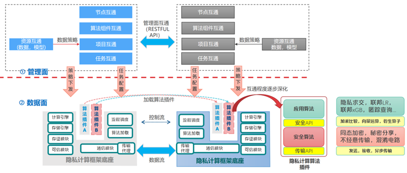
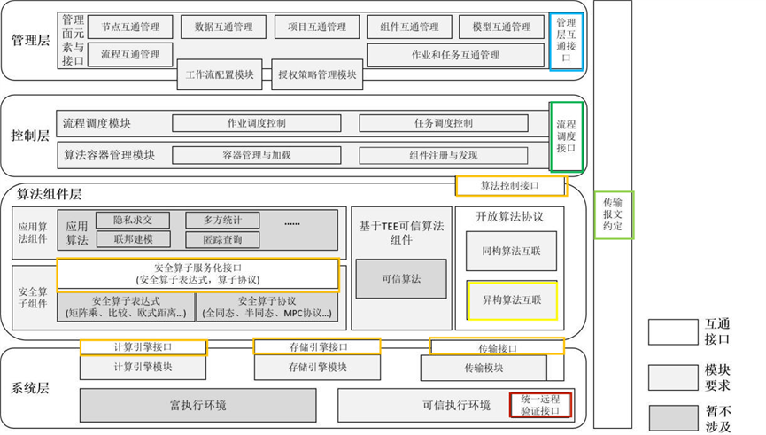
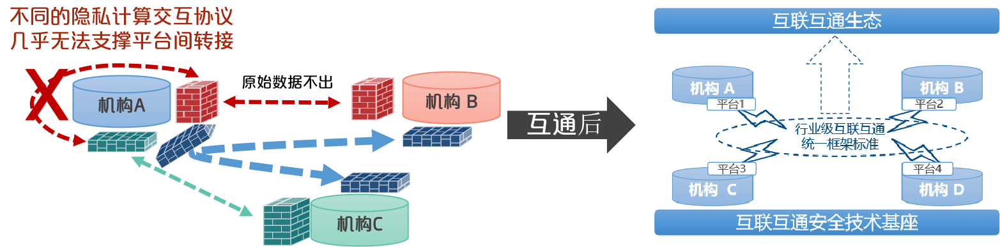
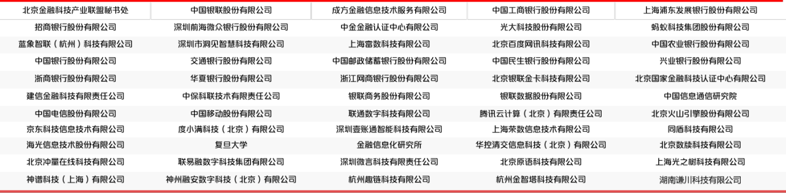

# README

## Overview/概述

为解决当前异构隐私计算平台互联互通问题，由北京金融科技产业联盟组织，中国银联牵头，联合主要金融机构、电信运营商、互联网公司、科技公司、检测机构、科研院所等 60 余家单位共同参与开展了隐私计算互联互通工作，形成了隐私计算互联互通统一框架，并制定了互联互通 API 接口规范。

在隐私计算产业联盟、开源社区等产业合作伙伴的大力支持下，现已完成本接口规范与各主流标准、技术路线的兼容对齐，并进一步与各主流隐私计算平台完成了跨平台多方互通验证。为帮助各隐私计算平台开发者更好开展互联互通改造，现将互联互通 API 接口规范、集成对接指引等文档进行发布。

To address the current interoperability issues of heterogeneous privacy computing platforms, organized by the Beijing Fintech Industry Alliance and led by China UnionPay Co. Ltd and in collaboration with more than 60 cooperators including major financial institutions, telecom operators, Internet companies, technology companies, testing organizations, research institutes, have collectively engaged in the work of enabling privacy computing interoperability. This has resulted in the formation of a unified framework for privacy computing interoperability, along with the establishment of API interface specifications for privacy computing-based interconnectivity.

With the vigorously support of industry partners such as the Privacy Computing Industry Alliance and the open source community, we have now completed the compatibility alignment of this interface specifications with various mainstream standards and technology paths. Furthermore, cross-platform multi-party interconnectivity verification has been accomplished with various mainstream privacy computing platforms. To assist developers of privacy computing platforms in improving their interconnectivity capabilities, we publish the API interface specifications and integration guidelines.

## Privacy Computing Interconnection Framework/隐私计算互联互通统一框架

隐私计算互联互通统一框架分为管理面与数据面两部分。管理面互通是对管理层所涉及互联互通资源管理的统一抽象，数据面互通是指管理面下发到数据面的数据信息流转调度及相关计算存储操作。互通视角描述了异构隐私计算平台在实现互联互通（InterConn）相关功能时双方在东西向与南北向所需的基础信息交互；模块视角定了 InterConn 各层最小必要接口及其模块实现的功能要求。

The unified framework for privacy computing-based interoperability is divided into two parts: the management plane and the data plane. The management plane interoperability refers to the unified abstraction designed for the interconnected resource management of the managerial level, while data plane interoperability refers to the data information flow dispatch and related computing and storage operations that are directed from the management plane to the data plane. The interoperability perspective describes the fundamental information exchange required in the east-west and north-south directions between heterogeneous privacy computing platforms when implementing interoperability (InterConn) related functions; the module perspective defines the minimal necessary interfaces at each layer of InterConn and the functional requirements of their module implementations.

**Interconnection View/互通视角**

<div align="center">
    
</div>

**Module View/功能视角**

<div align="center">
    
</div>

## Directory Structure/目录结构

```
InterOp
├─ LICENSE
├─ README.md              # 互联互通统一框架，贡献单位，版权声明等                  
└─ 互联互通集成对接指引     # 存放对接指引，注意事项等相关内容
└─ 互联互通API接口规范
    ├─ README.md          # 子模块简述等  
    └─ （模块名称）
        ├── README.md     # 模块简介，Contributor联系方式等                     
        ├── api.md        # 存放接口文件
        ├── figure        # 存放图片
        └── examples      # 接口使用示例及参考实现（可选）
```

注：各子模块按照“管理层接口-控制层接口-算法组件层接口-传输层接口-开放算法协议-TEE 统一远程证明协议”的顺序进行文件夹排布。

## Case Descriptions/案例说明

本次接口规范已与隐私计算开源社区、头部科技公司等课题参与单位内完成了五方跨平台、跨算法的互通联调，验证了互联互通 API 接口规范支持多方异构隐私计算平台时的可行性与安全性。目前，商业银行、电信运营商、互联网公司等单位也正在积极对接验证中。

The interface specification for this project has been completed through five party cross-platform and cross-algorithm interoperability and debugging with participating units such as the privacy computing open-source community and leading technology companies, verifying the feasibility and security of the interoperability API interface specification supporting multi-party heterogeneous privacy computing platforms. At present, commercial banks, telecommunications operators, internet companies and other units are also actively coordinating and verifying.

<div align="center">
    
</div>

多方互联互通前后数据合作形态对比

Comparisons of data cooperation forms before and after multi-party interconnectivity

## Contribution Institutions/参与单位

<div align="center">
    
</div>

## License/版权声明

**开源协议：**

Apache License 2.0
