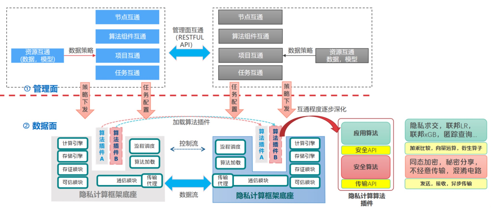

# InterOp

本仓库用于存放隐私计算互联互通接口，成果由北京金融科技产业联盟数据专委会隐私计算互联互通课题贡献。

## 互联互通架构

### 互通视角

<div align="center">
    
</div>

### 模块视角

<div align="center">
    
</div>


## 成果形式

互联互通的成果形式包括文档和代码，其中文档包括接口描述文档、说明文档、白皮书、各类标准文件等；代码（可选）可以是某一个接口的参考实现，接口的示例用法等等。

其中接口文档格式可以是：

 - Restful 接口推荐使用 swagger
 - RPC 接口推荐使用 protobuf 文档描述（需转成 Swagger UI 形式展示）
 - 简单、少量的 C/C++ 函数接口推荐直接用 .h 文件描述，并要求每一个函数的功能、入参、出参都有详细的注释
 - 其它接口请根据接口类型选择合适的表达形式，包括且不限于 Markdown 等等。

说明文档推荐用 Markdown 格式；白皮书，标准文件推荐用 pdf 格式。


## 仓库提交流程

请各课题研究单位发起 Pull Request（PR），PR 经过课题组及社区审核后，合入主干分支。

发起 Pull Request 的流程：

1. Fork 本仓库到您的个人目录下
2. 将成果文件添加到您的个人仓库。关于如何将文件添加到 git 仓库请参考 [git 基本操作教程](https://git-scm.com/book/zh/v2/Git-%E5%9F%BA%E7%A1%80-%E8%8E%B7%E5%8F%96-Git-%E4%BB%93%E5%BA%93)
3. 在您的个人仓库的"Pull Requests"页面发起一个 PR，合入的目标为 secretflow/interconnection-bfia 的 main 分支。关于 Github PR 创建流程的更详细步骤参考 [Github 官方文档](https://docs.github.com/en/pull-requests/collaborating-with-pull-requests/proposing-changes-to-your-work-with-pull-requests/creating-a-pull-request-from-a-fork)
4. 课题组及社区 Review PR，如果 PR 需要修改，发起单位需将更新内容 push 到个人仓库，PR 页面会自动更新
5. PR 通过以后，合并入本仓库


## 仓库组织形式

```
InterOp
├── LICENSE
├── README.md
|── framework.md # 整体互联互通框架介绍
└── bfia
    └── 子课题名称（或模块名称）
        ├── README.md   # 包括但不限于：子课题介绍；课题牵头/成员单位的介绍、联系式、版权声明等；Contributor 账号等
        ├── api         # 接口文档
        │   └── some.pb
        └── examples    # 接口使用示例（可选）
```

