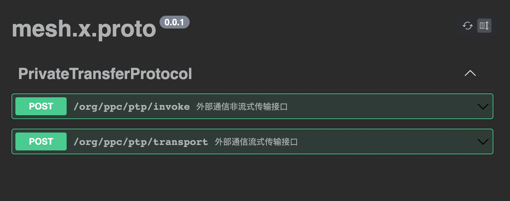
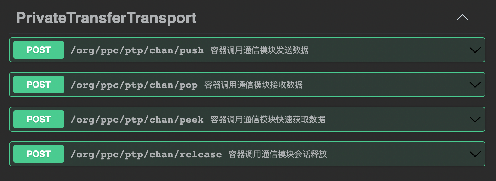

# 隐私计算传输协议 -- PTP/1.0

查看英文版 [PTP/1.1](Specifications.md)

## 说明

本文档为隐私计算传输规范，目前主要面向金融行业，并随时针对各行业针对互联互通提出的讨论和建议做优化。

## 版权

本标准由北京金融科技产业联盟（Beijing FinTech Industry Alliance）牵头起草，各个隐私计算技术服务商各自实现该标准，版权由北京金融科技产业联盟所有。

**开源协议**

| 协议名        | 地址                                              |
|------------|-------------------------------------------------|
| Apache 2.0 | http://www.apache.org/licenses/LICENSE-2.0.html |

**联系方式**

| 联系人 | 邮箱                       |
|-----|--------------------------|
| 樊昕晔 | fanxinye@ebchinatech.com |
| 王超  | congying.wang@trustbe.cn |
| 曾成  | coyzeng@gmail.com        |

## 摘要

隐私计算传输协议是一个应用层协议，是无状态/分布式/通用的一个信息传输协议。

## 内容

* <a href="#1">1 传输编程接口</a>
    * <a href="#1.1">1.1 传输编程接口定义</a>
* <a href="#2">2 容器调用通信模块接口</a>
    * <a href="#2.1">2.1 报文定义</a>
    * <a href="#2.2">2.2 接口定义</a>
* <a href="#3">3 节点间通信接口</a>
    * <a href="#3.1">3.1 报文定义</a>
    * <a href="#3.2">3.2 接口定义</a>
* <a href="#4">4 标准实现库</a>
    * <a href="#4.1">4.1 通信模块</a>
    * <a href="#4.2">4.1 Go SDK</a>
    * <a href="#4.3">4.2 Java SDK</a>
    * <a href="#4.4">4.3 Python SDK</a>
    * <a href="#4.5">4.4 Rust SDK</a>
    * <a href="#4.6">4.5 Typescript SDK</a>
* <a href="#5">5 附录</a>
    * <a href="#5.1">5.1 错误码表</a>
    * <a href="#5.2">5.2 Protobuf格式声明</a>
    * <a href="#5.3">5.3 Swagger格式声明</a>
    * <a href="#5.4">5.4 示例程序</a>

### <a id="1">1 传输编程接口</a>

### <a id="1.1">1.1 传输编程接口定义</a>

算法组件调用自身容器的传输编程接口。接口以Python语言作为示例，其他语言参考本文档的 <a id="#4">4 标准实现库</a>。

```python

from abc import abstractmethod, ABC
from typing import Generic, Dict

from mesh.macro import spi, mpi, T


@spi("mesh")
class Transport(ABC, Generic[T]):
    """
    Private compute data channel in async and blocking mode.
    """

    MESH = "mesh"
    GRPC = "grpc"

    @abstractmethod
    @mpi("mesh.chan.open")
    def open(self, session_id: str, metadata: Dict[str, str]) -> "Session":
        """
        Metadata 包含如下KEY，这些值会在Session句柄中持久，在传输时候使用
        
        mesh.mpc.address:            required 本方通信组件地址
        x-ptp-tech-provider-code:    required 厂商编码
        x-ptp-trace-id:              required 链路追踪ID
        x-ptp-token                  required 认证令牌
        x-ptp-session-id             required 通信会话号，全网唯一
        x-ptp-target-node-id         required 接收端节点编号，全网唯一
        x-ptp-target-inst-id         optional 接收端机构编号，全网唯一
        
        Open a channel session.
        :param session_id:  node id or inst id
        :param metadata channel metadata
        :return:
        """
        pass

    @abstractmethod
    @mpi("mesh.chan.close")
    def close(self, timeout: int):
        """
        Close the channel.
        :return:
        """
        pass

    @abstractmethod
    @mpi("mesh.chan.roundtrip")
    def roundtrip(self, payload: bytes, metadata: Dict[str, str]) -> bytes:
        """
        Roundtrip with the channel.
        :param payload:
        :param metadata:
        :return:
        """
        pass


@spi("mesh")
class Session(ABC, Generic[T]):
    """
    Remote queue in async and blocking mode.
    """

    @abstractmethod
    @mpi("mesh.chan.peek")
    def peek(self, topic: str = "") -> bytes:
        """
        Retrieves, but does not remove, the head of this queue,
        or returns None if this queue is empty.
        :param topic: message topic
        :return: the head of this queue, or None if this queue is empty
        :return:
        """
        pass

    @abstractmethod
    @mpi(name="mesh.chan.pop", timeout=120 * 1000)
    def pop(self, timeout: int, topic: str = "") -> bytes:
        """
        Retrieves and removes the head of this queue,
        or returns None if this queue is empty.
        :param timeout: timeout in mills.
        :param topic: message topic
        :return: the head of this queue, or None if this queue is empty
        """
        pass

    @abstractmethod
    @mpi("mesh.chan.push")
    def push(self, payload: bytes, metadata: Dict[str, str], topic: str = ""):
        """
        Inserts the specified element into this queue if it is possible to do
        so immediately without violating capacity restrictions.
        When using a capacity-restricted queue, this method is generally
        preferable to add, which can fail to insert an element only
        by throwing an exception.
        :param payload: message payload
        :param metadata: Message metadata
        :param topic: message topic
        :return:
        """
        pass

    @abstractmethod
    @mpi("mesh.chan.release")
    def release(self, timeout: int, topic: str = ""):
        """
        Close the channel session.
        :param timeout:
        :param topic: message topic
        :return:
        """
        pass
```

### <a id="2">2 容器调用通信模块接口</a>

容器调用通信模块接口，采用HTTP协议为基础，所以该文档中定义了基于HTTP协议的报文和接口。

### <a id="2.1">2.1 报文定义</a>

* 报头

```shell
x-ptp-tech-provider-code:    required 厂商编码
x-ptp-trace-id:              required 链路追踪ID
x-ptp-token                  required 认证令牌
x-ptp-session-id             required 通信会话号，全网唯一
x-ptp-target-node-id         required 接收端节点编号，全网唯一
x-ptp-target-inst-id         optional 接收端机构编号，全网唯一
```

* 报文

```shell
互联互通下节点间通信报文透传二进制报文，复用HTTP协议Body传输。
```

### <a id="2.2">2.2 接口定义</a>

内部通信协议接口规范包含，**数据发送、接收数据、快速获取数据、会话释放** 四个接口。资源释放为可选。

#### 2.2.1 数据发送接口

容器调用通信模块发送数据。

```shell
HTTP/1.1 POST /org/ppc/ptp/chan/push
请求头:
x-ptp-tech-provider-code:    required 厂商编码
x-ptp-trace-id:              required 链路追踪ID
x-ptp-token                  required 认证令牌
x-ptp-session-id             required 通信会话号，全网唯一
x-ptp-target-node-id         required 接收端节点编号，全网唯一
x-ptp-target-inst-id         optional 接收端机构编号，全网唯一
```

**请求体**

| 参数名称     | 数据类型   | 默认值 | 是否必填  | 描述                         |
|----------|--------|-----|-------|----------------------------|
| payload  | byte[] | 空   | true  | 消息序列化后的字节数组                |
| topic    | string | 空   | false | 会话主题，相同信道具有唯一性，用于同一信道的传输隔离 |
| metadata | object | 空   | false | 保留参数，用于扩展性                 |

**响应体**

| 参数名称    | 类型     | 默认值         | 是否必填 | 描述                         |
|---------|--------|-------------|------|----------------------------|
| code    | string | E0000000000 | true | 状态码，E0000000000表示成功，其余均为失败 |
| message | string | 成功          | true | 状态说明                       |

#### 2.2.2 接收数据接口

容器调用通信模块接口获取数据，该接口会从通信信道中阻塞读取一次数据，如信道中无数据，会一直阻塞等待触发超时返回空。

```shell
HTTP/1.1 POST /org/ppc/ptp/chan/pop
请求头:
x-ptp-tech-provider-code:    required 厂商编码
x-ptp-trace-id:              required 链路追踪ID
x-ptp-token                  required 认证令牌
x-ptp-session-id             required 通信会话号，全网唯一
x-ptp-target-node-id         required 接收端节点编号，全网唯一
x-ptp-target-inst-id         optional 接收端机构编号，全网唯一
```

**请求体**

| 参数名称    | 数据类型   | 默认值 | 是否必填  | 描述                         |
|---------|--------|-----|-------|----------------------------|
| timeout | byte[] | 空   | false | 阻塞超时时间，默认120s              |
| topic   | string | 空   | false | 会话主题，相同信道具有唯一性，用于同一信道的传输隔离 |

**响应体**

| 参数名称    | 类型     | 默认值         | 是否必填  | 描述                         |
|---------|--------|-------------|-------|----------------------------|
| code    | string | E0000000000 | true  | 状态码，E0000000000表示成功，其余均为失败 |
| message | string | 成功          | true  | 状态说明                       |
| content | byte[] | 空           | false | 消息序列化后的字节数组                |

#### 2.2.3 快速获取数据接口

容器调用通信模块接口快速获取数据，即在非阻塞情况下从通信信道中读取一次数据，若信道中有数据则返回数据，无数据则返回空。

```shell
HTTP/1.1 POST /org/ppc/ptp/chan/peek
请求头:
x-ptp-tech-provider-code:    required 厂商编码
x-ptp-trace-id:              required 链路追踪ID
x-ptp-token                  required 认证令牌
x-ptp-session-id             required 通信会话号，全网唯一
x-ptp-target-node-id         required 接收端节点编号，全网唯一
x-ptp-target-inst-id         optional 接收端机构编号，全网唯一
```

**请求体**

| 参数名称  | 数据类型   | 默认值 | 是否必填  | 描述                         |
|-------|--------|-----|-------|----------------------------|
| topic | string | 空   | false | 会话主题，相同信道具有唯一性，用于同一信道的传输隔离 |

**响应体**

| 参数名称    | 类型     | 默认值         | 是否必填  | 描述                         |
|---------|--------|-------------|-------|----------------------------|
| code    | string | E0000000000 | true  | 状态码，E0000000000表示成功，其余均为失败 |
| message | string | 成功          | true  | 状态说明                       |
| content | byte[] | 空           | false | 消息序列化后的字节数组                |

#### 2.2.4 会话释放接口

容器调用通信模块接口，清理掉以x-ptp-session-id标记的会话，调用该接口会释放会话中未读取的数据。

```shell
HTTP/1.1 POST /org/ppc/ptp/chan/release
请求头:
x-ptp-tech-provider-code:    required 厂商编码
x-ptp-trace-id:              required 链路追踪ID
x-ptp-token                  required 认证令牌
x-ptp-session-id             required 通信会话号，全网唯一
x-ptp-target-node-id         required 接收端节点编号，全网唯一
x-ptp-target-inst-id         optional 接收端机构编号，全网唯一
```

**请求体**

| 参数名称    | 数据类型   | 默认值 | 是否必填  | 描述                         |
|---------|--------|-----|-------|----------------------------|
| timeout | byte[] | 空   | false | 释放最长等待时间，默认10s             |
| topic   | string | 空   | false | 会话主题，相同信道具有唯一性，用于同一信道的传输隔离 |

**响应体**

| 参数名称    | 类型     | 默认值         | 是否必填 | 描述                         |
|---------|--------|-------------|------|----------------------------|
| code    | string | E0000000000 | true | 状态码，E0000000000表示成功，其余均为失败 |
| message | string | 成功          | true | 状态说明                       |

### <a id="3">3 节点间通信接口</a>

节点间通信接口是指两个通信模块间进行跨域数据传输的接口。定义了流式和非流式的传输接口以及基于HTTP协议的报文头。

#### <a id="3.1">3.1 报文定义</a>

节点间通信报文含报头和报文两部分，报头携带通信元数据，报文透传二进制传输内容。

互联互通使用HTTP（HTTP/0.9 HTTP/1.0 HTTP/1.1 HTTP/2）作为底层通信协议，复用HTTP报头传输互联互通报头。

* 报头

```shell
x-ptp-version:               required 协议版本
x-ptp-tech-provider-code:    required 厂商编码
x-ptp-trace-id:              required 链路追踪ID
x-ptp-token                  required 认证令牌
x-ptp-session-id             required 通信会话号，全网唯一
x-ptp-source-node-id         required 发送端节点编号，全网唯一
x-ptp-target-node-id         required 接收端节点编号，全网唯一
x-ptp-source-inst-id         optional 发送端机构编号，全网唯一
x-ptp-target-inst-id         optional 接收端机构编号，全网唯一
```

* 报文

```shell
互联互通下节点间通信报文透传二进制报文，复用HTTP协议Body传输。
```

#### <a id="3.2">3.2 接口定义</a>

节点间通信提供两个传输接口，非流式调用，针对单次调用场景；流式接口，针对大数据/小报文连续传输场景。

##### 3.2.1 非流式接口规范

针对单次调用场景

```shell
HTTP/1.1 POST /org/ppc/ptp/invoke
请求头:
x-ptp-version:               required 协议版本
x-ptp-tech-provider-code:    required 厂商编码
x-ptp-trace-id:              required 链路追踪ID
x-ptp-token                  required 认证令牌
x-ptp-session-id             required 通信会话号，全网唯一
x-ptp-source-node-id         required 发送端节点编号，全网唯一
x-ptp-target-node-id         required 接收端节点编号，全网唯一
x-ptp-source-inst-id         optional 发送端机构编号，全网唯一
x-ptp-target-inst-id         optional 接收端机构编号，全网唯一
请求体:
payload                      透传二进制报文，不做特殊处理

响应体:
payload                      透传二进制报文，不做特殊处理
```

##### 3.2.2 流式接口规范

针对大数据/小报文连续传输场景

```shell
HTTP/1.1 POST /org/ppc/ptp/transport
请求头:
x-ptp-version:               required 协议版本
x-ptp-tech-provider-code:    required 厂商编码
x-ptp-trace-id:              required 链路追踪ID
x-ptp-token                  required 认证令牌
x-ptp-session-id             required 通信会话号，全网唯一
x-ptp-source-node-id         required 发送端节点编号，全网唯一
x-ptp-target-node-id         required 接收端节点编号，全网唯一
x-ptp-source-inst-id         optional 发送端机构编号，全网唯一
x-ptp-target-inst-id         optional 接收端机构编号，全网唯一
请求体:
payload                      透传二进制报文，不做特殊处理

响应体:
payload                      透传二进制报文，不做特殊处理
```

### <a id="4">4 标准实现库</a>

隐私计算互联互通传输协议标准实现为开源产品mesh，该库主要由通信模块和多语言SDK组成，通信模块提供通信管控、传输及适配能力，
同时提供集群规模化及多活等高可用能力，通信模块运行模式有OCI容器及多架构可执行文件两种形式，支持当下所有国际和国产化CPU、OS。

### <a id="4.1">4.1 通信模块</a>

通信模块提供节点间跨域通信管控和传输，[项目地址](https://github.com/be-io/interconnection-bfia)

```bash
docker pull imesh
docker run -d -e MID=xxx -p 7304:7304 imesh
```

### <a id="4.2">4.1 Go SDK</a>

Go SDK提供Golang语言通信SPI集成包，实现Go语言节点间跨域通信管控和传输。

```bash
go get github.com/be-io/interconnection-bfia/imesh
```

### <a id="4.3">4.2 Java SDK</a>

Java SDK提供Golang语言通信SPI集成包，实现Java语言节点间跨域通信管控和传输。

```xml

<dependency>
    <groupId>io.inc.mesh</groupId>
    <artifactId>imesh</artifactId>
    <version>0.0.1</version>
</dependency>
```

### <a id="4.4">4.3 Python SDK</a>

Python SDK提供Golang语言通信SPI集成包，实现Python语言节点间跨域通信管控和传输。

```bash
poetry add imesh
```

### <a id="4.5">4.4 Rust SDK</a>

Rust SDK提供Golang语言通信SPI集成包，实现Rust语言节点间跨域通信管控和传输。

```bash
cargo add imesh
```

### <a id="4.6">4.5 Typescript SDK</a>

Typescript SDK提供Golang语言通信SPI集成包，实现Typescript语言节点间跨域通信管控和传输。

```bash
yarn add imesh
```

### <a id="5">5 附录</a>

附录提供互联互通附录文件和说明。

### <a id="5.1">5.1 错误码表</a>

| 编码          | 描述           |
|-------------|--------------|
| E0000000000 | 请求成功         |
| E0000000404 | 请求资源不存在      |
| E0000000500 | 系统异常         |
| E0000000503 | 循环请求服务不可达    |
| E0000000400 | 请求非法         |
| E0000000403 | 请求资源未被授权     |
| E0000000520 | 未知异常         |
| E0000000600 | 系统不兼容        |
| E0000000601 | 请求超时         |
| E0000000602 | 无服务实例        |
| E0000000603 | 数字证书校验异常     |
| E0000000604 | 节点授权码已过期     |
| E0000000605 | 节点组网时间已过期    |
| E0000000606 | 对方节点已禁用网络    |
| E0000000607 | 网络不通         |
| E0000000614 | 接口未被许可调用     |
| E0000000615 | 证书签名非法       |
| E0000000616 | 报文编解码异常      |
| E0000000617 | 下游版本不匹配服务不存在 |
| E0000000618 | 节点或机构未组网     |
| E0000000619 | 地址非法或无法访问    |

### <a id="5.2">5.2 Protobuf格式声明</a>

外部通信协议Protobuf格式声明 [README.proto](mesh.x.proto)

内部通信协议Protobuf格式声明 [README.proto](mesh.y.proto)

### <a id="5.3">5.3 Swagger格式声明</a>

外部通信协议Swagger格式声明 [README.swagger.json](mesh.x.swagger.json)



内部通信协议Swagger格式声明 [README.swagger.json](mesh.y.swagger.json)



### <a id="5.4">5.4 示例程序</a>

示例程序 [examples](../examples)
