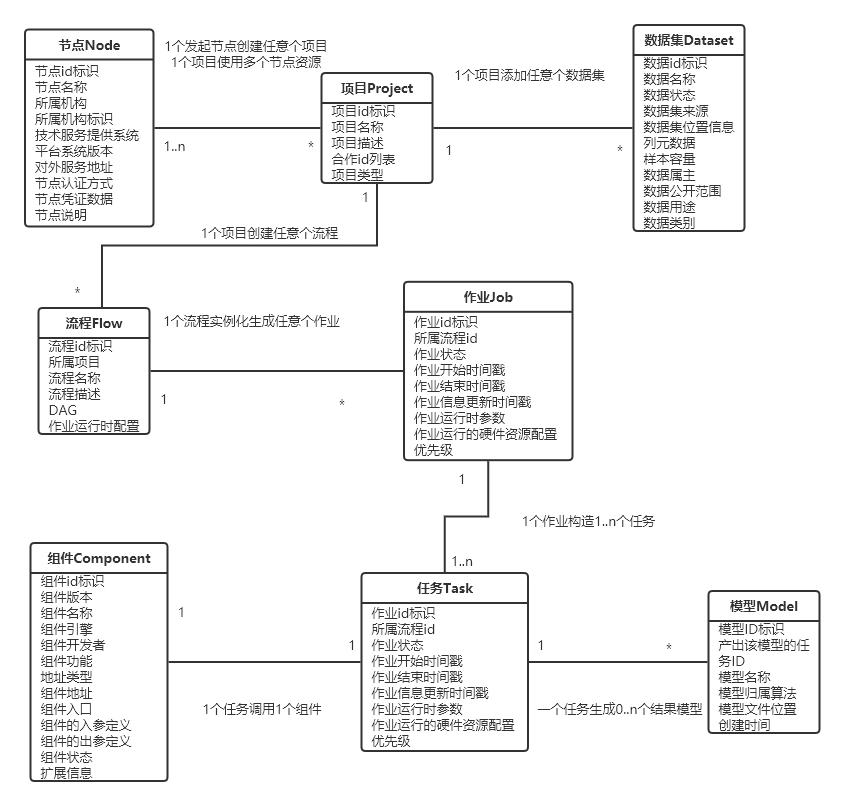

# README

## 说明

本仓库用于存放隐私计算互联互通管理层模块接口，成果由北京金融科技产业联盟数据专委会隐私计算互联互通课题贡献。

## 联系人信息

关于接口 API 内容如有问题可以联系我们，联系方式如下：

| 姓名   | 单位             | 联系方式                                                |
| ------ | ---------------- | ------------------------------------------------------- |
| 王思婷 | 招商银行         | w_siting@cmbchina.com       |
| 龚乐诚 | 上海浦东发展银行 | gonglc@spdb.com.cn            |
| 王梦鸽 | 上海浦东发展银行 | wangmg@spdb.com.cn             |
| 杨天雅 | 富数科技         | salan@fudata.cn                  |
| 王超   | 蓝象智联         | congying.wang@trustbe.cn |

## 目录结构

```
InterOp
├─ LICENSE
├─ README.md              # 互联互通统一框架，贡献单位，版权声明等                  
└─ 互联互通集成对接指引      # 存放对接指引，注意事项等相关内容
└─ 互联互通API接口文档
    ├─ README.md          # 子模块概述，Contributor联系方式等  
    └─ 管理层接口
        ├── README.md     # 模块简介，Contributor联系方式等                     
        ├── api.md        # 存放接口文件
        ├── figure        # 存放相关图片
        └── examples      # 接口使用示例（可选）
```

## 管理层模块概述

隐私计算互联互通管理层模块包含互联互通平台的基本元素、各级资源的互通流程、及支撑互通流程的东西向接口，分层级约定了节点互通、数据互通、项目互通、流程互通、组件互通、模型互通等资源互通接口。架构图如下：

<div align="center">
    
</div>


## 管理层实体关系

管理层各实体间的关系图如下图所示。参与互联互通合作的异构平台作为节点加入到互联互通网络，一个节点可以创建多个项目，每个项目中可能包含多个参与方节点，通过项目实体来统一管理项目中相关的节点、数据集和模型等资源，项目中可以创建多个流程,流程运行多次生成多个作业，不同作业可以配置不同的运行时参数，一个作业可能由多个任务组成，任务承接作业中对应位置的运行时参数配置，每个任务通过调度底层组件对应的算法资源进而执行任务，生成模型、报告等隐私计算结果。其中，每个组件都是独立的算法模块，例如：PSI、LR 等，组件可以配置调度顺序、输入输出关系等，从而编排形成一个具有完整计算逻辑的流程。

<div align="center">
    
</div>


## 参与单位

- 招商银行
- 上海浦东发展银行
- 富数科技
- 蓝象智联
