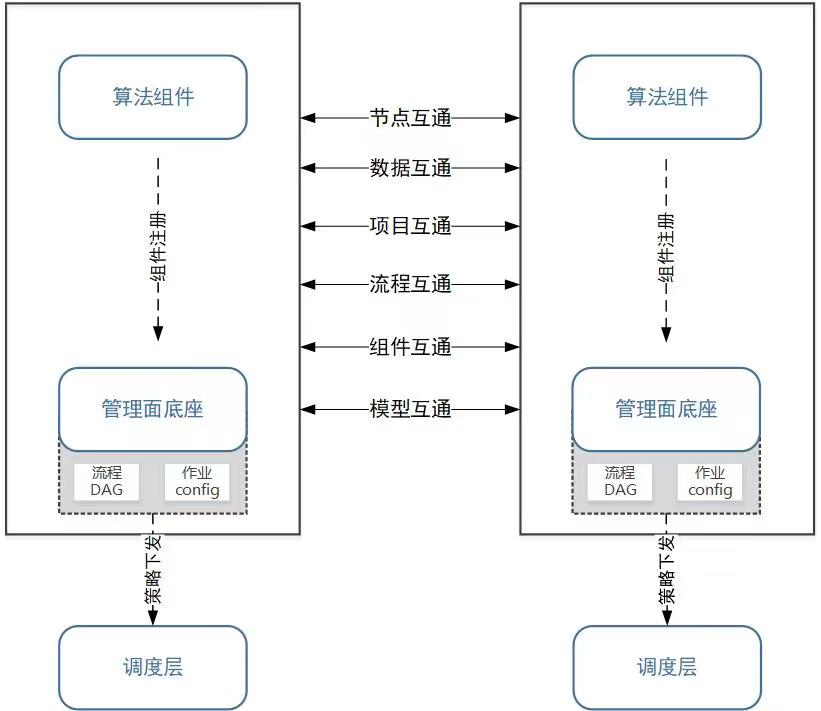

# 隐私计算互联互通管理层 API

- [隐私计算互联互通管理层 API](#隐私计算互联互通管理层-api)
  - [1 整体框架](#1-整体框架)
  - [2 通用报文头规范及公共出参](#2-通用报文头规范及公共出参)
    - [2.1  通用规范](#21--通用规范)
    - [2.2  通用报文头规范](#22--通用报文头规范)
    - [2.3  公共出参](#23--公共出参)
  - [3 节点互通接口](#3-节点互通接口)
    - [3.1  合作申请接口](#31--合作申请接口)
    - [3.2 更新合作意向](#32-更新合作意向)
    - [3.3 节点合约解除](#33-节点合约解除)
    - [3.4 更新节点信息(可选)](#34-更新节点信息可选)
    - [3.5 节点合作查询](#35-节点合作查询)
    - [3.6 节点信息查询](#36-节点信息查询)
    - [3.7 节点健康探测(可选)](#37-节点健康探测可选)
  - [4 数据集互通接口](#4-数据集互通接口)
    - [4.1 公开数据集列表查询](#41-公开数据集列表查询)
    - [4.2 数据集明细查询](#42-数据集明细查询)
    - [4.3 数据集授权申请](#43-数据集授权申请)
    - [4.4 数据集授权意向更新](#44-数据集授权意向更新)
    - [4.5 数据集授权解除](#45-数据集授权解除)
    - [4.6 数据集授权状态查询](#46-数据集授权状态查询)
  - [5 项目互通接口](#5-项目互通接口)
    - [5.1 项目审批申请](#51-项目审批申请)
    - [5.2 项目审批确认](#52-项目审批确认)
    - [5.3 项目审批解除](#53-项目审批解除)
    - [5.4 项目审批状态查询](#54-项目审批状态查询)
    - [5.5 项目列表查询](#55-项目列表查询)
    - [5.6 项目信息查询](#56-项目信息查询)
  - [6 组件互通接口](#6-组件互通接口)
    - [6.1 公开组件列表查询](#61-公开组件列表查询)
    - [6.2 公开组件信息查询](#62-公开组件信息查询)
  - [7 流程互通接口](#7-流程互通接口)
    - [7.1 流程审批接口](#71-流程审批接口)
    - [7.2 流程审批确认](#72-流程审批确认)
    - [7.3 流程审批解除](#73-流程审批解除)
    - [7.4 流程审批状态查询](#74-流程审批状态查询)
  - [8 作业互通接口](#8-作业互通接口)
    - [8.1 作业审批接口](#81-作业审批接口)
    - [8.2 作业审批确认](#82-作业审批确认)
    - [8.3 作业审批解除(可选)](#83-作业审批解除可选)
  - [9 模型互通接口](#9-模型互通接口)
    - [9.1 合作模型审批](#91-合作模型审批)
    - [9.2 合作模型审批确认](#92-合作模型审批确认)
    - [9.3 合作模型审批解除](#93-合作模型审批解除)
    - [9.4 合作模型审批查询](#94-合作模型审批查询)


## 1 整体框架

隐私计算互联互通管理层模块包含互联互通平台的基本元素、各级资源的互通流程、及支撑互通流程的东西向接口，分层级约定了节点互通、数据互通、项目互通、流程互通、组件互通、模型互通等资源互通接口。架构图如下：

<div align="center">
    
</div>


**文档版本**

```
v1.1.0
```

## 2 通用报文头规范及公共出参

### 2.1  通用规范

```python
Content-Type：application/json
HTTP Method：读GET，写POST
```

### 2.2  通用报文头规范

```python
Request Header： 
x-auth-sign：利用签约时指定的算法构造的签名值，用于安全校验，节点签约完成后才能生成，节点信息查询、合作申请、更新合作意向接口header无需包含
x-csrf-protection: 避免跨站点请求伪造攻击，POST时必选
x-source-node-id:请求方节点id；
x-target-node-id:目的方节点id；
x-nonce：系统生成的防重放随机串，如 UUID
x-trace-id：业务自定义标识，用于全链路跟踪
x-timestamp：调用方毫秒时间戳（Unix epoch time，具有时区无关性）
x-mprac-token-set：多方资源访问控制的许可凭证
```

注：多方资源访问控制时，

1. 基于管理层的授权关系，建立多方资源访问控制凭证，资源持有方记录并持有资源的授权凭证，资源使用方记录并持有资源的许可凭证；
2. 资源访问时，资源使用方下发本地最高资源等级的许可凭证，提交资源访问请求；资源持有方下发本地最高资源等级的授权凭证，处理资源访问请求，完成资源的鉴权核验；
3. 资源鉴权完成后，控制层建立会话与令牌对，透传给传输层。

### 2.3  公共出参

状态码 **0**

| 名称 | 类型   | 必选 | 中文名       | 说明             |
| ---- | ------ | ---- | ------------ | ---------------- |
| code | int32  | true | 状态码       | 0 正常，否则错误 |
| msg  | string | true | 错误信息     | none             |
| data | object | true | 响应数据内容 | none             |

## 3 节点互通接口

### 3.1  合作申请接口

> POST /v1/interconn/node/contract/apply

**接口描述**

> 发起方节点向合作方节点发起成为合作伙伴的申请，合作方返回新的合约 id

**请求体(Request Body)**

| 参数名称        | 数据类型 | 默认值 | 不为空 | 描述                                 |
| --------------- | -------- | ------ | ------ | ------------------------------------ |
| address         | string   |        | true   | 节点服务地址                         |
| auth_credential | string   |        | true   | 凭证数据：公钥值、证书内容           |
| auth_type       | string   |        | true   | 认证方式：公钥、证书                 |
| description     | string   |        |        | 节点描述                             |
| expired_time    | int64    |        |        | 合约过期时间，时区约定 Asia/Shanghai |
| inst_id         | string   |        | true   | 合作方机构 Id                        |
| institution     | string   |        | true   | 节点所属机构                         |
| name            | string   |        | true   | 节点名称                             |
| node_id         | string   |        | true   | 发起方的节点 Id                      |
| system          | string   |        | true   | 技术服务提供系统                     |
| system_version  | string   |        | true   | 系统版本                             |

**返回结果**

| 状态码 | 状态码含义                                              | 说明 | 数据模型 |
| ------ | ------------------------------------------------------- | ---- | -------- |
| 0      | [OK](https://tools.ietf.org/html/rfc7231#section-6.3.1) | 成功 | Inline   |

**返回数据结构**

状态码 **0**

| 参数名称       | 类型   | 默认值 | 不为空 | 描述                       |
| -------------- | ------ | ------ | ------ | -------------------------- |
| code           | int32  |        | true   | 状态码。0 正常，否则错误 |
| msg            | string |        | true   | 错误信息                   |
| data           | object |        | true   | 响应数据内容               |
| ⇥ contract_id | string |        | true   | 合约 id                    |

### 3.2 更新合作意向

> POST /v1/interconn/node/contract/confirm

**接口描述**

> 合作方向发起方更新合作意向，包括同意合作申请、拒绝合作申请

**请求体(Request Body)**

| 参数名称        | 数据类型 | 默认值 | 不为空                   | 描述                                              |
| --------------- | -------- | ------ | ------------------------ | ------------------------------------------------- |
| auth_credential | string   |        | 当 staus=APPROVED 时必选 | 凭证数据：公钥值、证书内容                        |
| auth_type       | string   |        | 当 staus=APPROVED 时必选 | 认证方式：公钥、证书                              |
| contract_id     | string   |        | true                     | 合约 id                                           |
| expired_time    | int64    |        | 当 staus=APPROVED 时必选 | 合约过期时间                                      |
| status          | string   |        | true                     | 审批状态。枚举值：APPROVED 已接受 REJECTED 已拒绝 |

**返回结果**

| 状态码 | 状态码含义                                              | 说明 | 数据模型 |
| ------ | ------------------------------------------------------- | ---- | -------- |
| 0      | [OK](https://tools.ietf.org/html/rfc7231#section-6.3.1) | 成功 | Inline   |

**返回数据结构**

状态码 **0**

### 3.3 节点合约解除

> POST /v1/interconn/node/contract/terminate

**接口描述**

> 撤销节点间合约关系，双方均可发起

**请求体(Request Body)**

| 参数名称    | 数据类型 | 默认值 | 不为空 | 描述    |
| ----------- | -------- | ------ | ------ | ------- |
| contract_id | string   |        | true   | 合约 id |

**返回结果**

| 状态码 | 状态码含义                                              | 说明 | 数据模型 |
| ------ | ------------------------------------------------------- | ---- | -------- |
| 0      | [OK](https://tools.ietf.org/html/rfc7231#section-6.3.1) | 成功 | Inline   |

**返回数据结构**

状态码 **0**

| 参数名称 | 类型   | 默认值 | 不为空 | 描述                     |
| -------- | ------ | ------ | ------ | ------------------------ |
| code     | int32  |        | true   | 状态码。0 正常，否则错误 |
| msg      | string |        | true   | 错误信息                 |
| data     | object |        | true   | 响应数据内容             |

### 3.4 更新节点信息(可选)

> POST /v1/interconn/node/update

**接口描述**

> 发起方向合作方同步更新发起方的节点信息，更新后合约 id 不变

**请求体(Request Body)**

| 参数名称        | 数据类型 | 默认值 | 不为空 | 描述                                                 |
| --------------- | -------- | ------ | ------ | ---------------------------------------------------- |
| contract_id     | string   |        | true   | 合约 id                                              |
| address         | string   |        | true   | 节点服务地址                                         |
| auth_credential | string   |        | true   | 凭证数据：公钥值、证书内容                           |
| auth_type       | string   |        | true   | 认证方式，枚举值：SHA256_RSA、 SHA256_ECDSA、CERT 等 |
| description     | string   |        |        | 节点描述                                             |
| inst_id         | string   |        | true   | 机构 Id                                              |
| institution     | string   |        | true   | 节点所属机构                                         |
| name            | string   |        | true   | 节点名称                                             |
| system          | string   |        | true   | 技术服务提供系统                                     |
| system_version  | string   |        | true   | 系统版本                                             |

**返回结果**

| 状态码 | 状态码含义                                              | 说明 | 数据模型 |
| ------ | ------------------------------------------------------- | ---- | -------- |
| 0      | [OK](https://tools.ietf.org/html/rfc7231#section-6.3.1) | 成功 | Inline   |

**返回数据结构**

状态码 **0**

| 参数名称 | 类型   | 默认值 | 不为空 | 描述                     |
| -------- | ------ | ------ | ------ | ------------------------ |
| code     | int32  |        | true   | 状态码。0 正常，否则错误 |
| msg      | string |        | true   | 错误信息                 |
| data     | object |        | true   | 响应数据内容             |

### 3.5 节点合作查询

> GET /v1/interconn/node/contract/query

**接口描述**

> 发起方向合作方查询合作签约状态，确认回调失败的兜底操作

**请求参数(****Query**** Param)**

| 参数名称    | 类型   | 默认值 | 不为空 | 描述    |
| ----------- | ------ | ------ | ------ | ------- |
| contract_id | string |        | true   | 合约 id |

**返回结果**

| 状态码 | 状态码含义                                              | 说明 | 数据模型 |
| ------ | ------------------------------------------------------- | ---- | -------- |
| 0      | [OK](https://tools.ietf.org/html/rfc7231#section-6.3.1) | 成功 | Inline   |

**返回数据结构**

状态码 **0**

| 参数名称  | 类型   | 默认值 | 不为空 | 描述                                                                               |
| --------- | ------ | ------ | ------ | ---------------------------------------------------------------------------------- |
| code      | int32  |        | true   | 状态码。0 正常，否则错误                                                         |
| msg       | string |        | true   | 错误信息                                                                           |
| data      | object |        | true   | 响应数据内容                                                                       |
| ⇥ status | string |        | true   | 合约状态。枚举值：REJECTED-已拒绝,APPROVED-已接受,TERMINATED-已解除,APPLIED-已申请 |

### 3.6 节点信息查询

> GET /v1/interconn/node/query

**接口描述**

> 发起方查询合作方节点信息

**请求参数(****Query**** Param)**

| 参数名称 | 类型   | 默认值 | 不为空 | 描述    |
| -------- | ------ | ------ | ------ | ------- |
| node_id  | string |        | true   | 节点 id |

**返回结果**

| 状态码 | 状态码含义                                              | 说明 | 数据模型 |
| ------ | ------------------------------------------------------- | ---- | -------- |
| 0      | [OK](https://tools.ietf.org/html/rfc7231#section-6.3.1) | 成功 | Inline   |

**返回数据结构**

状态码 **0**

| 参数名称          | 类型   | 默认值 | 不为空 | 描述                                    |
| ----------------- | ------ | ------ | ------ | --------------------------------------- |
| code              | int32  |        | true   | 状态码。0 正常，否则错误              |
| msg               | string |        | true   | 错误信息                                |
| data              | object |        | true   | 响应数据内容                            |
| ⇥ address        | string |        | true   | 节点服务地址                            |
| ⇥ description    | string |        |        | 节点描述                                |
| ⇥ inst_id        | string |        | true   | 机构 Id                                 |
| ⇥ institution    | string |        | true   | 节点所属机构                            |
| ⇥ name           | string |        | true   | 节点名称                                |
| ⇥ node_id        | string |        | true   | 节点唯一标识                            |
| ⇥ system         | string |        | true   | 节点的平台技术提供商户，如 avatar、fate |
| ⇥ system_version | string |        | true   | 平台系统版本号，如 3.0.0                |

### 3.7 节点健康探测(可选)

> GET /v1/interconn/node/health

**接口描述**

> 发起方向合作方进行健康检查

**请求参数(****Query**** Param)**

| 参数名称 | 默认值 | 描述 |
| -------- | ------ | ---- |

**返回结果**

| 状态码 | 状态码含义                                              | 说明 | 数据模型 |
| ------ | ------------------------------------------------------- | ---- | -------- |
| 0      | [OK](https://tools.ietf.org/html/rfc7231#section-6.3.1) | 成功 | Inline   |

**返回数据结构**

状态码 **0**

| 参数名称  | 类型   | 默认值 | 不为空 | 描述                       |
| --------- | ------ | ------ | ------ | -------------------------- |
| code      | int32  |        | true   | 状态码。0 正常，否则错误 |
| msg       | string |        | true   | 错误信息                   |
| data      | object |        | true   | 响应数据内容               |
| ⇥ status | string |        | true   | 节点健康状态，直接返回 ok  |

## 4 数据集互通接口

### 4.1 公开数据集列表查询

> GET /v1/interconn/dataset/pub/list

**接口描述**

> 查询合作方公开的数据集列表

**请求参数(****Query**** Param)**

| 参数名称    | 类型   | 默认值 | 不为空 | 描述                                         |
| ----------- | ------ | ------ | ------ | -------------------------------------------- |
| contract_id | string |        | true   | 合约 id                                      |
| page_num    | int32  | 1      |        | 页号，默认 1                                 |
| page_size   | int32  | 20     |        | 每页数量，默认 20，page_size=-1 时为全量查询 |

**返回结果**

| 状态码 | 状态码含义                                              | 说明 | 数据模型 |
| ------ | ------------------------------------------------------- | ---- | -------- |
| 0      | [OK](https://tools.ietf.org/html/rfc7231#section-6.3.1) | 成功 | Inline   |

**返回数据结构**

状态码 **0**

| 参数名称              | 类型          | 默认值 | 不为空 | 描述                                                         |
| --------------------- | ------------- | ------ | ------ | ------------------------------------------------------------ |
| code                  | int32         |        | true   | 状态码。0 正常，否则错误                                   |
| msg                   | string        |        | true   | 错误信息                                                     |
| data                  | object        |        | true   | 响应数据内容                                                 |
| ⇥ records            | array[object] |        | true   | 数据                                                         |
| ⇥ ⇥ category        | string        |        |        | 数据类别                                                     |
| ⇥ ⇥ count           | int32         |        |        | 数据集行数                                                   |
| ⇥ ⇥ dataset_id      | string        |        | true   | 数据集 id                                                    |
| ⇥ ⇥ description     | string        |        |        | 数据集描述                                                   |
| ⇥ ⇥ name            | string        |        | true   | 数据集名称                                                   |
| ⇥ ⇥ owner           | string        |        | true   | 数据属主（机构 id）                                          |
| ⇥ ⇥ column_metas    | array<object> |        |        | 列元数据，与字段排序保持一致。列表查询时可选，明细查询时必选 |
| ⇥ ⇥ ⇥ name         | string        |        | true   | 字段名/特征名                                                |
| ⇥ ⇥ ⇥ data_type    | string        |        | true   | 字段类型，枚举值：如 varchar、int、double（参考 SQL）        |
| ⇥ ⇥ ⇥ description  | string        |        |        | 字段描述                                                     |
| ⇥ ⇥ ⇥ distribution | string        |        | true   | 数据分布，枚举值：DISCRETE、CONTINUOUS                       |
| ⇥ total              | int32         |        | true   | 总量                                                         |

### 4.2 数据集明细查询

> GET /v1/interconn/dataset/pub/query

**接口描述**

> 发起方向合作方查询公开的或已授权的数据集详细信息

**请求参数(****Query**** Param)**

| 参数名称    | 类型   | 默认值 | 不为空 | 描述      |
| ----------- | ------ | ------ | ------ | --------- |
| contract_id | string |        | true   | 合约 id   |
| dataset_id  | string |        | true   | 数据集 id |

**返回结果**

| 状态码 | 状态码含义                                              | 说明 | 数据模型 |
| ------ | ------------------------------------------------------- | ---- | -------- |
| 0      | [OK](https://tools.ietf.org/html/rfc7231#section-6.3.1) | 成功 | Inline   |

**返回数据结构**

状态码 **0**

| 参数名称           | 类型          | 默认值 | 不为空 | 描述                                                         |
| ------------------ | ------------- | ------ | ------ | ------------------------------------------------------------ |
| code               | int32         |        | true   | 状态码。0 正常，否则错误                                   |
| msg                | string        |        | true   | 错误信息                                                     |
| data               | object        |        | true   | 响应数据内容                                                 |
| ⇥ category        | string        |        |        | 数据类别                                                     |
| ⇥ count           | int32         |        |        | 数据集行数                                                   |
| ⇥ dataset_id      | string        |        | true   | 数据集 id                                                    |
| ⇥ description     | string        |        |        | 数据集描述                                                   |
| ⇥ name            | string        |        | true   | 数据集名称                                                   |
| ⇥ owner           | string        |        | true   | 数据属主（机构 id）                                          |
| ⇥ ⇥ column_metas | array<object> |        | true   | 列元数据，与字段排序保持一致。列表查询时可选，明细查询时必选 |
| ⇥ ⇥ name         | string        |        | true   | 字段名/特征名                                                |
| ⇥ ⇥ data_type    | string        |        | true   | 字段类型，枚举值：如 varchar、int、double（参考 SQL）        |
| ⇥ ⇥ description  | string        |        |        | 字段描述                                                     |
| ⇥ ⇥ distribution | string        |        | true   | 数据分布，枚举值：DISCRETE、CONTINUOUS                       |

### 4.3 数据集授权申请

> POST /v1/interconn/dataset/audit/apply

**接口描述**

> 根据合作方公开数据集 ID 发起授权申请

**请求体(Request Body)**

| 参数名称    | 数据类型 | 默认值 | 不为空 | 描述                                                         |
| ----------- | -------- | ------ | ------ | ------------------------------------------------------------ |
| audit_id    | string   |        | true   | 审批 id                                                      |
| auth_scope  | map      |        |        | 数据集授权适用范围。key 对应授权范围的类型，取值为：NODE 节点级 PROJECT 项目级 COMPONENT 组件级 value 为该类型具体的授权对象唯一 id 列表。样例：{"PROJECT": ["project_123"],"COMPONENT": ["psi"]} |
| contract_id | string   |        | true   | 合约 id                                                      |
| dataset_id  | string   |        | true   | 数据集 id                                                    |
| time_limit  | int64    |        |        | 访问时间限制                                                 |
| times_limit | int32    |        |        | 访问次数限制                                                 |

**返回结果**

| 状态码 | 状态码含义                                              | 说明 | 数据模型 |
| ------ | ------------------------------------------------------- | ---- | -------- |
| 0      | [OK](https://tools.ietf.org/html/rfc7231#section-6.3.1) | 成功 | Inline   |

**返回数据结构**

状态码 **0**

| 参数名称 | 类型   | 默认值 | 不为空 | 描述                     |
| -------- | ------ | ------ | ------ | ------------------------ |
| code     | int32  |        | true   | 状态码。0 正常，否则错误 |
| msg      | string |        | true   | 错误信息                 |
| data     | object |        | true   | 响应数据内容             |

### 4.4 数据集授权意向更新

> POST /v1/interconn/dataset/audit/confirm

**接口描述**

> 数据集持有方向另一方更新数据授权状态(已授权、已拒绝)

**请求体(Request Body)**

| 参数名称            | 数据类型 | 默认值 | 不为空 | 描述                                                                 |
| ------------------- | -------- | ------ | ------ | -------------------------------------------------------------------- |
| audit_id            | string   |        | true   | 审批 id                                                              |
| status              | string   |        | true   | 授权状态。枚举值：APPROVED 已授权 REJECTED 已拒绝                    |
| resource_permit     | object   |        |        | 资源许可凭证                                                         |
| ⇥ token            | string   |        | true   | 用于核验的令牌，颁发给资源使用方的唯一授权标识，与授权主体、资源绑定 |
| ⇥ resource_level   | int32    |        | true   | 资源等级                                                             |
| ⇥ resource_type    | string   |        | true   | 资源类型                                                             |
| ⇥ resource_id      | string   |        | true   | 资源 ID                                                              |
| ⇥ resource_node_id | string   |        | true   | 资源提供方的节点 ID                                                  |
| ⇥ resource_inst_id | string   |        | true   | 资源提供方的机构 ID                                                  |
| ⇥ request_node_id  | string   |        | true   | 资源使用方的节点 ID                                                  |
| ⇥ request_inst_id  | string   |        | true   | 资源使用方的机构 ID                                                  |
| ⇥ time_limit       | int64    |        |        | 访问时间限制                                                         |
| ⇥ times_limit      | int32    |        |        | 访问次数限制                                                         |

**返回结果**

| 状态码 | 状态码含义                                              | 说明 | 数据模型 |
| ------ | ------------------------------------------------------- | ---- | -------- |
| 0      | [OK](https://tools.ietf.org/html/rfc7231#section-6.3.1) | 成功 | Inline   |

**返回数据结构**

状态码 **0**

| 参数名称 | 类型   | 默认值 | 不为空 | 描述                     |
| -------- | ------ | ------ | ------ | ------------------------ |
| code     | int32  |        | true   | 状态码。0 正常，否则错误 |
| msg      | string |        | true   | 错误信息                 |
| data     | object |        | true   | 响应数据内容             |

### 4.5 数据集授权解除

> POST /v1/interconn/dataset/audit/terminate

**接口描述**

> 撤销数据集授权权限。

**请求体(Request Body)**

| 参数名称 | 数据类型 | 默认值 | 不为空 | 描述    |
| -------- | -------- | ------ | ------ | ------- |
| audit_id | string   |        | true   | 审批 id |

**返回结果**

| 状态码 | 状态码含义                                              | 说明 | 数据模型 |
| ------ | ------------------------------------------------------- | ---- | -------- |
| 0      | [OK](https://tools.ietf.org/html/rfc7231#section-6.3.1) | 成功 | Inline   |

**返回数据结构**

状态码 **0**

| 参数名称 | 类型   | 默认值 | 不为空 | 描述                     |
| -------- | ------ | ------ | ------ | ------------------------ |
| code     | int32  |        | true   | 状态码。0 正常，否则错误 |
| msg      | string |        | true   | 错误信息                 |
| data     | object |        | true   | 响应数据内容             |

### 4.6 数据集授权状态查询

> GET /v1/interconn/dataset/audit/query

**接口描述**

> 数据集使用方向提供方查询申请状态，确认回调失败的兜底操作。

**请求参数(****Query**** Param)**

| 参数名称 | 类型   | 默认值 | 不为空 | 描述    |
| -------- | ------ | ------ | ------ | ------- |
| audit_id | string |        | true   | 审批 id |

**返回结果**

| 状态码 | 状态码含义                                              | 说明 | 数据模型 |
| ------ | ------------------------------------------------------- | ---- | -------- |
| 0      | [OK](https://tools.ietf.org/html/rfc7231#section-6.3.1) | 成功 | Inline   |

**返回数据结构**

状态码 **0**

| 参数名称  | 类型   | 默认值 | 不为空 | 描述                                                                               |
| --------- | ------ | ------ | ------ | ---------------------------------------------------------------------------------- |
| code      | int32  |        | true   | 状态码。0 正常，否则错误                                                         |
| msg       | string |        | true   | 错误信息                                                                           |
| data      | object |        | true   | 响应数据内容                                                                       |
| ⇥ status | string |        | true   | 授权状态。枚举值：APPLIED 已申请 APPROVED 已授权 REJECTED 已拒绝 TERMINATED 已解除 |

## 5 项目互通接口

### 5.1 项目审批申请

> POST /v1/interconn/project/audit/apply

**接口描述**

> 发起方向协作方发起项目审批的请求

**请求体(Request Body)**

| 参数名称       | 数据类型      | 默认值 | 不为空 | 描述                                                                                              |
| -------------- | ------------- | ------ | ------ | ------------------------------------------------------------------------------------------------- |
| audit_id       | string        |        | true   | 审批 id                                                                                           |
| contract_id    | string        |        | true   | 合约 id                                                                                           |
| name           | string        |        | true   | 项目名称                                                                                          |
| project_id     | string        |        | true   | 项目 id                                                                                           |
| type           | string        |        |        | 项目类型 HETERO_FL 纵向联邦学习 MPC 联合统计 HOMO_FL 横向联邦学习 PSI 安全求交 ANONYM_FL 全匿联邦 |
| datasets       | array[object] |        |        | 项目使用的该协作方的数据集                                                                        |
| ⇥ category    | string        |        |        | 数据类别                                                                                          |
| ⇥ count       | int32         |        |        | 数据集行数                                                                                        |
| ⇥ dataset_id  | string        |        | true   | 数据集 id                                                                                         |
| ⇥ description | string        |        |        | 数据集描述                                                                                        |
| ⇥ name        | string        |        | true   | 数据集名称                                                                                        |
| ⇥ owner       | string        |        | true   | 数据属主（机构 id）                                                                               |

**返回结果**

| 状态码 | 状态码含义                                              | 说明 | 数据模型 |
| ------ | ------------------------------------------------------- | ---- | -------- |
| 0      | [OK](https://tools.ietf.org/html/rfc7231#section-6.3.1) | 成功 | Inline   |

**返回数据结构**

状态码 **0**

| 参数名称 | 类型   | 默认值 | 不为空 | 描述                     |
| -------- | ------ | ------ | ------ | ------------------------ |
| code     | int32  |        | true   | 状态码。0 正常，否则错误 |
| msg      | string |        | true   | 错误信息                 |
| data     | object |        | true   | 响应数据内容             |

### 5.2 项目审批确认

> POST /v1/interconn/project/audit/confirm

**接口描述**

> 合作方向发起方确认审批结果

**请求体(Request Body)**

| 参数名称        | 数据类型 | 默认值 | 不为空 | 描述                                         |
| --------------- | -------- | ------ | ------ | -------------------------------------------- |
| audit_id        | string   |        | true   |                                              |
| resource_permit | object   |        |        | 同 13 数据集授权意向更新中的 resource_permit |
| status          | string   |        | true   |                                              |

**返回结果**

| 状态码 | 状态码含义                                              | 说明 | 数据模型 |
| ------ | ------------------------------------------------------- | ---- | -------- |
| 0      | [OK](https://tools.ietf.org/html/rfc7231#section-6.3.1) | 成功 | Inline   |

**返回数据结构**

状态码 **0**

| 参数名称 | 类型   | 默认值 | 不为空 | 描述                     |
| -------- | ------ | ------ | ------ | ------------------------ |
| code     | int32  |        | true   | 状态码。0 正常，否则错误 |
| msg      | string |        | true   | 错误信息                 |
| data     | object |        | true   | 响应数据内容             |

### 5.3 项目审批解除

> POST /v1/interconn/project/audit/terminate

**接口描述**

> 撤销已通过的项目审批

**请求体(Request Body)**

| 参数名称 | 数据类型 | 默认值 | 不为空 | 描述    |
| -------- | -------- | ------ | ------ | ------- |
| audit_id | string   |        | true   | 审批 id |

**返回结果**

| 状态码 | 状态码含义                                              | 说明 | 数据模型 |
| ------ | ------------------------------------------------------- | ---- | -------- |
| 0      | [OK](https://tools.ietf.org/html/rfc7231#section-6.3.1) | 成功 | Inline   |

**返回数据结构**

状态码 **0**

### 5.4 项目审批状态查询

> GET /v1/interconn/project/audit/query

**接口描述**

> 发起方向合作方查询审批状态，确认回调失败的兜底操作

**请求参数(****Query**** Param)**

| 参数名称 | 类型   | 默认值 | 不为空 | 描述    |
| -------- | ------ | ------ | ------ | ------- |
| audit_id | string |        | true   | 审批 id |

**返回结果**

| 状态码 | 状态码含义                                              | 说明 | 数据模型 |
| ------ | ------------------------------------------------------- | ---- | -------- |
| 0      | [OK](https://tools.ietf.org/html/rfc7231#section-6.3.1) | 成功 | Inline   |

**返回数据结构**

状态码 **0**

| 参数名称  | 类型   | 默认值 | 不为空 | 描述                                                                               |
| --------- | ------ | ------ | ------ | ---------------------------------------------------------------------------------- |
| code      | int32  |        | true   | 状态码。200 正常，否则错误                                                         |
| msg       | string |        | true   | 错误信息                                                                           |
| data      | object |        | true   | 响应数据内容                                                                       |
| ⇥ status | string |        | true   | 审批状态。枚举值：APPLIED 已申请 APPROVED 已授权 REJECTED 已拒绝 TERMINATED 已解除 |

### 5.5 项目列表查询

> GET /v1/interconn/project/list

**接口描述**

> 协作方向发起方查询本方参与的项目列表

**请求参数(****Query**** Param)**

| 参数名称    | 类型   | 默认值 | 不为空 | 描述                                               |
| ----------- | ------ | ------ | ------ | -------------------------------------------------- |
| contract_id | string |        | true   | 合约 id                                            |
| page_num    | int32  |        |        | 页号，从 1 开始递增，默认为 1                      |
| page_size   | int32  |        |        | 每页查询数据量，默认 20，page_size=-1 时为全量查询 |

**返回结果**

| 状态码 | 状态码含义                                              | 说明 | 数据模型 |
| ------ | ------------------------------------------------------- | ---- | -------- |
| 0      | [OK](https://tools.ietf.org/html/rfc7231#section-6.3.1) | 成功 | Inline   |

**返回数据结构**

状态码 **0**

| 参数名称          | 类型          | 默认值 | 不为空 | 描述                                                                                              |
| ----------------- | ------------- | ------ | ------ | ------------------------------------------------------------------------------------------------- |
| code              | int32         |        | true   | 状态码。0 正常，否则错误                                                                        |
| msg               | string        |        | true   | 错误信息                                                                                          |
| data              | object        |        | true   | 响应数据内容                                                                                      |
| ⇥ records        | array[object] |        | true   | 数据                                                                                              |
| ⇥ ⇥ description | string        |        |        | 项目简介                                                                                          |
| ⇥ ⇥ name        | string        |        | true   | 项目名称                                                                                          |
| ⇥ ⇥ project_id  | string        |        | true   | 项目 id                                                                                           |
| ⇥ ⇥ type        | string        |        |        | 项目分类 HETERO_FL 纵向联邦学习 MPC 联合统计 HOMO_FL 横向联邦学习 PSI 安全求交 ANONYM_FL 全匿联邦 |
| ⇥ total          | int32         |        | true   | 总量                                                                                              |

### 5.6 项目信息查询

> GET /v1/interconn/project/query

**接口描述**

> 协作方向发起方查询项目详细信息

**请求参数(****Query**** Param)**

| 参数名称    | 类型   | 默认值 | 不为空 | 描述    |
| ----------- | ------ | ------ | ------ | ------- |
| contract_id | string |        | true   | 合约 id |
| project_id  | string |        | true   | 项目 id |

**返回结果**

| 状态码 | 状态码含义                                              | 说明 | 数据模型 |
| ------ | ------------------------------------------------------- | ---- | -------- |
| 0      | [OK](https://tools.ietf.org/html/rfc7231#section-6.3.1) | 成功 | Inline   |

**返回数据结构**

状态码 **0**

| 参数名称       | 类型        | 默认值 | 不为空 | 描述                                                                             |
| -------------- | ----------- | ------ | ------ | -------------------------------------------------------------------------------- |
| code           | int32       |        | true   | 状态码。0 正常，否则错误                                                       |
| msg            | string      |        | true   | 错误信息                                                                         |
| data           | object      |        | true   | 响应数据内容                                                                     |
| ⇥ nodes       | array[Node] |        | true   | 项目的参与节点列表                                                               |
| ⇥ description | string      |        |        | 项目简介                                                                         |
| ⇥ name        | string      |        | true   | 项目名称                                                                         |
| ⇥ project_id  | string      |        | true   | 项目 id                                                                          |
| ⇥ type        | string      |        |        | 项目类型 HETERO_FL、 MPC、 HOMO_FL                                               |
| ⇥ datasets    | map         |        | true   | 项目使用的数据集。{"node_id_1":["dataset_id_1"，"dataset_id_2"，"dataset_id_3"]} |

## 6 组件互通接口

### 6.1 公开组件列表查询

> GET /v1/interconn/component/list

**接口描述**

> 公开可见的组件列表查询

**请求参数(****Query**** Param)**

| 参数名称    | 类型   | 默认值 | 不为空 | 描述                                               |
| ----------- | ------ | ------ | ------ | -------------------------------------------------- |
| category    | string |        |        | 所属分类，如 LOADER、FEATURE_ENGINEERING…          |
| contract_Id | string |        | 是     | 合约 ID                                            |
| developer   | string |        |        | 组件开发者，如：baidu、webank                      |
| page_num    | int32  |        |        | 页码，从 1 开始                                    |
| page_size   | int32  |        |        | 每页查询数据量，默认 20，page_size=-1 时为全量查询 |

**返回结果**

| 状态码 | 状态码含义                                              | 说明 | 数据模型 |
| ------ | ------------------------------------------------------- | ---- | -------- |
| 0      | [OK](https://tools.ietf.org/html/rfc7231#section-6.3.1) | 成功 | Inline   |

**返回数据结构**

状态码 **0**

| 参数名称        | 类型          | 默认值 | 不为空 | 描述                                                 |
| --------------- | ------------- | ------ | ------ | ---------------------------------------------------- |
| code            | int32         |        | true   | 状态码。0 正常，否则错误                           |
| msg             | string        |        | true   | 错误信息                                             |
| data            | object        |        | true   | 响应数据内容                                         |
| ⇥ records      | array[object] |        | true   | 数据                                                 |
| ⇥ ⇥ category  | string        |        |        | 所属分类，如加载器、特征工程                         |
| ⇥ ⇥ code      | string        |        | true   | 组件 code，通过一定规范生成                          |
| ⇥ ⇥ developer | string        |        |        | 组件开发者，如：baidu、webank                        |
| ⇥ ⇥ version   | string        |        | true   | 组件版本，如 1.0.0，code 和 version 唯一标识一个组件 |
| ⇥ total        | int32         |        | true   | 总量                                                 |

### 6.2 公开组件信息查询

> GET /v1/interconn/component/query

**接口描述**

> 公开可见的组件信息查询

**请求参数(****Query**** Param)**

| 参数名称    | 类型   | 默认值 | 不为空 | 描述      |
| ----------- | ------ | ------ | ------ | --------- |
| code        | string |        | true   | 组件 code |
| contract_id | string |        | true   | 合约 ID   |
| version     | string |        | true   | 组件版本  |

**返回结果**

| 状态码 | 状态码含义                                              | 说明 | 数据模型 |
| ------ | ------------------------------------------------------- | ---- | -------- |
| 0      | [OK](https://tools.ietf.org/html/rfc7231#section-6.3.1) | 成功 | Inline   |

**返回数据结构**

状态码 **0**

| 参数名称       | 类型          | 默认值 | 不为空 | 描述                                                 |
| -------------- | ------------- | ------ | ------ | ---------------------------------------------------- |
| code           | int32         |        | true   | 状态码。0 正常，否则错误                           |
| msg            | string        |        | true   | 错误信息                                             |
| data           | object        |        | true   | 响应数据内容                                         |
| ⇥ category    | string        |        |        | 所属分类，如加载器、特征工程                         |
| ⇥ code        | string        |        | true   | 组件 code，通过一定规范生成                          |
| ⇥ description | string        |        |        | 组件描述                                             |
| ⇥ developer   | string        |        |        | 组件开发者                                           |
| ⇥ engine      | string        |        | true   | 组件引擎标识:AVATAR,FATA                             |
| ⇥ extension   | object        |        |        | 扩展信息                                             |
| ⇥ inputs      | array[object] |        | true   | 组件的入参定义                                       |
| ⇥ name        | string        |        | true   | 组件名称                                             |
| ⇥ outputs     | array[object] |        | true   | 组件的出参定义                                       |
| ⇥ status      | string        |        | true   | 组件状态，ENABLED-启用、DISABLED-禁用                |
| ⇥ version     | string        |        | true   | 组件版本，如 1.0.0，code 和 version 唯一标识一个组件 |

## 7 流程互通接口

### 7.1 流程审批接口

> POST /v1/interconn/flow/audit/apply

**接口描述**

> 触发合作节点对流程数据进行审批，结果需等待对方通知

**请求体(Request Body)**

| 参数名称    | 数据类型 | 默认值 | 不为空 | 描述           |
| ----------- | -------- | ------ | ------ | -------------- |
| audit_id    | string   |        | true   | 审批 ID        |
| config      | Config   |        |        | 作业运行时配置 |
| dag         | DAG      |        | true   | 流程 DAG       |
| description | string   |        |        | 流程描述       |
| flow_id     | string   |        | true   | 流程 ID        |
| name        | string   |        | true   | 流程名称       |
| project_id  | string   |        |        | 流程所属项目   |

**返回结果**

| 状态码 | 状态码含义                                              | 说明 | 数据模型 |
| ------ | ------------------------------------------------------- | ---- | -------- |
| 0      | [OK](https://tools.ietf.org/html/rfc7231#section-6.3.1) | 成功 | Inline   |

**返回数据结构**

状态码 **0**

### 7.2 流程审批确认

> POST /v1/interconn/flow/audit/confirm

**接口描述**

> 合作方向发起方确认审批结果。

**请求体(Request Body)**

| 参数名称        | 数据类型 | 默认值 | 不为空 | 描述                                 |
| --------------- | -------- | ------ | ------ | ------------------------------------ |
| audit_id        | string   |        | true   | 审批 ID                              |
| resource_permit | object   |        |        | 资源许可凭证                         |
| status          | string   |        | true   | 审批状态，枚举值：REJECTED、APPROVED |

**返回结果**

| 状态码 | 状态码含义                                              | 说明 | 数据模型 |
| ------ | ------------------------------------------------------- | ---- | -------- |
| 0      | [OK](https://tools.ietf.org/html/rfc7231#section-6.3.1) | 成功 | Inline   |

**返回数据结构**

状态码 **0**

### 7.3 流程审批解除

> POST /v1/interconn/flow/audit/terminate

**接口描述**

> 撤销已通过的流程审批

**请求体(Request Body)**

| 参数名称 | 数据类型 | 默认值 | 不为空 | 描述    |
| -------- | -------- | ------ | ------ | ------- |
| audit_id | string   |        | true   | 审批 ID |

**返回结果**

| 状态码 | 状态码含义                                              | 说明 | 数据模型 |
| ------ | ------------------------------------------------------- | ---- | -------- |
| 0      | [OK](https://tools.ietf.org/html/rfc7231#section-6.3.1) | 成功 | Inline   |

**返回数据结构**

状态码 **0**

### 7.4 流程审批状态查询

> GET /v1/interconn/flow/audit/query

**接口描述**

> 发起方向合作方查询审批状态，确认回调失败的兜底操作

**请求参数(****Query**** Param)**

| 参数名称 | 类型   | 默认值 | 不为空 | 描述    |
| -------- | ------ | ------ | ------ | ------- |
| audit_id | string |        | true   | 审批 id |

**返回结果**

| 状态码 | 状态码含义                                              | 说明 | 数据模型 |
| ------ | ------------------------------------------------------- | ---- | -------- |
| 0      | [OK](https://tools.ietf.org/html/rfc7231#section-6.3.1) | 成功 | Inline   |

**返回数据结构**

状态码 **0**

| 参数名称  | 类型   | 默认值 | 不为空 | 描述                                                      |
| --------- | ------ | ------ | ------ | --------------------------------------------------------- |
| code      | int32  |        | true   | 状态码。0 正常，否则错误                                |
| msg       | string |        | true   | 错误信息                                                  |
| data      | object |        | true   | 响应数据内容                                              |
| ⇥ status | string |        | true   | 审批状态，枚举值：APPLIED、REJECTED、APPROVED、TERMINATED |

## 8 作业互通接口

### 8.1 作业审批接口

>POST /v1/interconn/job/audit/apply

**接口描述**

>请求对方节点进行作业审批

**请求体(Request Body)**

| 参数名称   | 数据类型 | 默认值 | 不为空 | 描述           |
| ---------- | -------- | ------ | ------ | -------------- |
| audit_id   | string   |        | true   | 审批id         |
| job_id     | string   |        | true   | 作业 id        |
| flow_id    | string   |        | true   | 作业所属流程   |
| name       | string   |        | true   | 作业名称       |
| project_id | string   |        | true   | 作业所属项目id |
| dag        | DAG      |        | true   | 流程DAG        |
| conf       | CONF     |        | true   | 作业运行配置   |

**返回结果**

| 状态码 | 状态码含义                                              | 说明 | 数据模型 |
| ------ | ------------------------------------------------------- | ---- | -------- |
| 0      | [OK](https://tools.ietf.org/html/rfc7231#section-6.3.1) | 成功 | Inline   |

**返回数据结构**

状态码 **0**

| 参数名称 | 类型   | 默认值 | 不为空 | 描述                       |
| -------- | ------ | ------ | ------ | -------------------------- |
| code     | int32  |        | true   | 状态码。0正常，否则错误    |
| msg      | string |        | true   | 错误信息                   |
| data     | object |        |        | 相应数据内容，成功时可为空 |

### 8.2 作业审批确认

> POST /v1/interconn/job/audit/confirm

**接口描述**

> 审批合作方发起的作业审批请求

**请求体(Request Body)**

| 参数名称        | 数据类型 | 默认值 | 不为空 | 描述                               |
| --------------- | -------- | ------ | ------ | ---------------------------------- |
| audit_id        | string   |        | true   | 审批id                             |
| status          | string   |        | true   | 审批状态，枚举值APPROVED、REJECTED |
| resource_permit | string   |        |        | 资源许可凭证                       |

**返回结果**

| 状态码 | 状态码含义                                              | 说明 | 数据模型 |
| ------ | ------------------------------------------------------- | ---- | -------- |
| 0      | [OK](https://tools.ietf.org/html/rfc7231#section-6.3.1) | 成功 | Inline   |

**返回数据结构**

状态码 **0**

| 参数名称 | 类型   | 默认值 | 不为空 | 描述                       |
| -------- | ------ | ------ | ------ | -------------------------- |
| code     | int32  |        | true   | 状态码。0正常，否则错误    |
| msg      | string |        | true   | 错误信息                   |
| data     | object |        |        | 相应数据内容，成功时可为空 |

### 8.3 作业审批解除(可选)

> POST /v1/interconn/job/audit/terminate

**接口描述**

> 撤销已通过审批的作业

**请求体（Request Body）**

| 参数名称 | 数据类型 | 默认值 | 不为空 | 描述   |
| -------- | -------- | ------ | ------ | ------ |
| audit_id | string   |        | true   | 审批id |

**返回结果**

| 状态码 | 状态码含义                                              | 说明 | 数据模型 |
| ------ | ------------------------------------------------------- | ---- | -------- |
| 0      | [OK](https://tools.ietf.org/html/rfc7231#section-6.3.1) | 成功 | Inline   |

**返回数据结构**

状态码 **0**

| 参数名称 | 类型   | 默认值 | 不为空 | 描述                       |
| -------- | ------ | ------ | ------ | -------------------------- |
| code     | int32  |        | true   | 状态码。0正常，否则错误    |
| msg      | string |        | true   | 错误信息                   |
| data     | object |        |        | 相应数据内容，成功时可为空 |

## 9 模型互通接口

### 9.1 合作模型审批

> POST /v1/interconn/model/audit/apply

**接口描述**

> 触发合作节点对合作模型(碎片)进行审批，结果需等待对方通知。

**请求体(Request Body)**

| 参数名称         | 数据类型 | 默认值 | 不为空 | 描述                                         |
| ---------------- | -------- | ------ | ------ | -------------------------------------------- |
| apply_project_id | string   |        | true   | 后续要使用模型的项目 id，非产生模型的项目 id |
| audit_id         | string   |        | true   | 审批 id                                      |
| digest           | string   |        |        | 模型摘要值                                   |
| model_id         | string   |        | true   | 模型 ID                                      |
| task_id          | string   |        |        | 产生模型的任务                               |

**返回结果**

| 状态码 | 状态码含义                                              | 说明 | 数据模型 |
| ------ | ------------------------------------------------------- | ---- | -------- |
| 0      | [OK](https://tools.ietf.org/html/rfc7231#section-6.3.1) | 成功 | Inline   |

**返回数据结构**

状态码 **0**

### 9.2 合作模型审批确认

> POST /v1/interconn/model/audit/confirm

**接口描述**

> 合作方向发起方确认审批结果

**请求体(Request Body)**

| 参数名称        | 数据类型 | 默认值 | 不为空 | 描述                                 |
| --------------- | -------- | ------ | ------ | ------------------------------------ |
| audit_id        | string   |        | true   | 审批 ID                              |
| resource_permit | string   |        |        | 资源许可凭证                         |
| status          | string   |        | true   | 审批状态，枚举值：REJECTED、APPROVED |

**返回结果**

| 状态码 | 状态码含义                                              | 说明 | 数据模型 |
| ------ | ------------------------------------------------------- | ---- | -------- |
| 0      | [OK](https://tools.ietf.org/html/rfc7231#section-6.3.1) | 成功 | Inline   |

**返回数据结构**

状态码 **0**

### 9.3 合作模型审批解除

> POST /v1/interconn/model/audit/terminate

**接口描述**

> 撤销已通过的模型审批

**请求体(Request Body)**

| 参数名称 | 数据类型 | 默认值 | 不为空 | 描述    |
| -------- | -------- | ------ | ------ | ------- |
| audit_id | string   |        | true   | 审批 id |

**返回结果**

| 状态码 | 状态码含义                                              | 说明 | 数据模型 |
| ------ | ------------------------------------------------------- | ---- | -------- |
| 0      | [OK](https://tools.ietf.org/html/rfc7231#section-6.3.1) | 成功 | Inline   |

**返回数据结构**

状态码 **0**

### 9.4 合作模型审批查询

> GET /v1/interconn/model/audit/query

**接口描述**

> 发起方向合作方查询审批状态，确认回调失败的兜底操作

**请求参数(****Query**** Param)**

| 参数名称 | 类型   | 默认值 | 不为空 | 描述    |
| -------- | ------ | ------ | ------ | ------- |
| audit_id | string |        | true   | 审批 id |

**返回结果**

| 状态码 | 状态码含义                                              | 说明 | 数据模型 |
| ------ | ------------------------------------------------------- | ---- | -------- |
| 0      | [OK](https://tools.ietf.org/html/rfc7231#section-6.3.1) | 成功 | Inline   |

**返回数据结构**

状态码 **0**

| 参数名称  | 类型   | 默认值 | 不为空 | 描述                                                      |
| --------- | ------ | ------ | ------ | --------------------------------------------------------- |
| code      | int32  |        | true   | 状态码。0 正常，否则错误                                |
| msg       | string |        | true   | 错误信息                                                  |
| data      | object |        | true   | 响应数据内容                                              |
| ⇥ status | string |        | true   | 审批状态，枚举值：APPLIED、REJECTED、APPROVED、TERMINATED |
