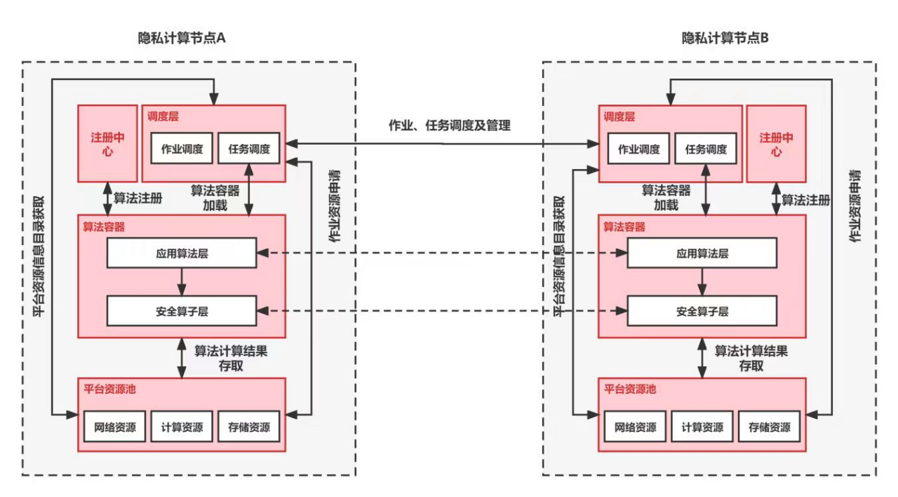

# 隐私计算互联互通控制层 API

- [隐私计算互联互通控制层 API](#隐私计算互联互通控制层-api)
  - [1 整体框架](#1-整体框架)
  - [2 通用报文头规范及公共出参](#2-通用报文头规范及公共出参)
    - [2.1  通用规范](#21--通用规范)
    - [2.2  通用报文头规范](#22--通用报文头规范)
    - [2.3  公共出参](#23--公共出参)
  - [3 流程调度接口（东西向）](#3-流程调度接口东西向)
    - [3.1 创建作业-调度方](#31-创建作业-调度方)
    - [3.2 创建作业](#32-创建作业)
    - [3.3 启动作业](#33-启动作业)
    - [3.4 启动任务](#34-启动任务)
    - [3.5 停止作业-调度方](#35-停止作业-调度方)
    - [3.6 停止作业](#36-停止作业)
    - [3.7 查询作业状态-调度方](#37-查询作业状态-调度方)
    - [3.8 查询任务回调信息](#38-查询任务回调信息)
    - [3.9 推送任务回调信息](#39-推送任务回调信息)
    - [3.10 作业审批确认](#310-作业审批确认)
  - [4 任务信息回调接口](#4-任务信息回调接口)
    - [4.1 回调任务信息](#41-回调任务信息)
  - [5 流程调度接口（南北向）](#5-流程调度接口南北向)
    - [5.1 创建作业](#51-创建作业)
    - [5.2 停止作业](#52-停止作业)
    - [5.3 查询作业状态](#53-查询作业状态)
    - [5.4 查询任务日志行数](#54-查询任务日志行数)
    - [5.5 查询任务日志](#55-查询任务日志)
    - [5.6 查询作业列表](#56-查询作业列表)
    - [5.7 停止任务](#57-停止任务)
    - [5.8 组件注册](#58-组件注册)
  - [6 数据模型](#6-数据模型)
    - [6.1 组件注册信息](#61-组件注册信息)
    - [6.2 组件结果信息](#62-组件结果信息)
    - [6.3 组件输出数据](#63-组件输出数据)
    - [6.4 组件输入数据](#64-组件输入数据)
    - [6.5 组件算法输入参数](#65-组件算法输入参数)
    - [6.6 作业运行配置](#66-作业运行配置)
    - [6.7 流程组合配置](#67-流程组合配置)


## 1 整体框架

隐私计算互联互通控制层模块包含流程调度和算法容器管理两部分内容，流程调度约定了互联互通平台基于南北向、东西向的作业调度控制以及任务调度控制接口，算法容器管理明确了平台对于算法容器的管理机制，包含组件注册与发现以及容器管理与加载。架构图如下：

<div align="center">
    
</div>

**文档版本**

```
v1.0.0
```

## 2 通用报文头规范及公共出参

### 2.1  通用规范

```python
Content-Type：application/json
HTTP Method：读GET，写POST
```

### 2.2  通用报文头规范

```
Request Header： 
x-auth-sign：        required 利用签约时指定的算法构造的签名值，用于安全校验，节点信息查询、合作申请、更新合作意向接口header无需包含X-Auth-Sign，节点签约完成后才能生成签名值；
x-csrf-protection:   required 避免跨站点请求伪造攻击， POST时必选
x-source-node-id:    required 请求方节点id；
x-target-node-id:    required 目的方节点id；
x-nonce：            required 系统生成的防重放随机串，如 UUID；
x-trace-id：         required 业务自定义标识，用于全链路跟踪；
x-timestamp：        required 调用方毫秒时间戳（Unix epoch time，具有时区无关性）。
x-mprac-token-set：  required 多方资源访问控制的许可凭证，用于多方资源访问控制，是资源的使用方向资源的持有方发资源操作时，所需要的凭证集合,集合元组之间，用逗号分割，单个许可凭证的格式定义如下为：统一资源名称/资源等级/资源授权令牌
```

注：调度层需协商生成 session-id，{session-id}={job-id}

### 2.3  公共出参

状态码 **200**

| 名称 | 类型   | 必选 | 中文名       | 说明               |
| ---- | ------ | ---- | ------------ | ------------------ |
| code | int32  | true | 状态码       | 200 正常，否则错误 |
| msg  | string | true | 错误信息     | none               |
| data | object | true | 响应数据内容 | none               |

## 3 流程调度接口（东西向）

### 3.1 创建作业-调度方

> POST /v1/interconn/schedule/job/create_all

**接口描述**

发起方向调度方发送创建作业请求时调用的接口

**请求参数**

| 名称              | 位置 | 类型     | 必选 | 中文名               | 说明                                     |
| ----------------- | ---- | -------- | ---- | -------------------- | ---------------------------------------- |
| job_id            | body | string   | 是   | 作业 ID              | 全局唯一，由发起方生成                   |
| flow_id           | body | string   | 否   | 流程 ID              | 作业所属流程 ID                          |
| dag               | body | DAG      | 是   | 流程中组件组合配置   | 描述组件组合流程的配置信息               |
| ⇥version         | body | string   | 是   | 版本                 | DAG 配置版本信息                         |
| ⇥components      | body | [object] | 是   | 组件列表             | 所有组件集合                             |
| ⇥⇥name          | body | string   | 是   | 组件名称             | none                                     |
| ⇥⇥componentName | body | string   | 是   | 组件类名             | none                                     |
| ⇥⇥version       | body | string   | 是   | 组件版本             | none                                     |
| ⇥⇥provider      | body | string   | 是   | 组件提供方           | none                                     |
| ⇥⇥input         | body | [object] | 是   | 组件输入信息         | none                                     |
| ⇥⇥⇥key         | body | string   | 是   | 输入名称             | none                                     |
| ⇥⇥⇥type        | body | string   | 是   | 输入类型             | none                                     |
| ⇥⇥output        | body | [object] | 是   | 组件输出信息         | none                                     |
| ⇥⇥⇥key         | body | string   | 是   | 输出名称             | none                                     |
| ⇥⇥⇥type        | body | string   | 是   | 输出类型             | none                                     |
| config            | body | Config   | 是   | 作业运行配置         | 作业参与方节点信息和每个组件参数配置等等 |
| ⇥version         | body | string   | 是   | 版本信息             | Config 配置的版本信息                    |
| ⇥initiator       | body | object   | 是   | 发起方节点信息       | none                                     |
| ⇥⇥role          | body | string   | 是   | 节点角色             | guest、host、arbiter 等等                |
| ⇥⇥node_id       | body | string   | 是   | 节点 ID              | none                                     |
| ⇥role            | body | object   | 是   | 参与方节点集合       | none                                     |
| ⇥⇥guest         | body | [string] | 是   | guest 节点           | none                                     |
| ⇥⇥host          | body | [string] | 是   | host 节点            | none                                     |
| ⇥⇥arbiter       | body | [string] | 是   | arbiter 节点         | none                                     |
| ⇥job_params      | body | object   | 是   | 作业参数配置         | none                                     |
| ⇥⇥common        | body | object   | 是   | 节点间共用参数配置   | none                                     |
| ⇥⇥guest         | body | object   | 是   | guest 节点参数配置   | key 为从 0 开始的序号                    |
| ⇥⇥host          | body | object   | 是   | host 节点参数配置    | key 为从 0 开始的序号                    |
| ⇥⇥arbiter       | body | object   | 是   | arbiter 节点参数配置 | key 为从 0 开始的序号                    |
| ⇥task_params     | body | object   | 是   | 任务参数配置         | none                                     |
| ⇥⇥common        | body | object   | 是   | 节点间共用参数配置   | none                                     |
| ⇥⇥guest         | body | object   | 是   | guest 节点参数配置   | key 为从 0 开始的序号                    |
| ⇥⇥host          | body | object   | 是   | host 节点参数配置    | key 为从 0 开始的序号                    |
| ⇥⇥arbiter       | body | object   | 是   | arbiter 节点参数配置 | none                                     |

> Body 请求参数

```json
{
  "job_id": "string",
  "flow_id": "string",
  "dag": {
    "version": "string",
    "components": [
      {
        "name": "string",
        "componentName": "string",
        "version": "string",
        "provider": "string",
        "input": [
          {
            "key": null,
            "type": null
          }
        ],
        "output": [
          {
            "key": null,
            "type": null
          }
        ]
      }
    ]
  },
  "config": {
    "version": "string",
    "initiator": {
      "role": "string",
      "node_id": "string"
    },
    "role": {
      "guest": [
        "string"
      ],
      "host": [
        "string"
      ],
      "arbiter": [
        "string"
      ]
    },
    "job_params": {
      "common": {},
      "guest": {},
      "host": {},
      "arbiter": {}
    },
    "task_params": {
      "common": {},
      "guest": {},
      "host": {},
      "arbiter": {}
    }
  }
}
```

**返回结果**

| 状态码 | 状态码含义                                              | 说明 | 数据模型 |
| ------ | ------------------------------------------------------- | ---- | -------- |
| 200    | [OK](https://tools.ietf.org/html/rfc7231#section-6.3.1) | 成功 | Inline   |

**返回数据结构**

状态码 **200**

| 名称 | 类型    | 必选 | 约束 | 中文名       | 说明               |
| ---- | ------- | ---- | ---- | ------------ | ------------------ |
| code | integer | true | none | 状态码       | 200 正常，否则错误 |
| msg  | string  | true | none | 错误信息     | none               |
| data | object  | true | none | 响应数据内容 | none               |

> 返回示例

> 200 Response

```json
{
  "code": 0,
  "msg": "string",
  "data": {}
}
```

### 3.2 创建作业

> POST /v1/interconn/schedule/job/create

**接口描述**

发起方或调度方向所有参与方发送创建作业请求时调用的接口

**请求参数**

| 名称              | 位置 | 类型     | 必选 | 中文名               | 说明                                     |
| ----------------- | ---- | -------- | ---- | -------------------- | ---------------------------------------- |
| job_id            | body | string   | 是   | 作业 ID              | 全局唯一，由发起方生成                   |
| flow_id           | body | string   | 否   | 流程 ID              | 作业所属流程 ID                          |
| dag               | body | DAG      | 是   | 流程中组件组合配置   | 描述组件组合流程的配置信息               |
| ⇥version         | body | string   | 是   | 版本                 | DAG 配置版本信息                         |
| ⇥components      | body | [object] | 是   | 组件列表             | 所有组件集合                             |
| ⇥⇥name          | body | string   | 是   | 组件名称             | none                                     |
| ⇥⇥componentName | body | string   | 是   | 组件类名             | none                                     |
| ⇥⇥version       | body | string   | 是   | 组件版本             | none                                     |
| ⇥⇥provider      | body | string   | 是   | 组件提供方           | none                                     |
| ⇥⇥input         | body | [object] | 是   | 组件输入信息         | none                                     |
| ⇥⇥⇥key         | body | string   | 是   | 输入名称             | none                                     |
| ⇥⇥⇥type        | body | string   | 是   | 输入类型             | none                                     |
| ⇥⇥output        | body | [object] | 是   | 组件输出信息         | none                                     |
| ⇥⇥⇥key         | body | string   | 是   | 输出名称             | none                                     |
| ⇥⇥⇥type        | body | string   | 是   | 输出类型             | none                                     |
| config            | body | Config   | 是   | 作业运行配置         | 作业参与方节点信息和每个组件参数配置等等 |
| ⇥version         | body | string   | 是   | 版本信息             | Config 配置的版本信息                    |
| ⇥initiator       | body | object   | 是   | 发起方节点信息       | none                                     |
| ⇥⇥role          | body | string   | 是   | 节点角色             | guest、host、arbiter 等等                |
| ⇥⇥node_id       | body | string   | 是   | 节点 ID              | none                                     |
| ⇥role            | body | object   | 是   | 参与方节点集合       | none                                     |
| ⇥⇥guest         | body | [string] | 是   | guest 节点           | none                                     |
| ⇥⇥host          | body | [string] | 是   | host 节点            | none                                     |
| ⇥⇥arbiter       | body | [string] | 是   | arbiter 节点         | none                                     |
| ⇥job_params      | body | object   | 是   | 作业参数配置         | none                                     |
| ⇥⇥common        | body | object   | 是   | 节点间共用参数配置   | none                                     |
| ⇥⇥guest         | body | object   | 是   | guest 节点参数配置   | key 为从 0 开始的序号                    |
| ⇥⇥host          | body | object   | 是   | host 节点参数配置    | key 为从 0 开始的序号                    |
| ⇥⇥arbiter       | body | object   | 是   | arbiter 节点参数配置 | key 为从 0 开始的序号                    |
| ⇥task_params     | body | object   | 是   | 任务参数配置         | none                                     |
| ⇥⇥common        | body | object   | 是   | 节点间共用参数配置   | none                                     |
| ⇥⇥guest         | body | object   | 是   | guest 节点参数配置   | key 为从 0 开始的序号                    |
| ⇥⇥host          | body | object   | 是   | host 节点参数配置    | key 为从 0 开始的序号                    |
| ⇥⇥arbiter       | body | object   | 是   | arbiter 节点参数配置 | none                                     |

> Body 请求参数

```json
{
  "job_id": "string",
  "flow_id": "string",
  "dag": {
    "version": "string",
    "components": [
      {
        "name": "string",
        "componentName": "string",
        "version": "string",
        "provider": "string",
        "input": [
          {
            "key": null,
            "type": null
          }
        ],
        "output": [
          {
            "key": null,
            "type": null
          }
        ]
      }
    ]
  },
  "config": {
    "version": "string",
    "initiator": {
      "role": "string",
      "node_id": "string"
    },
    "role": {
      "guest": [
        "string"
      ],
      "host": [
        "string"
      ],
      "arbiter": [
        "string"
      ]
    },
    "job_params": {
      "common": {},
      "guest": {},
      "host": {},
      "arbiter": {}
    },
    "task_params": {
      "common": {},
      "guest": {},
      "host": {},
      "arbiter": {}
    }
  }
}
```

**返回结果**

| 状态码 | 状态码含义                                              | 说明 | 数据模型 |
| ------ | ------------------------------------------------------- | ---- | -------- |
| 200    | [OK](https://tools.ietf.org/html/rfc7231#section-6.3.1) | 成功 | Inline   |

**返回数据结构**

状态码 **200**

| 名称 | 类型    | 必选 | 约束 | 中文名       | 说明               |
| ---- | ------- | ---- | ---- | ------------ | ------------------ |
| code | integer | true | none | 状态码       | 200 正常，否则错误 |
| msg  | string  | true | none | 错误信息     | none               |
| data | object  | true | none | 响应数据内容 | none               |

> 返回示例

> 200 Response

```json
{
  "code": 0,
  "msg": "string",
  "data": {}
}
```

### 3.3 启动作业

> POST /v1/interconn/schedule/job/start

**接口描述**

发起方或调度方向所有参与方发送启动作业请求时调用的接口，每个参与方只会被请求一次，当某个参与方包含多个角色时，有参与方自己根据作业配置将不同角色的任务启动

**请求参数**

| 名称   | 位置 | 类型   | 必选 | 中文名  | 说明     |
| ------ | ---- | ------ | ---- | ------- | -------- |
| job_id | body | string | 是   | 作业 ID | 全局唯一 |

> Body 请求参数

```json
{
  "job_id": "string"
}
```

**返回结果**

| 状态码 | 状态码含义                                              | 说明 | 数据模型 |
| ------ | ------------------------------------------------------- | ---- | -------- |
| 200    | [OK](https://tools.ietf.org/html/rfc7231#section-6.3.1) | 成功 | Inline   |

**返回数据结构**

状态码 **200**

| 名称 | 类型    | 必选 | 约束 | 中文名       | 说明               |
| ---- | ------- | ---- | ---- | ------------ | ------------------ |
| code | integer | true | none | 状态码       | 200 正常，否则错误 |
| msg  | string  | true | none | 错误信息     | none               |
| data | object  | true | none | 响应数据内容 | none               |

> 返回示例

> 200 Response

```json
{
  "code": 0,
  "msg": "string",
  "data": {}
}
```

### 3.4 启动任务

> POST /v1/interconn/schedule/task/start

**接口描述**

发起方或调度方向所有参与方发送启动任务请求时调用的接口

**请求参数**

| 名称      | 位置 | 类型   | 必选 | 中文名   | 说明                           |
| --------- | ---- | ------ | ---- | -------- | ------------------------------ |
| task_id   | body | string | 是   | 任务 ID  | 全局唯一，由发起方或调度方生成 |
| job_id    | body | string | 是   | 作业 ID  | 全局唯一                       |
| task_name | body | string | 是   | 组件名称 | 对应 DAG 中的 component_name   |

> Body 请求参数

```json
{
  "task_id": "string",
  "job_id": "string",
  "task_name": "string"
}
```

**返回结果**

| 状态码 | 状态码含义                                              | 说明 | 数据模型 |
| ------ | ------------------------------------------------------- | ---- | -------- |
| 200    | [OK](https://tools.ietf.org/html/rfc7231#section-6.3.1) | 成功 | Inline   |

**返回数据结构**

状态码 **200**

| 名称 | 类型    | 必选 | 约束 | 中文名       | 说明               |
| ---- | ------- | ---- | ---- | ------------ | ------------------ |
| code | integer | true | none | 状态码       | 200 正常，否则错误 |
| msg  | string  | true | none | 错误信息     | none               |
| data | object  | true | none | 响应数据内容 | none               |

> 返回示例

> 200 Response

```json
{
  "code": 0,
  "msg": "string",
  "data": {}
}
```

### 3.5 停止作业-调度方

> POST /v1/interconn/schedule/job/stop_all

**接口描述**

发起方向调度方发送停止作业请求时调用的接口

**请求参数**

| 名称      | 位置 | 类型   | 必选 | 中文名   | 说明                                                                                                                         |
| --------- | ---- | ------ | ---- | -------- | ---------------------------------------------------------------------------------------------------------------------------- |
| job_id    | body | string | 是   | 作业 ID  | 全局唯一                                                                                                                     |
| task_name | body | string | 否   | 组件名称 | 对应作业 DAG 中起点的 component_name 当该值不为空时，该任务被停止后，其后的所有任务都停止 当该值为空时，停止作业下的所有任务 |

> Body 请求参数

```json
{
  "job_id": "string",
  "task_name": "string"
}
```

**返回结果**

| 状态码 | 状态码含义                                              | 说明 | 数据模型 |
| ------ | ------------------------------------------------------- | ---- | -------- |
| 200    | [OK](https://tools.ietf.org/html/rfc7231#section-6.3.1) | 成功 | Inline   |

**返回数据结构**

状态码 **200**

| 名称 | 类型    | 必选 | 约束 | 中文名       | 说明               |
| ---- | ------- | ---- | ---- | ------------ | ------------------ |
| code | integer | true | none | 状态码       | 200 正常，否则错误 |
| msg  | string  | true | none | 错误信息     | none               |
| data | object  | true | none | 响应数据内容 | none               |

> 返回示例

> 200 Response

```json
{
  "code": 0,
  "msg": "string",
  "data": {}
}
```

### 3.6 停止作业

> POST /v1/interconn/schedule/job/stop

**接口描述**

发起方或调度方向所有参与方发送停止作业请求时调用的接口

**请求参数**

| 名称      | 位置 | 类型   | 必选 | 中文名   | 说明                                                                                                                         |
| --------- | ---- | ------ | ---- | -------- | ---------------------------------------------------------------------------------------------------------------------------- |
| job_id    | body | string | 是   | 作业 ID  | 全局唯一                                                                                                                     |
| task_name | body | string | 否   | 组件名称 | 对应作业 DAG 中起点的 component_name 当该值不为空时，该任务被停止后，其后的所有任务都停止 当该值为空时，停止作业下的所有任务 |

> Body 请求参数

```json
{
  "job_id": "string",
  "task_name": "string"
}
```

**返回结果**

| 状态码 | 状态码含义                                              | 说明 | 数据模型 |
| ------ | ------------------------------------------------------- | ---- | -------- |
| 200    | [OK](https://tools.ietf.org/html/rfc7231#section-6.3.1) | 成功 | Inline   |

**返回数据结构**

状态码 **200**

| 名称 | 类型    | 必选 | 约束 | 中文名       | 说明               |
| ---- | ------- | ---- | ---- | ------------ | ------------------ |
| code | integer | true | none | 状态码       | 200 正常，否则错误 |
| msg  | string  | true | none | 错误信息     | none               |
| data | object  | true | none | 响应数据内容 | none               |

> 返回示例

> 200 Response

```json
{
  "code": 0,
  "msg": "string",
  "data": {}
}
```

### 3.7 查询作业状态-调度方

> GET /v1/interconn/schedule/job/status_all

**接口描述**

某个参与方向调度方发起查询作业状态时调用的接口

**请求参数**

| 名称   | 位置  | 类型   | 必选 | 中文名 | 说明    |
| ------ | ----- | ------ | ---- | ------ | ------- |
| job_id | query | string | 是   |        | 作业 ID |

**返回结果**

| 状态码 | 状态码含义                                              | 说明 | 数据模型 |
| ------ | ------------------------------------------------------- | ---- | -------- |
| 200    | [OK](https://tools.ietf.org/html/rfc7231#section-6.3.1) | 成功 | Inline   |

**返回数据结构**

状态码 **200**

| 名称         | 类型    | 必选 | 约束 | 中文名             | 说明                                               |
| ------------ | ------- | ---- | ---- | ------------------ | -------------------------------------------------- |
| code         | integer | true | none | 状态码             | 200 正常，否则错误                                 |
| msg          | string  | true | none | 错误信息           | none                                               |
| data         | object  | true | none | 响应数据内容       | none                                               |
| ⇥job_status | string  | true | none | 作业状态           | 状态有 PENDING、READY、REJECTED、RUNNING、FINISHED |
| ⇥status     | object  | true | none | 作业中所有任务状态 | none                                               |

> 返回示例

> 200 Response

```json
{
  "code": 0,
  "msg": "string",
  "data": {
    "job_status": "string",
    "status": {}
  }
}
```

### 3.8 查询任务回调信息

> POST /v1/interconn/schedule/task/poll

**接口描述**

发起方或调度方向所有参与方查询任务回调信息时调用的接口

**请求参数**

| 名称    | 位置 | 类型   | 必选 | 中文名  | 说明                 |
| ------- | ---- | ------ | ---- | ------- | -------------------- |
| task_id | body | string | 是   | 任务 ID | none                 |
| role    | body | string | 是   | 角色    | 当前回调节点所属角色 |

> Body 请求参数

```json
{
  "task_id": "string",
  "role": "string"
}
```

**返回结果**

| 状态码 | 状态码含义                                              | 说明 | 数据模型 |
| ------ | ------------------------------------------------------- | ---- | -------- |
| 200    | [OK](https://tools.ietf.org/html/rfc7231#section-6.3.1) | 成功 | Inline   |

**返回数据结构**

状态码 **200**

| 名称     | 类型    | 必选 | 约束 | 中文名       | 说明                                     |
| -------- | ------- | ---- | ---- | ------------ | ---------------------------------------- |
| code     | integer | true | none | 状态码       | 200 正常，否则错误                       |
| msg      | string  | true | none | 错误信息     | none                                     |
| data     | object  | true | none | 响应数据内容 | none                                     |
| ⇥status | string  | true | none | 状态         | PENDING、READY、RUNNING、SUCCESS、FAILED |

> 返回示例

> 200 Response

```json
{
  "code": 0,
  "msg": "string",
  "data": {
    "status": "string"
  }
}
```

### 3.9 推送任务回调信息

> POST /v1/interconn/schedule/task/callback

**接口描述**

任意参与方向发起方或调度方向推送任务回调信息时调用的接口

**请求参数**

| 名称    | 位置 | 类型   | 必选 | 中文名   | 说明                                     |
| ------- | ---- | ------ | ---- | -------- | ---------------------------------------- |
| task_id | body | string | 是   | 任务 ID  | none                                     |
| status  | body | string | 是   | 任务状态 | PENDING、READY、RUNNING、SUCCESS、FAILED |
| role    | body | string | 是   | 角色     | 当前回调节点所属角色                     |

> Body 请求参数

```json
{
  "task_id": "string",
  "status": "string",
  "role": "string"
}
```

**返回结果**

| 状态码 | 状态码含义                                              | 说明 | 数据模型 |
| ------ | ------------------------------------------------------- | ---- | -------- |
| 200    | [OK](https://tools.ietf.org/html/rfc7231#section-6.3.1) | 成功 | Inline   |

**返回数据结构**

状态码 **200**

| 名称 | 类型    | 必选 | 约束 | 中文名       | 说明               |
| ---- | ------- | ---- | ---- | ------------ | ------------------ |
| code | integer | true | none | 状态码       | 200 正常，否则错误 |
| msg  | string  | true | none | 错误信息     | none               |
| data | object  | true | none | 响应数据内容 | none               |

> 返回示例

> 200 Response

```json
{
  "code": 0,
  "msg": "string",
  "data": {}
}
```

### 3.10 作业审批确认

> POST /v1/interconn/schedule/job/audit_confirm

**接口描述**

某个参与方向调度方或发起方作业审批结果时调用的接口

**请求参数**

| 名称   | 位置 | 类型   | 必选 | 中文名   | 说明            |
| ------ | ---- | ------ | ---- | -------- | --------------- |
| job_id | body | string | 是   | 作业 ID  | none            |
| status | body | string | 是   | 作业状态 | READY、REJECTED |

> Body 请求参数

```json
{
  "job_id": "string",
  "status": "string"
}
```

**返回结果**

| 状态码 | 状态码含义                                              | 说明 | 数据模型 |
| ------ | ------------------------------------------------------- | ---- | -------- |
| 200    | [OK](https://tools.ietf.org/html/rfc7231#section-6.3.1) | 成功 | Inline   |

**返回数据结构**

状态码 **200**

| 名称 | 类型    | 必选 | 约束 | 中文名       | 说明               |
| ---- | ------- | ---- | ---- | ------------ | ------------------ |
| code | integer | true | none | 状态码       | 200 正常，否则错误 |
| msg  | string  | true | none | 错误信息     | none               |
| data | object  | true | none | 响应数据内容 | none               |

> 返回示例

> 200 Response

```json
{
  "code": 0,
  "msg": "string",
  "data": {}
}
```

## 4 任务信息回调接口

### 4.1 回调任务信息

> POST /v1/platform/schedule/task/callback

**接口描述**

某个参与方的算法组件层将任务运行的状态等回调信息推送给调度层时调用的接口

**请求参数**

| 名称    | 位置 | 类型   | 必选 | 中文名   | 说明                     |
| ------- | ---- | ------ | ---- | -------- | ------------------------ |
| task_id | body | string | 是   | 任务 ID  | none                     |
| status  | body | string | 是   | 任务状态 | RUNNING、SUCCESS、FAILED |
| role    | body | string | 是   | 角色     | 回调任务节点所属角色     |

> Body 请求参数

```json
{
  "task_id": "string",
  "status": "string",
  "role": "string"
}
```

**返回结果**

| 状态码 | 状态码含义                                              | 说明 | 数据模型 |
| ------ | ------------------------------------------------------- | ---- | -------- |
| 200    | [OK](https://tools.ietf.org/html/rfc7231#section-6.3.1) | 成功 | Inline   |

**返回数据结构**

状态码 **200**

| 名称 | 类型    | 必选 | 约束 | 中文名       | 说明               |
| ---- | ------- | ---- | ---- | ------------ | ------------------ |
| code | integer | true | none | 状态码       | 200 正常，否则错误 |
| msg  | string  | true | none | 错误信息     | none               |
| data | object  | true | none | 响应数据内容 | none               |

> 返回示例

> 200 Response

```json
{
  "code": 0,
  "msg": "string",
  "data": {}
}
```

## 5 流程调度接口（南北向）

### 5.1 创建作业

> POST /v1/platform/schedule/job/create_all

**接口描述**

发起方发起创建作业配置，并发送给己方调度层时调用的接口

**请求参数**

| 名称              | 位置 | 类型     | 必选 | 中文名               | 说明                                                      |
| ----------------- | ---- | -------- | ---- | -------------------- | --------------------------------------------------------- |
| flow_id           | body | string   | 否   | 流程 ID              | 该参数调度层不会使用，只会用来存储 flow 和 job 的对应关系 |
| dag               | body | DAG      | 是   | 流程中组件组合配置   | 描述组件组合流程的配置信息                                |
| ⇥version         | body | string   | 是   | 版本                 | DAG 配置版本信息                                          |
| ⇥components      | body | [object] | 是   | 组件列表             | 所有组件集合                                              |
| ⇥⇥name          | body | string   | 是   | 组件名称             | none                                                      |
| ⇥⇥componentName | body | string   | 是   | 组件类名             | none                                                      |
| ⇥⇥version       | body | string   | 是   | 组件版本             | none                                                      |
| ⇥⇥provider      | body | string   | 是   | 组件提供方           | none                                                      |
| ⇥⇥input         | body | [object] | 是   | 组件输入信息         | none                                                      |
| ⇥⇥⇥key         | body | string   | 是   | 输入名称             | none                                                      |
| ⇥⇥⇥type        | body | string   | 是   | 输入类型             | none                                                      |
| ⇥⇥output        | body | [object] | 是   | 组件输出信息         | none                                                      |
| ⇥⇥⇥key         | body | string   | 是   | 输出名称             | none                                                      |
| ⇥⇥⇥type        | body | string   | 是   | 输出类型             | none                                                      |
| config            | body | Config   | 是   | 作业运行配置         | 作业参与方节点信息和每个组件参数配置等等                  |
| ⇥version         | body | string   | 是   | 版本信息             | Config 配置的版本信息                                     |
| ⇥initiator       | body | object   | 是   | 发起方节点信息       | none                                                      |
| ⇥⇥role          | body | string   | 是   | 节点角色             | guest、host、arbiter 等等                                 |
| ⇥⇥node_id       | body | string   | 是   | 节点 ID              | none                                                      |
| ⇥role            | body | object   | 是   | 参与方节点集合       | none                                                      |
| ⇥⇥guest         | body | [string] | 是   | guest 节点           | none                                                      |
| ⇥⇥host          | body | [string] | 是   | host 节点            | none                                                      |
| ⇥⇥arbiter       | body | [string] | 是   | arbiter 节点         | none                                                      |
| ⇥job_params      | body | object   | 是   | 作业参数配置         | none                                                      |
| ⇥⇥common        | body | object   | 是   | 节点间共用参数配置   | none                                                      |
| ⇥⇥guest         | body | object   | 是   | guest 节点参数配置   | key 为从 0 开始的序号                                     |
| ⇥⇥host          | body | object   | 是   | host 节点参数配置    | key 为从 0 开始的序号                                     |
| ⇥⇥arbiter       | body | object   | 是   | arbiter 节点参数配置 | key 为从 0 开始的序号                                     |
| ⇥task_params     | body | object   | 是   | 任务参数配置         | none                                                      |
| ⇥⇥common        | body | object   | 是   | 节点间共用参数配置   | none                                                      |
| ⇥⇥guest         | body | object   | 是   | guest 节点参数配置   | key 为从 0 开始的序号                                     |
| ⇥⇥host          | body | object   | 是   | host 节点参数配置    | key 为从 0 开始的序号                                     |
| ⇥⇥arbiter       | body | object   | 是   | arbiter 节点参数配置 | none                                                      |

> Body 请求参数

```json
{
  "flow_id": "string",
  "dag": {
    "version": "string",
    "components": [
      {
        "name": "string",
        "componentName": "string",
        "version": "string",
        "provider": "string",
        "input": [
          {
            "key": null,
            "type": null
          }
        ],
        "output": [
          {
            "key": null,
            "type": null
          }
        ]
      }
    ]
  },
  "config": {
    "version": "string",
    "initiator": {
      "role": "string",
      "node_id": "string"
    },
    "role": {
      "guest": [
        "string"
      ],
      "host": [
        "string"
      ],
      "arbiter": [
        "string"
      ]
    },
    "job_params": {
      "common": {},
      "guest": {},
      "host": {},
      "arbiter": {}
    },
    "task_params": {
      "common": {},
      "guest": {},
      "host": {},
      "arbiter": {}
    }
  }
}
```

**返回结果**

| 状态码 | 状态码含义                                              | 说明 | 数据模型 |
| ------ | ------------------------------------------------------- | ---- | -------- |
| 200    | [OK](https://tools.ietf.org/html/rfc7231#section-6.3.1) | 成功 | Inline   |

**返回数据结构**

状态码 **200**

| 名称     | 类型    | 必选 | 约束 | 中文名       | 说明               |
| -------- | ------- | ---- | ---- | ------------ | ------------------ |
| code     | integer | true | none | 状态码       | 200 正常，否则错误 |
| msg      | string  | true | none | 错误信息     | none               |
| data     | object  | true | none | 响应数据内容 | none               |
| ⇥job_id | string  | true | none | 作业 ID      | 全局唯一           |

> 返回示例

> 200 Response

```json
{
  "code": 0,
  "msg": "string",
  "data": {
    "job_id": "string"
  }
}
```

### 5.2 停止作业

> POST /v1/platform/schedule/job/stop_all

**接口描述**

发起方向己方调度层发起停止作业时调用的接口

**请求参数**

| 名称   | 位置 | 类型   | 必选 | 中文名  | 说明     |
| ------ | ---- | ------ | ---- | ------- | -------- |
| job_id | body | string | 是   | 作业 ID | 全局唯一 |

> Body 请求参数

```json
{
  "job_id": "string"
}
```

**返回结果**

| 状态码 | 状态码含义                                              | 说明 | 数据模型 |
| ------ | ------------------------------------------------------- | ---- | -------- |
| 200    | [OK](https://tools.ietf.org/html/rfc7231#section-6.3.1) | 成功 | Inline   |

**返回数据结构**

状态码 **200**

| 名称 | 类型    | 必选 | 约束 | 中文名       | 说明               |
| ---- | ------- | ---- | ---- | ------------ | ------------------ |
| code | integer | true | none | 状态码       | 200 正常，否则错误 |
| msg  | string  | true | none | 错误信息     | none               |
| data | object  | true | none | 响应数据内容 | none               |

> 返回示例

> 200 Response

```json
{
  "code": 0,
  "msg": "string",
  "data": {}
}
```

### 5.3 查询作业状态

> GET /v1/platform/schedule/job/status_all

**接口描述**

某个参与方向己方调度层发起查询作业状态时调用的接口

**请求参数**

| 名称   | 位置  | 类型   | 必选 | 中文名 | 说明    |
| ------ | ----- | ------ | ---- | ------ | ------- |
| job_id | query | string | 是   |        | 作业 ID |

**返回结果**

| 状态码 | 状态码含义                                              | 说明 | 数据模型 |
| ------ | ------------------------------------------------------- | ---- | -------- |
| 200    | [OK](https://tools.ietf.org/html/rfc7231#section-6.3.1) | 成功 | Inline   |

**返回数据结构**

状态码 **200**

| 名称         | 类型    | 必选  | 约束 | 中文名             | 说明                                                                                                 |
| ------------ | ------- | ----- | ---- | ------------------ | ---------------------------------------------------------------------------------------------------- |
| code         | integer | true  | none | 状态码             | 200 正常，否则错误                                                                                   |
| msg          | string  | true  | none | 错误信息           | none                                                                                                 |
| data         | object  | true  | none | 响应数据内容       | none                                                                                                 |
| ⇥job_status | string  | true  | none | 作业状态           | 状态有 PENDING、READY、REJECTED、RUNNING、FINISHED                                                   |
| ⇥status     | object  | false | none | 作业中任务状态集合 | 作业中所有任务的状态，key 为 task_id，value 为任务的状态，任务状态有 READY、RUNNING、SUCCESS、FAILED |

> 返回示例

> 200 Response

```json
{
  "code": 0,
  "msg": "string",
  "data": {
    "job_status": "string",
    "status": {}
  }
}
```

### 5.4 查询任务日志行数

> GET /v1/platform/schedule/task/get_log_line

**接口描述**

某个参与方节点上层服务向调度层获取任务运行日志行数时调用的接口

**请求参数**

| 名称      | 位置  | 类型   | 必选 | 中文名 | 说明                       |
| --------- | ----- | ------ | ---- | ------ | -------------------------- |
| task_id   | query | string | 是   |        | 任务 ID                    |
| log_level | query | string | 是   |        | 日志类型，info/debug/error |

**返回结果**

| 状态码 | 状态码含义                                              | 说明 | 数据模型 |
| ------ | ------------------------------------------------------- | ---- | -------- |
| 200    | [OK](https://tools.ietf.org/html/rfc7231#section-6.3.1) | 成功 | Inline   |

**返回数据结构**

状态码 **200**

| 名称  | 类型    | 必选 | 约束 | 中文名       | 说明               |
| ----- | ------- | ---- | ---- | ------------ | ------------------ |
| code  | integer | true | none | 状态码       | 200 正常，否则错误 |
| msg   | string  | true | none | 错误信息     | none               |
| data  | object  | true | none | 响应数据内容 | none               |
| ⇥num | integer | true | none | 日志行数     | none               |

> 返回示例

> 200 Response

```json
{
  "code": 0,
  "msg": "string",
  "data": {
    "num": 0
  }
}
```

### 5.5 查询任务日志

> GET /v1/platform/schedule/task/get_log

**接口描述**

某个参与方节点上层服务向调度层获取任务运行日志内容时调用的接口

**请求参数**

| 名称      | 位置  | 类型    | 必选 | 中文名 | 说明                                         |
| --------- | ----- | ------- | ---- | ------ | -------------------------------------------- |
| task_id   | query | string  | 是   |        | 任务 ID                                      |
| log_level | query | string  | 是   |        | 日志类型，info/debug/error                   |
| start     | query | integer | 是   |        | 日志起始行                                   |
| length    | query | integer | 否   |        | 查询的日志行数，为空则返回起始行后的所有内容 |

**返回结果**

| 状态码 | 状态码含义                                              | 说明 | 数据模型 |
| ------ | ------------------------------------------------------- | ---- | -------- |
| 200    | [OK](https://tools.ietf.org/html/rfc7231#section-6.3.1) | 成功 | Inline   |

**返回数据结构**

状态码 **200**

| 名称   | 类型    | 必选 | 约束 | 中文名       | 说明               |
| ------ | ------- | ---- | ---- | ------------ | ------------------ |
| code   | integer | true | none | 状态码       | 200 正常，否则错误 |
| msg    | string  | true | none | 错误信息     | none               |
| data   | object  | true | none | 响应数据内容 | none               |
| ⇥data | string  | true | none | 日志内容     | none               |

> 返回示例

> 200 Response

```json
{
  "code": 0,
  "msg": "string",
  "data": {
    "data": "string"
  }
}
```

### 5.6 查询作业列表

> GET /v1/platform/schedule/job/query_job_list

**接口描述**

某个参与方向己方调度层发起查询作业列表时调用的接口

**请求参数**

| 名称    | 位置  | 类型   | 必选 | 中文名 | 说明    |
| ------- | ----- | ------ | ---- | ------ | ------- |
| flow_id | query | string | 否   |        | 流程 ID |

**返回结果**

| 状态码 | 状态码含义                                              | 说明 | 数据模型 |
| ------ | ------------------------------------------------------- | ---- | -------- |
| 200    | [OK](https://tools.ietf.org/html/rfc7231#section-6.3.1) | 成功 | Inline   |

**返回数据结构**

状态码 **200**

| 名称       | 类型    | 必选 | 约束 | 中文名       | 说明                                                                                                |
| ---------- | ------- | ---- | ---- | ------------ | --------------------------------------------------------------------------------------------------- |
| code       | integer | true | none | 状态码       | 200 正常，否则错误                                                                                  |
| msg        | string  | true | none | 错误信息     | none                                                                                                |
| data       | object  | true | none | 响应数据内容 | none                                                                                                |
| ⇥job_list | object  | true | none | 作业列表     | 作业列表，key 为 job_id，value 为作业的状态，作业状态有 PENDING、READY、REJECTED、RUNNING、FINISHED |

> 返回示例

> 200 Response

```json
{
  "code": 0,
  "msg": "string",
  "data": {
    "job_list": {}
  }
}
```

### 5.7 停止任务

> POST /v1/platform/schedule/job/stop_task

**接口描述**

发起方向己方调度层发起停止任务时调用的接口

**请求参数**

| 名称      | 位置 | 类型   | 必选 | 中文名   | 说明                                 |
| --------- | ---- | ------ | ---- | -------- | ------------------------------------ |
| job_id    | body | string | 是   | 作业 ID  | none                                 |
| task_name | body | string | 是   | 组件名称 | 对应作业 DAG 中起点的 component_name |

> Body 请求参数

```json
{
  "job_id": "string",
  "task_name": "string"
}
```

**返回结果**

| 状态码 | 状态码含义                                              | 说明 | 数据模型 |
| ------ | ------------------------------------------------------- | ---- | -------- |
| 200    | [OK](https://tools.ietf.org/html/rfc7231#section-6.3.1) | 成功 | response |

> 返回示例

> 200 Response

```json
{
  "code": 0,
  "msg": "string",
  "data": {}
}
```

### 5.8 组件注册

> POST /v1/platform/schedule/component/register

**接口描述**

向平台控制层注册异构平台的算法组件时调用的接口，需传入算法组件镜像 url 和组件注册信息等参数

**请求参数**

| 名称                  | 位置 | 类型          | 必选 | 中文名                   | 说明                                                                                                                                                                                                                                                                                                                                                                                                                                                                                                                                                                   |
| --------------------- | ---- | ------------- | ---- | ------------------------ | ---------------------------------------------------------------------------------------------------------------------------------------------------------------------------------------------------------------------------------------------------------------------------------------------------------------------------------------------------------------------------------------------------------------------------------------------------------------------------------------------------------------------------------------------------------------------- |
| imageUrl              | body | string        | 是   | 算法组件镜像地址         | none                                                                                                                                                                                                                                                                                                                                                                                                                                                                                                                                                                   |
| component_info        | body | ComponentInfo | 是   | 算法组件信息             | none                                                                                                                                                                                                                                                                                                                                                                                                                                                                                                                                                                   |
| ⇥componentName       | body | string        | 是   | 算法组件名称             | 跟算法容器的环境变量相对应                                                                                                                                                                                                                                                                                                                                                                                                                                                                                                                                             |
| ⇥title               | body | string        | 是   | 页面显示名称             | none                                                                                                                                                                                                                                                                                                                                                                                                                                                                                                                                                                   |
| ⇥provider            | body | string        | 是   | 算法提供商               | none                                                                                                                                                                                                                                                                                                                                                                                                                                                                                                                                                                   |
| ⇥version             | body | string        | 是   | 算法版本                 | none                                                                                                                                                                                                                                                                                                                                                                                                                                                                                                                                                                   |
| ⇥description         | body | string        | 否   | 算法描述信息             | none                                                                                                                                                                                                                                                                                                                                                                                                                                                                                                                                                                   |
| ⇥roleList            | body | [string]      | 是   | 算法支持的角色定义       | 数组类型。例如：["guest", "host","arbiter"]                                                                                                                                                                                                                                                                                                                                                                                                                                                                                                                            |
| ⇥desVersion          | body | string        | 否   | 描述文件版本             | none                                                                                                                                                                                                                                                                                                                                                                                                                                                                                                                                                                   |
| ⇥storageEngine       | body | [string]      | 是   | 算法组件所支持的存储引擎 | 数组类型。如：["s3", "hdfs","eggroll"]                                                                                                                                                                                                                                                                                                                                                                                                                                                                                                                                 |
| ⇥inputParam          | body | [InputParam]  | 是   | 算法输入参数             | none                                                                                                                                                                                                                                                                                                                                                                                                                                                                                                                                                                   |
| ⇥⇥ 组件算法输入参数 | body | InputParam    | 否   | 组件算法输入参数         | none                                                                                                                                                                                                                                                                                                                                                                                                                                                                                                                                                                   |
| ⇥⇥⇥name            | body | string        | 是   | 形式参数名称             | 跟算法容器的环境变量相对应                                                                                                                                                                                                                                                                                                                                                                                                                                                                                                                                             |
| ⇥⇥⇥title           | body | string        | 是   | 页面显示字段标题         | none                                                                                                                                                                                                                                                                                                                                                                                                                                                                                                                                                                   |
| ⇥⇥⇥description     | body | string        | 否   | 参数描述                 | none                                                                                                                                                                                                                                                                                                                                                                                                                                                                                                                                                                   |
| ⇥⇥⇥type            | body | string        | 是   | 输入参数类型             | string：字符串类型 int: 整数类型 float: 浮点数类型 boolean: 布尔类型 integer: 整型对象，可以为 null number: 数值型，包括整数和小数（当不具体区分整型和浮点型时采用该种类型） object: 复杂类型,可以使用 json 表示,前端就具体的 json 数据结构可扩展相关控件。 ...等其他类型                                                                                                                                                                                                                                                                                              |
| ⇥⇥⇥bindingData     | body | [object]      | 否   | 可枚举的静态绑定数据     | 可枚举的静态绑定数据,可以引用外部其它函数获取控件绑定的数据,如可渲染下拉菜单、单选框、多选框等的数据获取方式 例如 1:静态绑定数据 bindingData:"[{label: "${label}",value: "${value}"}]",其中是可以执行的 kv Json，格式参考为 kv 数组。 例如 2:动态绑定数据 bindingData:"call_function getKV()"。//定义一个调用的回调函数获取数据， 这里的 call_function 作为一个函数调用的标识符使用，解析执行器使用 call_function 作为标识符判断，用于与静态值区别， 后面的 getKV()，解析执行器需要保障执行上下文中存在可调用的 getKV()函数，getKV()的函数命名，在实际使用中，可自定义。 |
| ⇥⇥⇥optional        | body | boolean       | 是   | 参数是否可选             | 默认为 true 表示可选,false 表示必填                                                                                                                                                                                                                                                                                                                                                                                                                                                                                                                                    |
| ⇥⇥⇥defaultValue    | body | string        | 否   | 参数默认值               | none                                                                                                                                                                                                                                                                                                                                                                                                                                                                                                                                                                   |
| ⇥⇥⇥validator       | body | string        | 否   | 参数校验器               | 如可以写成 regular:'正则表达式',来做正则验证；使用（inf,sup）来对数值的上下界限进行限定                                                                                                                                                                                                                                                                                                                                                                                                                                                                                |
| ⇥⇥⇥dependsOn       | body | [string]      | 否   | 算法的条件参数           | 只用于 bindingData,表示算法的条件参数，用于组件内部依赖关系展示,默认为空值。若依赖于上游参数，则提供依赖列表，如：["param.value",""]                                                                                                                                                                                                                                                                                                                                                                                                                                   |
| ⇥⇥⇥UIPattern       | body | string        | 否   | 参数的 UI 模式           | 默认为 editeable,此外有 readOnly 表示只读,hidden,表示隐藏控件                                                                                                                                                                                                                                                                                                                                                                                                                                                                                                          |
| ⇥⇥⇥groupTag        | body | [string]      | 否   | 分组标签                 | 用于分组显示,如[默认分组-显示、高级分组-默认不显示]                                                                                                                                                                                                                                                                                                                                                                                                                                                                                                                    |
| ⇥⇥⇥UIType          | body | string        | 否   | 前端参数控件类型         | 默认为 input,其它的比如 textArea,numberPicker、checkbox、redio、switch、select、selectTree 等                                                                                                                                                                                                                                                                                                                                                                                                                                                                          |
| ⇥inputData           | body | [InputData]   | 是   | 算法组件输入数据         | none                                                                                                                                                                                                                                                                                                                                                                                                                                                                                                                                                                   |
| ⇥⇥ 组件输入数据     | body | InputData     | 否   | 组件输入数据             | none                                                                                                                                                                                                                                                                                                                                                                                                                                                                                                                                                                   |
| ⇥⇥⇥name            | body | string        | 是   | 形式参数名称             | 跟算法容器的环境变量相对应                                                                                                                                                                                                                                                                                                                                                                                                                                                                                                                                             |
| ⇥⇥⇥description     | body | string        | 否   | 数据描述信息             | none                                                                                                                                                                                                                                                                                                                                                                                                                                                                                                                                                                   |
| ⇥⇥⇥category        | body | string        | 是   | 数据类型                 | model、dataset、training_set、test_set、datasets（多个数据文件）                                                                                                                                                                                                                                                                                                                                                                                                                                                                                                       |
| ⇥⇥⇥dataFormat      | body | [string]      | 是   | 数据文件格式             | 数组类型。如：["csv","pmml","json","yaml","zip"]                                                                                                                                                                                                                                                                                                                                                                                                                                                                                                                       |
| ⇥outputData          | body | [OutputData]  | 是   | 算法组件输出数据         | none                                                                                                                                                                                                                                                                                                                                                                                                                                                                                                                                                                   |
| ⇥⇥ 组件输出数据     | body | OutputData    | 否   | 组件输出数据             | none                                                                                                                                                                                                                                                                                                                                                                                                                                                                                                                                                                   |
| ⇥⇥⇥name            | body | string        | 是   | 形式参数名称             | 跟算法容器的环境变量相对应                                                                                                                                                                                                                                                                                                                                                                                                                                                                                                                                             |
| ⇥⇥⇥description     | body | string        | 否   | 数据描述信息             | none                                                                                                                                                                                                                                                                                                                                                                                                                                                                                                                                                                   |
| ⇥⇥⇥category        | body | string        | 是   | 数据类型                 | model、dataset、training_set、test_set、report、metric                                                                                                                                                                                                                                                                                                                                                                                                                                                                                                                 |
| ⇥⇥⇥dataFormat      | body | [string]      | 是   | 数据文件格式             | 数组类型。如：["csv","pmml","json","yaml","zip"]                                                                                                                                                                                                                                                                                                                                                                                                                                                                                                                       |
| ⇥result              | body | [Result]      | 是   | 算法组件异常信息         | none                                                                                                                                                                                                                                                                                                                                                                                                                                                                                                                                                                   |
| ⇥⇥ 组件结果信息     | body | Result        | 否   | 组件结果信息             | none                                                                                                                                                                                                                                                                                                                                                                                                                                                                                                                                                                   |
| ⇥⇥⇥resultCode      | body | string        | 是   | 结果编码                 | none                                                                                                                                                                                                                                                                                                                                                                                                                                                                                                                                                                   |
| ⇥⇥⇥resultMessage   | body | string        | 是   | 结果提示信息             | none                                                                                                                                                                                                                                                                                                                                                                                                                                                                                                                                                                   |

> Body 请求参数

```json
{
  "imageUrl": "string",
  "component_info": {
    "componentName": "string",
    "title": "string",
    "provider": "string",
    "version": "string",
    "description": "string",
    "roleList": [
      "string"
    ],
    "desVersion": "string",
    "storageEngine": [
      "string"
    ],
    "inputParam": [
      {
        "name": "string",
        "title": "string",
        "description": "string",
        "type": "string",
        "bindingData": [
          {}
        ],
        "optional": true,
        "defaultValue": "string",
        "validator": "string",
        "dependsOn": [
          "string"
        ],
        "UIPattern": "string",
        "groupTag": [
          "string"
        ],
        "UIType": "string"
      }
    ],
    "inputData": [
      {
        "name": "string",
        "description": "string",
        "category": "string",
        "dataFormat": [
          "string"
        ]
      }
    ],
    "outputData": [
      {
        "name": "string",
        "description": "string",
        "category": "string",
        "dataFormat": [
          "string"
        ]
      }
    ],
    "result": [
      {
        "resultCode": "string",
        "resultMessage": "string"
      }
    ]
  }
}
```

**返回结果**

| 状态码 | 状态码含义                                              | 说明 | 数据模型 |
| ------ | ------------------------------------------------------- | ---- | -------- |
| 200    | [OK](https://tools.ietf.org/html/rfc7231#section-6.3.1) | 成功 | Inline   |

**返回数据结构**

状态码 **200**

| 名称 | 类型    | 必选 | 约束 | 中文名       | 说明               |
| ---- | ------- | ---- | ---- | ------------ | ------------------ |
| code | integer | true | none | 状态码       | 200 正常，否则错误 |
| msg  | string  | true | none | 错误信息     | none               |
| data | object  | true | none | 响应数据内容 | none               |

> 返回示例

> 200 Response

```json
{
  "code": 0,
  "msg": "string",
  "data": {}
}
```

## 6 数据模型

### 6.1 组件注册信息

**属性**

| 名称          | 类型         | 必选  | 约束 | 中文名                   | 说明                                        |
| ------------- | ------------ | ----- | ---- | ------------------------ | ------------------------------------------- |
| componentName | string       | true  | none | 算法组件名称             | 跟算法容器的环境变量相对应                  |
| title         | string       | true  | none | 页面显示名称             | none                                        |
| provider      | string       | true  | none | 算法提供商               | none                                        |
| version       | string       | true  | none | 算法版本                 | none                                        |
| description   | string       | false | none | 算法描述信息             | none                                        |
| roleList      | [string]     | true  | none | 算法支持的角色定义       | 数组类型。例如：["guest", "host","arbiter"] |
| desVersion    | string       | false | none | 描述文件版本             | none                                        |
| storageEngine | [string]     | true  | none | 算法组件所支持的存储引擎 | 数组类型。如：["s3", "hdfs","eggroll"]      |
| inputParam    | [InputParam] | true  | none | 算法输入参数             | none                                        |
| inputData     | [InputData]  | true  | none | 算法组件输入数据         | none                                        |
| outputData    | [OutputData] | true  | none | 算法组件输出数据         | none                                        |
| result        | [Result]     | true  | none | 算法组件异常信息         | none                                        |

**ComponentInfo**

```json
{
  "componentName": "string",
  "title": "string",
  "provider": "string",
  "version": "string",
  "description": "string",
  "roleList": [
    "string"
  ],
  "desVersion": "string",
  "storageEngine": [
    "string"
  ],
  "inputParam": [
    {
      "name": "string",
      "title": "string",
      "description": "string",
      "type": "string",
      "bindingData": [
        {}
      ],
      "optional": true,
      "defaultValue": "string",
      "validator": "string",
      "dependsOn": [
        "string"
      ],
      "UIPattern": "string",
      "groupTag": [
        "string"
      ],
      "UIType": "string"
    }
  ],
  "inputData": [
    {
      "name": "string",
      "description": "string",
      "category": "string",
      "dataFormat": [
        "string"
      ]
    }
  ],
  "outputData": [
    {
      "name": "string",
      "description": "string",
      "category": "string",
      "dataFormat": [
        "string"
      ]
    }
  ],
  "result": [
    {
      "resultCode": "string",
      "resultMessage": "string"
    }
  ]
}
```

### 6.2 组件结果信息

**属性**

| 名称          | 类型   | 必选 | 约束 | 中文名       | 说明 |
| ------------- | ------ | ---- | ---- | ------------ | ---- |
| resultCode    | string | true | none | 结果编码     | none |
| resultMessage | string | true | none | 结果提示信息 | none |

**Result**

```json
{
  "resultCode": "string",
  "resultMessage": "string"
}
```

### 6.3 组件输出数据

**属性**

| 名称        | 类型     | 必选  | 约束 | 中文名       | 说明                                                   |
| ----------- | -------- | ----- | ---- | ------------ | ------------------------------------------------------ |
| name        | string   | true  | none | 形式参数名称 | 跟算法容器的环境变量相对应                             |
| description | string   | false | none | 数据描述信息 | none                                                   |
| category    | string   | true  | none | 数据类型     | model、dataset、training_set、test_set、report、metric |
| dataFormat  | [string] | true  | none | 数据文件格式 | 数组类型。如：["csv","pmml","json","yaml","zip"]       |

**OutputData**

```json
{
  "name": "string",
  "description": "string",
  "category": "string",
  "dataFormat": [
    "string"
  ]
}
```

### 6.4 组件输入数据

**属性**

| 名称        | 类型     | 必选  | 约束 | 中文名       | 说明                                                             |
| ----------- | -------- | ----- | ---- | ------------ | ---------------------------------------------------------------- |
| name        | string   | true  | none | 形式参数名称 | 跟算法容器的环境变量相对应                                       |
| description | string   | false | none | 数据描述信息 | none                                                             |
| category    | string   | true  | none | 数据类型     | model、dataset、training_set、test_set、datasets（多个数据文件） |
| dataFormat  | [string] | true  | none | 数据文件格式 | 数组类型。如：["csv","pmml","json","yaml","zip"]                 |

**InputData**

```json
{
  "name": "string",
  "description": "string",
  "category": "string",
  "dataFormat": [
    "string"
  ]
}
```

### 6.5 组件算法输入参数

**属性**

| 名称         | 类型     | 必选  | 约束 | 中文名               | 说明                                                                                                                                                                                                                                                                                                                                                                                                                                                                                                                                                                   |
| ------------ | -------- | ----- | ---- | -------------------- | ---------------------------------------------------------------------------------------------------------------------------------------------------------------------------------------------------------------------------------------------------------------------------------------------------------------------------------------------------------------------------------------------------------------------------------------------------------------------------------------------------------------------------------------------------------------------- |
| name         | string   | true  | none | 形式参数名称         | 跟算法容器的环境变量相对应                                                                                                                                                                                                                                                                                                                                                                                                                                                                                                                                             |
| title        | string   | true  | none | 页面显示字段标题     | none                                                                                                                                                                                                                                                                                                                                                                                                                                                                                                                                                                   |
| description  | string   | false | none | 参数描述             | none                                                                                                                                                                                                                                                                                                                                                                                                                                                                                                                                                                   |
| type         | string   | true  | none | 输入参数类型         | string：字符串类型 int: 整数类型 float: 浮点数类型 boolean: 布尔类型 integer: 整型对象，可以为 null number: 数值型，包括整数和小数（当不具体区分整型和浮点型时采用该种类型） object: 复杂类型,可以使用 json 表示,前端就具体的 json 数据结构可扩展相关控件。 ...等其他类型                                                                                                                                                                                                                                                                                              |
| bindingData  | [object] | false | none | 可枚举的静态绑定数据 | 可枚举的静态绑定数据,可以引用外部其它函数获取控件绑定的数据,如可渲染下拉菜单、单选框、多选框等的数据获取方式 例如 1:静态绑定数据 bindingData:"[{label: "${label}",value: "${value}"}]",其中是可以执行的 kv Json，格式参考为 kv 数组。 例如 2:动态绑定数据 bindingData:"call_function getKV()"。//定义一个调用的回调函数获取数据， 这里的 call_function 作为一个函数调用的标识符使用，解析执行器使用 call_function 作为标识符判断，用于与静态值区别， 后面的 getKV()，解析执行器需要保障执行上下文中存在可调用的 getKV()函数，getKV()的函数命名，在实际使用中，可自定义。 |
| optional     | boolean  | true  | none | 参数是否可选         | 默认为 true 表示可选,false 表示必填                                                                                                                                                                                                                                                                                                                                                                                                                                                                                                                                    |
| defaultValue | string   | false | none | 参数默认值           | none                                                                                                                                                                                                                                                                                                                                                                                                                                                                                                                                                                   |
| validator    | string   | false | none | 参数校验器           | 如可以写成 regular:'正则表达式',来做正则验证；使用（inf,sup）来对数值的上下界限进行限定                                                                                                                                                                                                                                                                                                                                                                                                                                                                                |
| dependsOn    | [string] | false | none | 算法的条件参数       | 只用于 bindingData,表示算法的条件参数，用于组件内部依赖关系展示,默认为空值。若依赖于上游参数，则提供依赖列表，如：["param.value",""]                                                                                                                                                                                                                                                                                                                                                                                                                                   |
| UIPattern    | string   | false | none | 参数的 UI 模式       | 默认为 editeable,此外有 readOnly 表示只读,hidden,表示隐藏控件                                                                                                                                                                                                                                                                                                                                                                                                                                                                                                          |
| groupTag     | [string] | false | none | 分组标签             | 用于分组显示,如[默认分组-显示、高级分组-默认不显示]                                                                                                                                                                                                                                                                                                                                                                                                                                                                                                                    |
| UIType       | string   | false | none | 前端参数控件类型     | 默认为 input,其它的比如 textArea,numberPicker、checkbox、redio、switch、select、selectTree 等                                                                                                                                                                                                                                                                                                                                                                                                                                                                          |

**InputParam**

```json
{
  "name": "string",
  "title": "string",
  "description": "string",
  "type": "string",
  "bindingData": [
    {}
  ],
  "optional": true,
  "defaultValue": "string",
  "validator": "string",
  "dependsOn": [
    "string"
  ],
  "UIPattern": "string",
  "groupTag": [
    "string"
  ],
  "UIType": "string"
}
```

### 6.6 作业运行配置

**属性**

| 名称        | 类型     | 必选 | 约束 | 中文名               | 说明                      |
| ----------- | -------- | ---- | ---- | -------------------- | ------------------------- |
| version     | string   | true | none | 版本信息             | Config 配置的版本信息     |
| initiator   | object   | true | none | 发起方节点信息       | none                      |
| role        | string   | true | none | 节点角色             | guest、host、arbiter 等等 |
| node_id     | string   | true | none | 节点 ID              | none                      |
| role        | object   | true | none | 参与方节点集合       | none                      |
| guest       | [string] | true | none | guest 节点           | none                      |
| host        | [string] | true | none | host 节点            | none                      |
| arbiter     | [string] | true | none | arbiter 节点         | none                      |
| job_params  | object   | true | none | 作业参数配置         | none                      |
| common      | object   | true | none | 节点间共用参数配置   | none                      |
| guest       | object   | true | none | guest 节点参数配置   | key 为从 0 开始的序号     |
| host        | object   | true | none | host 节点参数配置    | key 为从 0 开始的序号     |
| arbiter     | object   | true | none | arbiter 节点参数配置 | key 为从 0 开始的序号     |
| task_params | object   | true | none | 任务参数配置         | none                      |
| common      | object   | true | none | 节点间共用参数配置   | none                      |
| guest       | object   | true | none | guest 节点参数配置   | key 为从 0 开始的序号     |
| host        | object   | true | none | host 节点参数配置    | key 为从 0 开始的序号     |
| arbiter     | object   | true | none | arbiter 节点参数配置 | none                      |

**Config**

```json
{
  "version": "string",
  "initiator": {
    "role": "string",
    "node_id": "string"
  },
  "role": {
    "guest": [
      "string"
    ],
    "host": [
      "string"
    ],
    "arbiter": [
      "string"
    ]
  },
  "job_params": {
    "common": {},
    "guest": {},
    "host": {},
    "arbiter": {}
  },
  "task_params": {
    "common": {},
    "guest": {},
    "host": {},
    "arbiter": {}
  }
}
```

### 6.7 流程组合配置

**属性**

| 名称          | 类型     | 必选 | 约束 | 中文名       | 说明             |
| ------------- | -------- | ---- | ---- | ------------ | ---------------- |
| version       | string   | true | none | 版本         | DAG 配置版本信息 |
| components    | [object] | true | none | 组件列表     | 所有组件集合     |
| name          | string   | true | none | 组件名称     | none             |
| componentName | string   | true | none | 组件类名     | none             |
| version       | string   | true | none | 组件版本     | none             |
| provider      | string   | true | none | 组件提供方   | none             |
| input         | [object] | true | none | 组件输入信息 | none             |
| ⇥key         | string   | true | none | 输入名称     | none             |
| ⇥type        | string   | true | none | 输入类型     | none             |
| output        | [object] | true | none | 组件输出信息 | none             |
| ⇥key         | string   | true | none | 输出名称     | none             |
| ⇥type        | string   | true | none | 输出类型     | none             |

**DAG**

```json
{
  "version": "string",
  "components": [
    {
      "name": "string",
      "componentName": "string",
      "version": "string",
      "provider": "string",
      "input": [
        {
          "key": "string",
          "type": "string"
        }
      ],
      "output": [
        {
          "key": "string",
          "type": "string"
        }
      ]
    }
  ]
}
```
