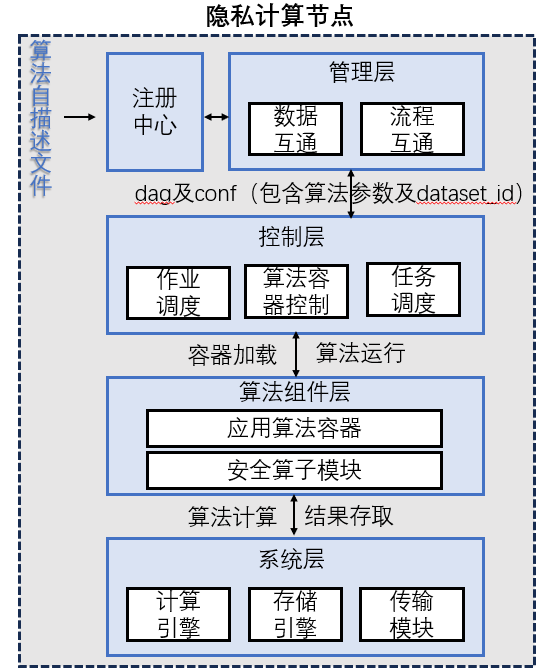

# README

## 说明

本仓库用于存放隐私计算互联互通算法组件层模块接口，成果由北京金融科技产业联盟数据专委会隐私计算互联互通课题贡献。

## 联系人信息

关于接口 API 内容如有问题可以联系我们，联系方式如下：

| 姓名   | 单位             | 联系方式                                                  |
| ------ | ---------------- | --------------------------------------------------------- |
| 丁亚丹 | 中国银联         | dingyadan@unionpay.com       |
| 刘瑞   | 上海浦东发展银行 | liur29@spdb.com.cn               |
| 龚乐诚 | 上海浦东发展银行 | gonglc@spdb.com.cn            |
| 靳新   | 洞见科技         | jinxin@insightone.cn          |
| 赵永坤 | 洞见科技         | zhaoyongkun@insightone.cn|
| 马煜翔 | 蓝象智联         | zichen.ma@trustbe.cn          |
| 王超   | 蓝象智联         | congying.wang@trustbe.cn   |

## 目录结构

```
InterOp
├─ LICENSE
├─ README.md              # 互联互通统一框架，贡献单位，版权声明等                  
└─ 互联互通集成对接指引      # 存放对接指引，注意事项等相关内容
└─ 互联互通API接口规范
    ├─ README.md          # 子模块概述，Contributor联系方式等  
    └─ 算法组件层接口
        ├── README.md     # 模块简介，Contributor联系方式等                     
        ├── api.md        # 存放接口文件
        ├── figure        # 存放相关图片
        └── examples      # 接口使用示例（可选）
```

## 算法组件层模块概述

算法组件层包括应用算法模块以及安全算子模块。其中，应用算法组件以容器镜像的形式打包存储，每一个算法组件需要具备针对该组件的算法自描述文件以供他方算法注册与使用加载。此外，算法组件层与控制层（调度层）、传输层以及系统层（计算、存储）等均有信息交互，需要遵循相应的规范和接口。安全算子模块向应用算法模块提供调用接口。框架图如下：

<div align="center">
    
</div>

## 参与单位

- 中国银联
- 上海浦东发展银行
- 洞见科技
- 蓝象智联
