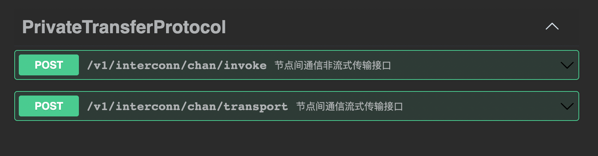
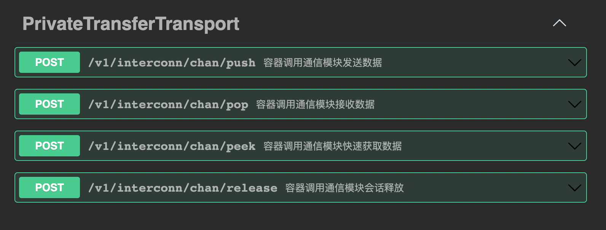

# 传输相关参考实现

## 1 传输编程接口

### 1.1 传输编程接口定义

算法组件调用自身容器的传输编程接口。接口以 Python 语言作为示例，其他语言参考本文档的 4 标准实现库。

```python
from abc import abstractmethod, ABC
from typing import Generic, Dict

from mesh.macro import spi, mpi, T


@spi("mesh")
class Transport(ABC, Generic[T]):
    """
    Private compute data channel in async and blocking mode.
    """

    MESH = "mesh"
    GRPC = "grpc"

    @abstractmethod
    @mpi("mesh.chan.open")
    def open(self, session_id: str, metadata: Dict[str, str]) -> "Session":
        """
        Metadata 包含如下KEY，这些值会在Session句柄中持久，在传输时候使用

        mesh.mpc.address:            required 本方通信组件地址
        x-ptp-tech-provider-code:    required 厂商编码
        x-ptp-trace-id:              required 链路追踪ID
        x-ptp-token                  required 认证令牌
        x-ptp-session-id             required 通信会话号，全网唯一
        x-ptp-target-node-id         required 接收端节点编号，全网唯一
        x-ptp-target-inst-id         optional 接收端机构编号，全网唯一

        Open a channel session.
        :param session_id:  node id or inst id
        :param metadata channel metadata
        :return:
        """
        pass

    @abstractmethod
    @mpi("mesh.chan.close")
    def close(self, timeout: int):
        """
        Close the channel.
        :return:
        """
        pass

    @abstractmethod
    @mpi("mesh.chan.roundtrip")
    def roundtrip(self, payload: bytes, metadata: Dict[str, str]) -> bytes:
        """
        Roundtrip with the channel.
        :param payload:
        :param metadata:
        :return:
        """
        pass


@spi("mesh")
class Session(ABC, Generic[T]):
    """
    Remote queue in async and blocking mode.
    """

    @abstractmethod
    @mpi("mesh.chan.peek")
    def peek(self, topic: str = "") -> bytes:
        """
        Retrieves, but does not remove, the head of this queue,
        or returns None if this queue is empty.
        :param topic: message topic
        :return: the head of this queue, or None if this queue is empty
        :return:
        """
        pass

    @abstractmethod
    @mpi(name="mesh.chan.pop", timeout=120 * 1000)
    def pop(self, timeout: int, topic: str = "") -> bytes:
        """
        Retrieves and removes the head of this queue,
        or returns None if this queue is empty.
        :param timeout: timeout in mills.
        :param topic: message topic
        :return: the head of this queue, or None if this queue is empty
        """
        pass

    @abstractmethod
    @mpi("mesh.chan.push")
    def push(self, payload: bytes, metadata: Dict[str, str], topic: str = ""):
        """
        Inserts the specified element into this queue if it is possible to do
        so immediately without violating capacity restrictions.
        When using a capacity-restricted queue, this method is generally
        preferable to add, which can fail to insert an element only
        by throwing an exception.
        :param payload: message payload
        :param metadata: Message metadata
        :param topic: message topic
        :return:
        """
        pass

    @abstractmethod
    @mpi("mesh.chan.release")
    def release(self, timeout: int, topic: str = ""):
        """
        Close the channel session.
        :param timeout:
        :param topic: message topic
        :return:
        """
        pass
```

## 2 参考实现

隐私计算互联互通传输协议标准实现为开源产品 mesh，该库主要由通信模块和多语言 SDK 组成，通信模块提供通信管控、传输及适配能力，
同时提供集群规模化及多活等高可用能力，通信模块运行模式有 OCI 容器及多架构可执行文件两种形式，支持当下所有国际和国产化 CPU、OS。

### 2.1 通信模块

通信模块提供节点间跨域通信管控和传输，[项目地址](https://github.com/be-io/interconnection-bfia)

```bash
docker pull imesh
docker run -d -e MID=xxx -p 7304:7304 imesh
```

### 2.2 Go SDK

Go SDK 提供 Golang 语言通信 SPI 集成包，实现 Go 语言节点间跨域通信管控和传输。

```bash
go get github.com/be-io/interconnection-bfia/imesh
```

### 2.3 Java SDK

Java SDK 提供 Golang 语言通信 SPI 集成包，实现 Java 语言节点间跨域通信管控和传输。

```xml
<dependency>
    <groupId>io.inc.mesh</groupId>
    <artifactId>imesh</artifactId>
    <version>0.0.1</version>
</dependency>
```

### 2.4 Python SDK

Python SDK 提供 Golang 语言通信 SPI 集成包，实现 Python 语言节点间跨域通信管控和传输。

```bash
poetry add imesh
```

### 2.5 Rust SDK

Rust SDK 提供 Golang 语言通信 SPI 集成包，实现 Rust 语言节点间跨域通信管控和传输。

```bash
cargo add imesh
```

### 2.6 Typescript SDK

Typescript SDK 提供 Golang 语言通信 SPI 集成包，实现 Typescript 语言节点间跨域通信管控和传输。

```bash
yarn add imesh
```

## 附录

附录提供互联互通附录文件和说明。

### 错误码表

| 编码        | 描述                     |
| ----------- | ------------------------ |
| E0000000000 | 请求成功                 |
| E0000000404 | 请求资源不存在           |
| E0000000500 | 系统异常                 |
| E0000000503 | 循环请求服务不可达       |
| E0000000400 | 请求非法                 |
| E0000000403 | 请求资源未被授权         |
| E0000000520 | 未知异常                 |
| E0000000600 | 系统不兼容               |
| E0000000601 | 请求超时                 |
| E0000000602 | 无服务实例               |
| E0000000603 | 数字证书校验异常         |
| E0000000604 | 节点授权码已过期         |
| E0000000605 | 节点组网时间已过期       |
| E0000000606 | 对方节点已禁用网络       |
| E0000000607 | 网络不通                 |
| E0000000614 | 接口未被许可调用         |
| E0000000615 | 证书签名非法             |
| E0000000616 | 报文编解码异常           |
| E0000000617 | 下游版本不匹配服务不存在 |
| E0000000618 | 节点或机构未组网         |
| E0000000619 | 地址非法或无法访问       |
| E0000000700 | 消息缓冲区满             |
| E0000000608 | 会话已释放               |
| E0000000413 | 报文超长 BodyTooLarge    |

### Protobuf 格式声明

节点间通信接口 Protobuf 格式声明 [README.proto](https://github.com/be-io/interconnection-bfia/blob/main/bfia/mesh/api/mesh.x.proto)

容器调用通信模块接口 Protobuf 格式声明 [README.proto](https://github.com/be-io/interconnection-bfia/blob/main/bfia/mesh/api/mesh.y.proto)

### Swagger 格式声明

节点间通信接口 Swagger 格式声明[ README.swagger.json](https://github.com/be-io/interconnection-bfia/blob/main/bfia/mesh/api/mesh.x.swagger.json)

<div align="center">
    
</div>

容器调用通信模块接口 Swagger 格式声明 [README.swagger.json](https://github.com/be-io/interconnection-bfia/blob/main/bfia/mesh/api/mesh.y.swagger.json)

<div align="center">
    
</div>
