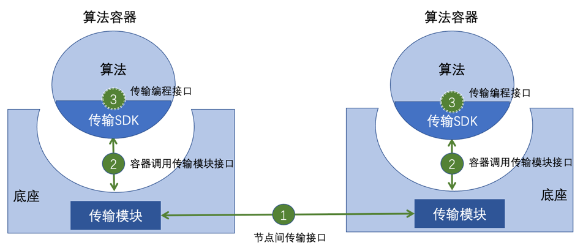

# 隐私计算互联互通传输层 API

- [隐私计算互联互通传输层 API](#隐私计算互联互通传输层-api)
  - [1 整体框架](#1-整体框架)
  - [2 节点间通信接口](#2-节点间通信接口)
    - [2.1 报文规范](#21-报文规范)
    - [2.2 接口定义](#22-接口定义)
      - [2.2.1 非流式接口定义](#221-非流式接口定义)
      - [2.2.2 流式接口定义](#222-流式接口定义)
  - [3 容器调用通信模块接口](#3-容器调用通信模块接口)
    - [3.1 报文规范](#31-报文规范)
    - [3.2 接口定义](#32-接口定义)
      - [3.2.1 数据发送接口](#321-数据发送接口)
      - [3.2.2 接收数据接口](#322-接收数据接口)
      - [3.2.3 快速获取数据接口](#323-快速获取数据接口)
      - [3.2.4 会话释放接口](#324-会话释放接口)
  - [4 传输编程接口（可选）](#4-传输编程接口可选)
  - [5 传输层序列化规则](#5-传输层序列化规则)
    - [5.1 南北向接口序列化](#51-南北向接口序列化)
    - [5.2 东西向接口序列化](#52-东西向接口序列化)
      - [5.2.1 透传模式](#521-透传模式)
      - [[5.2.2 封装模式]](#522-封装模式)


## 1 整体框架

隐私计算互联互通传输模块功能包括传输接口、传输报文约定，互联互通平台支持传输管理，包括节点间传输报文、节点间传输接口、节点间协议转换、容器调用传输报文、容器调用传输接口、传输编程接口。在充分考虑各隐私计算平台差异的前提下，对传输层的传输接口、报文格式等内容进行标准化定义，为隐私计算平台间的互联互通实现，提供底层的通信基础。隐私计算互联互通传输协议是一个应用层协议，是无状态/分布式/通用的一个信息传输协议。

<div align="center">
    
</div>

**文档版本**

```
v1.2.0
```

## 2 节点间通信接口

节点间通信接口是指两个通信模块间进行跨域数据传输的接口。定义了流式和非流式的传输接口以及基于 HTTP 协议的报文头。

### 2.1 报文规范

**报头**

节点间通信报文含报头和报文两部分，报头携带通信元数据，报文透传二进制传输内容。

互联互通使用 HTTP（HTTP/0.9 HTTP/1.0 HTTP/1.1 HTTP/2）作为底层通信协议，复用 HTTP 报头传输互联互通报头。

```python
x-ptp-version:               required 协议版本
x-ptp-tech-provider-code:    required 厂商编码
x-ptp-trace-id:              required 链路追踪ID
x-ptp-token                  required 认证令牌
x-ptp-uri                    required 互联互通资源定位符，为跨节点实际请求的资源路径，用于兼容多协议
x-ptp-session-id             required 通信会话号，全网唯一
x-ptp-source-node-id         required 发送端节点编号，全网唯一
x-ptp-target-node-id         required 接收端节点编号，全网唯一
x-ptp-source-inst-id         optional 发送端机构编号，全网唯一
x-ptp-target-inst-id         optional 接收端机构编号，全网唯一
```

**报文**

● 互联互通下节点间通信报文透传二进制报文，复用 HTTP 协议 Body 传输。

### 2.2 接口定义

节点间通信提供两个传输接口，非流式调用，针对单次调用场景；流式接口，针对大数据/小报文连续传输场景。

#### 2.2.1 非流式接口定义

> POST /v1/interconn/chan/invoke

**接口描述**

> 针对单次调用场景

**请求头**

| 编码                     | 名称           | 必选 | 说明                                                           |
| ------------------------ | -------------- | ---- | -------------------------------------------------------------- |
| x-ptp-version            | 版本           | 是   | 协议版本号                                                     |
| x-ptp-tech-provider-code | 厂商编码       | 是   | 互联互通厂商编码                                               |
| x-ptp-trace-id           | 追踪编号       | 是   | 全链路追踪编号                                                 |
| x-ptp-token              | 令牌           | 是   | 资源访问控制令牌                                               |
| x-ptp-uri                | 资源路径       | 是   | 互联互通资源定位符，为跨节点实际请求的资源路径，用于兼容多协议 |
| x-ptp-source-node-id     | 发送方节点编号 | 是   | 发送端物理节点编号                                             |
| x-ptp-target-node-id     | 接收端节点编号 | 是   | 接收端物理节点编号                                             |
| x-ptp-source-inst-id     | 发送端机构编号 | 否   | 发送端业务实体编号                                             |
| x-ptp-target-inst-id     | 接收端机构编号 | 否   | 接收端业务实体编号                                             |
| x-ptp-session-id         | 会话编号       | 是   | 全网唯一，用于建立有状态会话的通信，和对 token 的有效性验证    |

**请求体**

● 透传二进制报文，不做特殊处理

**响应体**

● 透传二进制报文，不做特殊处理

#### 2.2.2 流式接口定义

> POST /v1/interconn/chan/transport

**接口描述**

> 针对大数据/小报文连续传输场景

**请求头**

| 编码                     | 名称           | 必选 | 说明                                                           |
| ------------------------ | -------------- | ---- | -------------------------------------------------------------- |
| x-ptp-version            | 版本           | 是   | 协议版本号                                                     |
| x-ptp-tech-provider-code | 厂商编码       | 是   | 互联互通厂商编码                                               |
| x-ptp-trace-id           | 追踪编号       | 是   | 全链路追踪编号                                                 |
| x-ptp-token              | 令牌           | 是   | 资源访问控制令牌                                               |
| x-ptp-uri                | 资源路径       | 是   | 互联互通资源定位符，为跨节点实际请求的资源路径，用于兼容多协议 |
| x-ptp-source-node-id     | 发送方节点编号 | 是   | 发送端物理节点编号                                             |
| x-ptp-target-node-id     | 接收端节点编号 | 是   | 接收端物理节点编号                                             |
| x-ptp-source-inst-id     | 发送端机构编号 | 否   | 发送端业务实体编号                                             |
| x-ptp-target-inst-id     | 接收端机构编号 | 否   | 接收端业务实体编号                                             |
| x-ptp-session-id         | 会话编号       | 是   | 全网唯一，用于建立有状态会话的通信，和对 token 的有效性验证    |

**请求体**

● 透传二进制报文，不做特殊处理

**响应体**

● 透传二进制报文，不做特殊处理

## 3 容器调用通信模块接口

容器调用通信模块接口，采用 HTTP 协议为基础，所以该文档中定义了基于 HTTP 协议的报文和接口。

### 3.1 报文规范

**报头**

```python
x-ptp-tech-provider-code:    required 厂商编码
x-ptp-trace-id:              required 链路追踪ID
x-ptp-token                  required 认证令牌
x-ptp-session-id             required 通信会话号，全网唯一
x-ptp-target-node-id         required 接收端节点编号，全网唯一
x-ptp-target-inst-id         optional 接收端机构编号，全网唯一
```

**报文**

● 互联互通下节点间通信报文透传二进制报文，复用 HTTP 协议 Body 传输。

### 3.2 接口定义

内部通信协议接口定义包含，**数据发送、接收数据、快速获取数据、会话释放**四个接口。

接口功能支持以下内容：

a) 发送信息：向通信信道中发送数据；

b) 接收信息：接收信息两种模式，主动模式和被动模式，主动模式必选，被动模式可选：

- 主动模式即为算法容器主动向传输模块发起请求获取通道中的数据，应包括：
  (1)获取信息，阻塞情况下，从通信信道中读取数据；
  (2)快速查询，非阻塞情况下，从通信信道中读取数据；
- 被动模式即为算法容器启动时监听端口，传输模块收到信息后直接转发给算法容器端口。

c) 会话释放：释放会话资源，可选。

#### 3.2.1 数据发送接口

> POST /v1/interconn/chan/push

**接口描述**

> 容器调用通信模块发送数据

**请求头**

| 编码                     | 名称           | 必选 | 说明                                                        |
| ------------------------ | -------------- | ---- | ----------------------------------------------------------- |
| x-ptp-tech-provider-code | 厂商编码       | 是   | 互联互通厂商编码                                            |
| x-ptp-trace-id           | 追踪编号       | 是   | 全链路追踪编号                                              |
| x-ptp-token              | 令牌           | 是   | 资源访问控制令牌                                            |
| x-ptp-target-node-id     | 接收端节点编号 | 是   | 接收端物理节点编号                                          |
| x-ptp-target-inst-id     | 接收端机构编号 | 否   | 接收端业务实体编号                                          |
| x-ptp-session-id         | 会话编号       | 是   | 全网唯一，用于建立有状态会话的通信，和对 token 的有效性验证 |

**请求体**

| 参数名称 | 数据类型 | 默认值 | 是否必填 | 描述                                                 |
| -------- | -------- | ------ | -------- | ---------------------------------------------------- |
| payload  | byte[]   | 空     | true     | 消息序列化后的字节数组                               |
| topic    | string   | 空     | false    | 会话主题，相同信道具有唯一性，用于同一信道的传输隔离 |
| metadata | object   | 空     | false    | 保留参数，用于扩展性                                 |

**响应体**

| 参数名称 | 类型   | 默认值      | 是否必填 | 描述                                       |
| -------- | ------ | ----------- | -------- | ------------------------------------------ |
| code     | string | E0000000000 | true     | 状态码，E0000000000 表示成功，其余均为失败 |
| message  | string | 成功        | true     | 状态说明                                   |

#### 3.2.2 接收数据接口

> POST /v1/interconn/chan/pop

**接口描述**

> 容器调用通信模块接口获取数据，该接口会从通信信道中阻塞读取一次数据，如信道中无数据，会一直阻塞等待触发超时返回空

**请求头**

| 编码                     | 名称           | 必选 | 说明                                                        |
| ------------------------ | -------------- | ---- | ----------------------------------------------------------- |
| x-ptp-tech-provider-code | 厂商编码       | 是   | 互联互通厂商编码                                            |
| x-ptp-trace-id           | 追踪编号       | 是   | 全链路追踪编号                                              |
| x-ptp-token              | 令牌           | 是   | 资源访问控制令牌                                            |
| x-ptp-target-node-id     | 接收端节点编号 | 是   | 接收端物理节点编号                                          |
| x-ptp-target-inst-id     | 接收端机构编号 | 否   | 接收端业务实体编号                                          |
| x-ptp-session-id         | 会话编号       | 是   | 全网唯一，用于建立有状态会话的通信，和对 token 的有效性验证 |

**请求体**

| 参数名称 | 数据类型 | 默认值 | 是否必填 | 描述                                                 |
| -------- | -------- | ------ | -------- | ---------------------------------------------------- |
| timeout  | byte[]   | 空     | false    | 阻塞超时时间，默认 120s                              |
| topic    | string   | 空     | false    | 会话主题，相同信道具有唯一性，用于同一信道的传输隔离 |

**响应体**

| 参数名称 | 类型   | 默认值      | 是否必填 | 描述                                       |
| -------- | ------ | ----------- | -------- | ------------------------------------------ |
| code     | string | E0000000000 | true     | 状态码，E0000000000 表示成功，其余均为失败 |
| message  | string | 成功        | true     | 状态说明                                   |
| content  | byte[] | 空          | false    | 消息序列化后的字节数组                     |

#### 3.2.3 快速获取数据接口

> POST /v1/interconn/chan/peek

**接口描述**

> 容器调用通信模块接口快速获取数据，即在非阻塞情况下从通信信道中读取一次数据，若信道中有数据则返回数据，无数据则返回空

**请求头**

| 编码                     | 名称           | 必选 | 说明                                                        |
| ------------------------ | -------------- | ---- | ----------------------------------------------------------- |
| x-ptp-tech-provider-code | 厂商编码       | 是   | 互联互通厂商编码                                            |
| x-ptp-trace-id           | 追踪编号       | 是   | 全链路追踪编号                                              |
| x-ptp-token              | 令牌           | 是   | 资源访问控制令牌                                            |
| x-ptp-target-node-id     | 接收端节点编号 | 是   | 接收端物理节点编号                                          |
| x-ptp-target-inst-id     | 接收端机构编号 | 否   | 接收端业务实体编号                                          |
| x-ptp-session-id         | 会话编号       | 是   | 全网唯一，用于建立有状态会话的通信，和对 token 的有效性验证 |

**请求体**

| 参数名称 | 数据类型 | 默认值 | 是否必填 | 描述                                                 |
| -------- | -------- | ------ | -------- | ---------------------------------------------------- |
| topic    | string   | 空     | false    | 会话主题，相同信道具有唯一性，用于同一信道的传输隔离 |

**响应体**

| 参数名称 | 类型   | 默认值      | 是否必填 | 描述                                       |
| -------- | ------ | ----------- | -------- | ------------------------------------------ |
| code     | string | E0000000000 | true     | 状态码，E0000000000 表示成功，其余均为失败 |
| message  | string | 成功        | true     | 状态说明                                   |
| content  | byte[] | 空          | false    | 消息序列化后的字节数组                     |

#### 3.2.4 会话释放接口

> POST /v1/interconn/chan/release

**接口描述**

> 容器调用通信模块接口，清理掉以 x-ptp-session-id 标记的会话，调用该接口会释放会话中未读取的数据

> 可选，释放信道中的一个会话

**请求头**

| 编码                     | 名称           | 必选 | 说明                                                        |
| ------------------------ | -------------- | ---- | ----------------------------------------------------------- |
| x-ptp-tech-provider-code | 厂商编码       | 是   | 互联互通厂商编码                                            |
| x-ptp-trace-id           | 追踪编号       | 是   | 全链路追踪编号                                              |
| x-ptp-token              | 令牌           | 是   | 资源访问控制令牌                                            |
| x-ptp-target-node-id     | 接收端节点编号 | 是   | 接收端物理节点编号                                          |
| x-ptp-target-inst-id     | 接收端机构编号 | 否   | 接收端业务实体编号                                          |
| x-ptp-session-id         | 会话编号       | 是   | 全网唯一，用于建立有状态会话的通信，和对 token 的有效性验证 |

**请求体**

| 参数名称 | 数据类型 | 默认值 | 是否必填 | 描述                                                 |
| -------- | -------- | ------ | -------- | ---------------------------------------------------- |
| timeout  | byte[]   | 空     | false    | 释放最长等待时间，默认 10s                           |
| topic    | string   | 空     | false    | 会话主题，相同信道具有唯一性，用于同一信道的传输隔离 |

**响应体**

| 参数名称 | 类型   | 默认值      | 是否必填 | 描述                                       |
| -------- | ------ | ----------- | -------- | ------------------------------------------ |
| code     | string | E0000000000 | true     | 状态码，E0000000000 表示成功，其余均为失败 |
| message  | string | 成功        | true     | 状态说明                                   |

## 4 传输编程接口（可选）

该接口为可选接口，主要涉及算法调用传输 sdk 的具体接口实现，详细内容可以参见[传输相关参考实现](./examples/传输相关参考实现.md)

## 5 传输层序列化规则

传输层序列化分为南北向以及东西向接口，HTTP1.1、GRPC协议实现其一即可

### 5.1 南北向接口序列化

算法模块与传输模块南北向接口集成需按照如下序列化方案

- HTTP序列化

  HTTP协议序列化/反序列化方案可通过头字段Content-Type进行设置，支持列表如下

  > 注：使用protobuf序列化时protobuf格式参考南北向GRPC协议格式

|          Content-Type          | 序列化方式 |
| :----------------------------: | :--------: |
|       application/json*        |    json    |
|    application/x-protobuf*     |  protobuf  |
|   application/xml、text/xml    |    xml     |
| application/x-msgpack、msgpack |  msgpack   |
|       application/x-yaml       |    yaml    |
|        application/toml        |    toml    |
|     application/form-data      |    form    |

> *必选

- GRPC序列化

  GRPC协议使用protobuf进行序列化/反序列化，protobuf格式如下

```protobuf
syntax = "proto3";

package org.ppc.ptp;
option go_package = "github.com/be-io/mesh/ptp";
option java_package = "io.bfia.ptp";

// PTP Private transfer protocol
// 通用报头名称编码，4层无Header以二进制填充到报头，7层以Header传输
// x-ptp-tech-provider-code:    required 厂商编码
// x-ptp-trace-id:              required 链路追踪ID
// x-ptp-token                  required 认证令牌
// x-ptp-session-id             required 通信会话号，全网唯一
// x-ptp-target-node-id         required 接收端节点编号，全网唯一
// x-ptp-target-inst-id         optional 接收端机构编号，全网唯一

message PeekInbound {
  string topic = 1;                   // optional 会话主题，相同信道具有唯一性，用于同一信道的传输隔离
}

message PopInbound {
  string topic = 1;                   // optional 会话主题，相同信道具有唯一性，用于同一信道的传输隔离
  int32 timeout = 2;                  // optional 阻塞超时时间，默认120s
}

message PushInbound{
  string topic = 1;                   // optional 会话主题，相同信道具有唯一性，用于同一信道的传输隔离
  bytes payload = 2;                  // 二进制报文
  map<string, string> metadata = 3;   // optional 保留参数，用于扩展性
}

message ReleaseInbound {
  string topic = 1;                   // optional 会话主题，相同信道具有唯一性，用于同一信道的传输隔离
  int32 timeout = 2;                  // optional 阻塞超时时间，默认120s
}

message TransportOutbound {
  map<string, string>  metadata = 1;  // 可选，预留扩展，Dict，序列化协议由通信层统一实现
  bytes payload = 2;                  // 二进制报文
  string code = 3;                    // 状态码
  string message = 4;                 // 状态说明
}

service PrivateTransferTransport {
  rpc peek (PeekInbound) returns (TransportOutbound);
  rpc pop (PopInbound) returns (TransportOutbound);
  rpc push (PushInbound) returns (TransportOutbound);
  rpc release (ReleaseInbound) returns (TransportOutbound);
}
```

### 5.2 东西向接口序列化

传输模块东西向接口序列化有透传模式和封装模式两种方式，通过头字段x-ptp-version进行限定

#### 5.2.1 透传模式

头字段设置x-ptp-version=1时东西向接口为透传模式，传输模块直接透传南北向接口收到的消息给合作方东西向接口，不做任何额外处理

#### 5.2.2 封装模式

头字段x-ptp-version不为1或者未包含该字段时，东西向接口为封装模式，传输模块对南北向接口接收到的消息进行二次序列化后转发给合作方东西向接口，该模式可兼容v1.1.0及之前版本标准的传输模块

+ HTTP序列化

  HTTP序列化/反序列化方案与南北向HTTP序列化方式保持一致

  > 注：使用protobuf序列化时protobuf格式参考东西向GRPC协议protobuf格式

+ GRPC序列化

  GRPC协议使用protobuf进行序列化/反序列化，protobuf格式如下

```protobuf
syntax = "proto3";

package org.ppc.ptp;
option go_package = "github.com/be-io/mesh/ptp";
option java_package = "io.bfia.ptp";

// PTP Private transfer protocol
// 通用报头名称编码，4层无Header以二进制填充到报头，7层以Header传输
// x-ptp-version             required 协议版本
// x-ptp-tech-provider-code  required 厂商编码
// x-ptp-trace-id            required 链路追踪ID
// x-ptp-token               required 认证令牌
// x-ptp-uri                 required 互联互通资源定位符，为跨节点实际请求的资源路径，用于兼容多协议
// x-ptp-source-node-id      required 发送端节点编号
// x-ptp-target-node-id      required 接收端节点编号
// x-ptp-source-inst-id      required 发送端机构编号
// x-ptp-target-inst-id      required 接收端机构编号
// x-ptp-session-id          required 通信会话号，全网唯一

// 通信传输层输入报文编码
message Inbound {
  map<string, string>  metadata = 1;   // 报头，可选，预留扩展，Dict，序列化协议由通信层统一实现
  bytes payload = 2;                   // 报文，上层通信内容承载，序列化协议由上层基于SPI可插拔
}

// 通信传输层输出报文编码
message Outbound {
  map<string, string>  metadata = 1;  // 报头，可选，预留扩展，Dict，序列化协议由通信层统一实现
  bytes payload = 2;                  // 报文，上层通信内容承载，序列化协议由上层基于SPI可插拔
  string code = 3;                    // 状态码
  string message = 4;                 // 状态说明
}

// 互联互通如果使用异步传输协议作为标准参考，Header会复用metadata传输互联互通协议报头，且metadata中会传输异步场景下的消息相关属性
// 互联互通如果使用其他协议作为参考标准，Header会复用metadata传输互联互通协议报头
// 互联互通如果使用GRPC作为参考标准，Header会复用HTTP2的报头传输互联互通协议报头

service PrivateTransferProtocol {
  rpc transport (stream Inbound) returns (stream Outbound);
  rpc invoke (Inbound) returns (Outbound);
}
```

