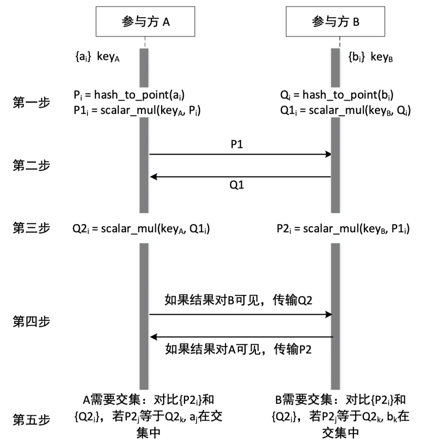

# 隐私计算互联互通开放算法协议 API

- [隐私计算互联互通开放算法协议 API](#隐私计算互联互通开放算法协议-api)
  - [1 整体框架](#1-整体框架)
  - [2 算法层接口](#2-算法层接口)
    - [2.1 算法参数配置](#21-算法参数配置)
      - [2.1.1 功能描述](#211-功能描述)
      - [2.1.2 参数描述](#212-参数描述)
    - [2.2 算法运行数据](#22-算法运行数据)
      - [2.2.1 接口描述](#221-接口描述)
      - [2.2.2 消息定义](#222-消息定义)
      - [2.2.3 参数描述](#223-参数描述)
  - [3 传输层接口](#3-传输层接口)
    - [3.1 消息推送请求](#31-消息推送请求)
      - [3.1.1 接口描述](#311-接口描述)
      - [3.1.2 消息定义](#312-消息定义)
      - [3.1.3 参数描述](#313-参数描述)
    - [3.2 消息推送响应](#32-消息推送响应)
      - [3.2.1 接口描述](#321-接口描述)
      - [3.2.2 消息定义](#322-消息定义)
      - [3.2.3 参数描述](#323-参数描述)


开放算法协议接口因不同协议的算法实现而不同，常见算法有如 ECDH-PSI、SS-LR 和 Secure Gradient Boosting ，本文选择典型的 ECDH-PSI 算法开放算法协议为例说明进行算法互通对接的对接接口方法与通信接口要求。

## 1 整体框架

ECDH-PSI 算法整体框架如下图所示，共包括五个步骤：

第一步，参与方在本地计算原始数据的哈希值，并将哈希值映射为椭圆曲线上的点，然后加密；

第二步，每个参与方将加密后的数据传输给其它参与方；

第三步，每个参与方在本地使用自己的私钥对步骤二中接收到的数据进行二次加密；

第四步，如果结果对另一个参与方可见，将步骤三中加密后的数据传输给另外一个参与方；

第五步，拿结果的参与方基于步骤三和步骤四的两方的二次密文在本地计算集合求交的结果。

<div align="center">
    
</div>

**文档版本**

```
v1.0.0
```

## 2 算法层接口

### 2.1 算法参数配置

#### 2.1.1 功能描述

确定交互互通的算法，确定算法安全性参数以及算法执行参数。

#### 2.1.2 参数描述

| **名称**                     | **位置** | **类型**         | **必选** | **中文名**       | **说明**                             |
| ---------------------------- | -------- | ---------------- | -------- |---------------| ------------------------------------ |
| body                         | body     |  | 是       | 算法公共参数配置      | 无                                   |
| ⇥version                    | body     | int32            | 是       | 版本号           | 从 1 开始累加                        |
| ⇥supported_algos            | body     | int32 list       | 是       | 支持的算法         | 取值为算法编号，ECDH-PSI 算法为 1    |
| ⇥protocol_families          | body     | int32 list       | 是       | 协议族类型         | 取值为协议族类型编号，ECC 协议族为 1 |
| ⇥protocol_family_params     | body     | ProtobufAny list | 是       | 协议族参数         | 与协议族类型相对应                   |
| ⇥⇥supported_versions       | body     | int32 list       | 是       | 支持的版本号        | 无                                   |
| ⇥⇥ec_suits                 | body     | EcSuit list      | 是       | 支持的算法套件参数     | 无                                   |
| ⇥⇥⇥curve                  | body     | int32            | 是       | 椭圆曲线类型        | 取值为椭圆曲线类型编号               |
| ⇥⇥⇥hash                   | body     | int32            | 是       | 哈希类型          | 取值为哈希类型编号                   |
| ⇥⇥⇥hash2curve_strategy    | body     | int32            | 是       | Hash2Curve 策略 | 取值为 Hash2Curve 策略编号           |
| ⇥⇥point_octet_formats      | body     | int32 list       | 是       | 支持的点的序列化格式    | 取值为点的序列化格式编号             |
| ⇥⇥support_point_truncation | body     | bool             | 是       | 是否支持二次密文截断    | 无                                   |
| ⇥io_param                   | body     | ProtobufAny      | 是       | 输入输出参数        | 无                                   |
| ⇥⇥supported_versions       | body     | int32 list       | 是       | 支持的版本号        | 无                                   |
| ⇥⇥item_num                 | body     | int64            | 是       | 待求交的 PSI 数据总量 | 无                                   |
| ⇥⇥result_to_rank           | body     | int32            | 是       | PSI 结果获取方的编号  | 取值 -1 表示所有参与方都获取结果     |

### 2.2 算法运行数据

#### 2.2.1 接口描述

一个参与方向另一个参与方发送算法主体运行数据的接口

#### 2.2.2 消息定义

```protobuf
message EcdhPsiCipherBatch {
  // The type hint for each message. (密文类型)
  //
  // "enc": the first stage ciphertext
  //
  // "dual.enc": the second stage ciphertext
  //
  // ECDH PSI 密文阶段类型，主要用来区分一阶段和二阶段的密文.
  string type = 1;

  // The batch index. Start from 0.
  //
  // Batch 索引，从 0 开始
  int32 batch_index = 3;

  // Is last batch flag
  bool is_last_batch = 4;

  // Count of items in this batch.
  // count == 0 is allowed for last batch
  int32 count = 6;

  // The packed all in one ciphertext for this batch.
  //
  // The first stage ciphertext takes 256 bits for each ciphertext element.
  // However, the second stage ciphertext takes 96 bits each. According to PSI
  // papers, we do not need to send all 256 bit for the final ciphertext. The
  // number of bits needed to compare is `Log(MN) + 40` given a 40 bits
  // statistical security parameter. TODO (add paper link here).
  //
  // We define each bucket has less than 2^28 items, i.e. about 270 million
  // (单桶最多 2.7亿) items, which is general enough for various psi algorithms.
  //
  // NOTE: we do not use `repeated`` here to save overhead of metadata.
  bytes ciphertext = 7;
}
```

#### 2.2.3 参数描述

| **名称**        | **位置** | **类型**           | **必选** | **中文名**             | **说明**                                              |
| --------------- | -------- | ------------------ | -------- | ---------------------- | ----------------------------------------------------- |
| body            | body     | EcdhPsiCipherBatch | 是       | ECDH-PSI 密文批量数据  | 无                                                    |
| ⇥type          | body     | string             | 是       | 密文类型               | 取值 "enc" 表示一次密文，取值 "dual.enc" 表示二次密文 |
| ⇥batch_index   | body     | int32              | 是       | 传输批次编号           | 从 0 开始累加                                         |
| ⇥is_last_batch | body     | bool               | 是       | 是否为最后一个批次     | 无                                                    |
| ⇥count         | body     | int32              | 是       | 当前批次包含的密文数量 | 无                                                    |
| ⇥ciphertext    | body     | bytes              | 是       | 密文                   | 无                                                    |

## 3 传输层接口

### 3.1 消息推送请求

#### 3.1.1 接口描述

一个参与方向另一个参与方推送消息的接口

#### 3.1.2 消息定义

```protobuf
message PushRequest {
  // sender's rank. 发送者的 rank
  uint64 sender_rank = 1;
  // key of the message. 消息唯一 ID
  string key = 2;
  // value of the message. 消息体
  bytes value = 3;
  // transfer mode. 传输模式：全量或分块
  TransType trans_type = 4;
  // chunk meta. 消息大小
  ChunkInfo chunk_info = 5;
}
```

#### 3.1.3 参数描述

| **名称**           | **位置** | **类型**    | **必选** | **中文名**       | **说明**               |
| ------------------ | -------- | ----------- | -------- | ---------------- | ---------------------- |
| body               | body     | PushRequest | 是       | 消息推送请求     | 无                     |
| ⇥sender_rank      | body     | uint64      | 是       | 发送者的编号     | 从 0 开始累加          |
| ⇥key              | body     | string      | 是       | 消息唯一 ID      | 无                     |
| ⇥value            | body     | bytes       | 是       | 消息体           | 需要传输的实际信息     |
| ⇥trans_type       | body     | int32       | 是       | 传输模式         | 包括全量传输、分块传输 |
| ⇥chunk_info       | body     | ChunkInfo   | 是       | 消息大小         | 无                     |
| ⇥⇥message_length | body     | uint64      | 是       | 数据总大小       | 单位是字节             |
| ⇥⇥chunk_offset   | body     | uint64      | 是       | 当前分块的偏移量 | 无                     |

### 3.2 消息推送响应

#### 3.2.1 接口描述

消息接收方向消息发送方发送消息推送响应的接口

#### 3.2.2 消息定义

```protobuf
message PushResponse {
  ResponseHeader header = 1;
}
```

#### 3.2.3 参数描述

| **名称**       | **位置** | **类型**       | **必选** | **中文名**       | **说明** |
| -------------- | -------- | -------------- | -------- | ---------------- | -------- |
| body           | body     | PushResponse   | 是       | 消息推送响应     | 无       |
| ⇥header       | body     | ResponseHeader | 是       | 握手响应头       | 无       |
| ⇥⇥error_code | body     | int32          | 是       | 消息推送响应结果 | 无       |
| ⇥⇥error_msg  | body     | string         | 是       | 消息推送响应描述 | 无       |
