# 互联互通集成对接指引

- [互联互通集成对接指引](#互联互通集成对接指引)
  - [1 整体框架](#1-整体框架)
  - [2 管理层](#2-管理层)
    - [2.1 概述](#21-概述)
      - [2.1.1 功能介绍](#211-功能介绍)
        - [2.1.1.1 基本元素](#2111-基本元素)
        - [2.1.1.2 功能概述](#2112-功能概述)
        - [2.1.1.3 流程有向无环图（DAG）及作业配置（conf）通用结构](#2113-流程有向无环图dag及作业配置conf通用结构)
      - [2.1.2 交互流程](#212-交互流程)
    - [2.2 改造指南](#22-改造指南)
      - [2.2.1 管理层接口](#221-管理层接口)
      - [2.2.2 涉及改造内容](#222-涉及改造内容)
      - [2.2.3 注意事项](#223-注意事项)
        - [2.2.3.1 与其它各层的重要参数及内容](#2231-与其它各层的重要参数及内容)
        - [2.2.3.2 与数据面的交互问题](#2232-与数据面的交互问题)
        - [2.2.3.3 问题清单](#2233-问题清单)
  - [3 控制层](#3-控制层)
    - [3.1 概述](#31-概述)
      - [3.1.1 功能介绍](#311-功能介绍)
        - [3.1.1.1 DAG 和 conf 规范](#3111-dag-和-conf-规范)
        - [3.1.1.2 调度交互](#3112-调度交互)
        - [3.1.1.3 加载算法容器](#3113-加载算法容器)
    - [3.2 改造指南](#32-改造指南)
      - [3.2.1 控制层接口](#321-控制层接口)
      - [3.2.2 涉及改造内容](#322-涉及改造内容)
        - [3.2.2.1 调度流程改造](#3221-调度流程改造)
        - [3.2.2.2 算法容器加载](#3222-算法容器加载)
      - [3.2.3 注意事项](#323-注意事项)
  - [4 算法组件层](#4-算法组件层)
    - [4.1 概述](#41-概述)
      - [4.1.1 功能介绍](#411-功能介绍)
        - [4.1.1.1 算法容器化加载](#4111-算法容器化加载)
        - [4.1.1.2 算法镜像参数定义及注入方式](#4112-算法镜像参数定义及注入方式)
        - [4.1.1.3 算法自描述文件](#4113-算法自描述文件)
        - [4.1.1.4 存储功能规范](#4114-存储功能规范)
        - [4.1.1.5 传输功能规范](#4115-传输功能规范)
        - [4.1.1.6 计算功能规范](#4116-计算功能规范)
        - [4.1.1.7 其他约定规范](#4117-其他约定规范)
    - [4.2 改造指南](#42-改造指南)
      - [4.2.1 相关接口及规范](#421-相关接口及规范)
        - [4.2.1.1 参数映射方式](#4211-参数映射方式)
        - [4.2.1.2 算法自描述文件规范](#4212-算法自描述文件规范)
        - [4.2.1.3 存储相关参数规范](#4213-存储相关参数规范)
        - [4.2.1.4 传输协议规范](#4214-传输协议规范)
        - [4.2.1.5 算法组件层接口](#4215-算法组件层接口)
      - [4.2.2 涉及改造内容](#422-涉及改造内容)
        - [4.2.2.1 算法容器化改造](#4221-算法容器化改造)
        - [4.2.2.2 算法注册（对应管理层）](#4222-算法注册对应管理层)
        - [4.2.2.3 存储](#4223-存储)
        - [4.2.2.4 传输](#4224-传输)
      - [4.2.3 注意事项](#423-注意事项)
  - [5 传输层](#5-传输层)
    - [5.1 概述](#51-概述)
      - [5.1.1 功能介绍](#511-功能介绍)
        - [5.1.1.1 传输信道管理](#5111-传输信道管理)
        - [5.1.1.2 Token 及 Session 管理](#5112-token-及-session-管理)
        - [5.1.1.3 阻塞和非阻塞传输](#5113-阻塞和非阻塞传输)
        - [5.1.1.4 路由转发](#5114-路由转发)
      - [5.1.2 流程及关系](#512-流程及关系)
    - [5.2 改造指南](#52-改造指南)
      - [5.2.1 传输协议规范及接口](#521-传输协议规范及接口)
        - [5.2.1.1 传输协议规范](#5211-传输协议规范)
        - [5.2.1.2 传输接口](#5212-传输接口)
          - [5.2.1.2.1 传输模块跨节点接口改造](#52121-传输模块跨节点接口改造)
          - [5.2.1.2.2 SDK 与传输模块接口改造](#52122-sdk-与传输模块接口改造)
      - [5.2.2 传输引擎](#522-传输引擎)
      - [5.2.3 注意事项](#523-注意事项)
  - [附录](#附录)


## 1 整体框架

隐私计算互联互通总体框架分为管理面与数据面两部分，整体架构如下图所示：

<div align="center">
    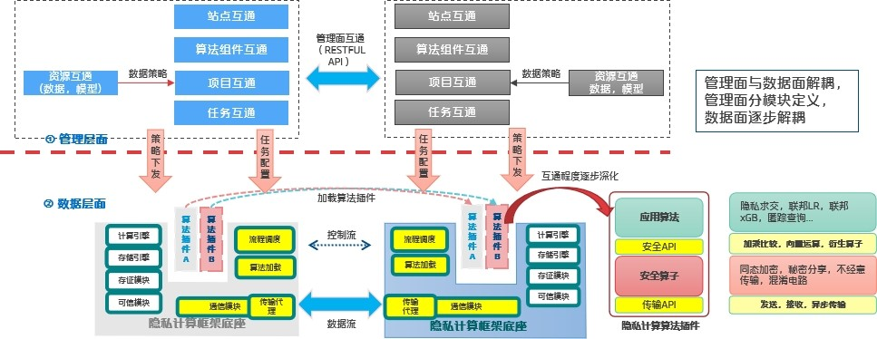
</div>

管理面互通是对管理层所涉及互联互通资源管理的统一抽象，数据面互通是指管理面下发到数据面的数据信息流转调度及相关计算存储操作。

<div align="center">
    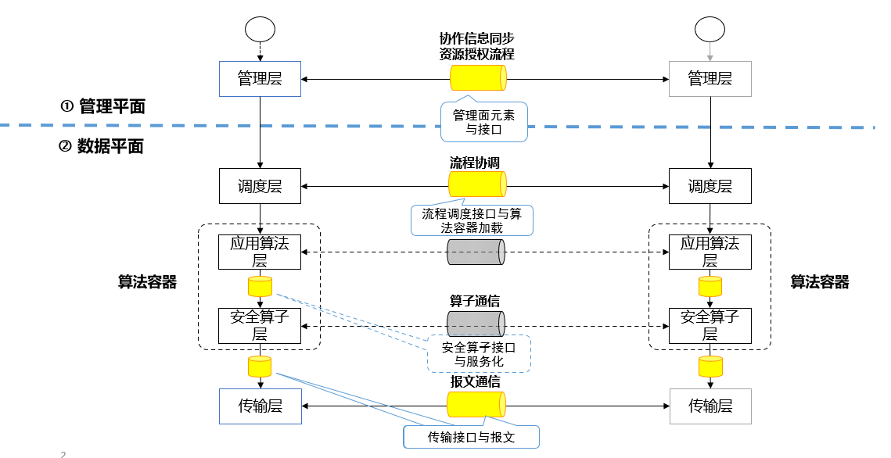
</div>

管理面互联互通接口聚焦于节点、数据、项目、流程、作业、任务、组件、模型等管理层资源的静态协同，实现安全可控的跨平台互通协作。

数据面接口分为控制层交互接口、算法组件相关接口（包括存储接口、计算接口）以及传输协议及接口等。

<div align="center">
    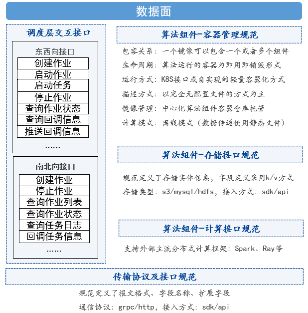
</div>

本指引将从管理层、控制层、算法组件层、通信层几个方面介绍互联互通方案设计思路、集成改造方案，并将常见问题及解决方案列举在附录中供参考。

## 2 管理层

### 2.1 概述

管理层需对隐私计算平台的基本元素、各级资源的授权流程及支撑授权流程的 API 接口进行标准化定义，从而对互联互通的隐私计算平台内外部各元素进行协调管控，实现管理层级的互联互通。

#### 2.1.1 功能介绍

##### 2.1.1.1 基本元素

隐私计算互联互通首先需要提炼出最小必要的实体元素，参与互联互通的各参与方需要对其这些实体元素的定义和数据结构。具体包括以下实体：

- 节点（Node）：隐私计算生态中的抽象功能单元，用来指代由机构或组织部署的隐私计算平台。
- 数据集（Dataset）：可供参与隐私计算的数据资源。
- 项目（Project）：面向特定目标的，提供一项独特产品、服务或成果的隐私计算方案，该实体为可选项。
- 组件（Component）：独立执行隐私计算任务的模块单元，其经过封装、符合开放接口规范、可以完成某个特定计算或算法，可独立部署。
- 流程（Flow）：采用 DAG 结构定义的、可编排的隐私计算作业运行模板。
- 作业（Job）：一个隐私计算流程通过配置运行参数后的运行实例。
- 任务（Task）：组件运行实例的载体，每个运行实例通过任务来管理。
- 模型（Model）：指通过隐私计算技术训练完成，可用于进一步推理的模型，或是已有的现成模型。

结合上述实体定义，实体间的关系图如图所示：

<div align="center">
    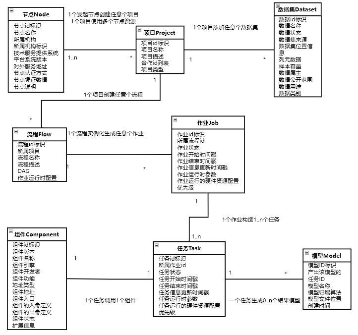
</div>

##### 2.1.1.2 功能概述

隐私计算互联互通必需的管理操作包括：节点互通管理、数据互通管理，项目互通管理、组件互通管理、流程互通管理、模型互通管理。

<div align="center">
    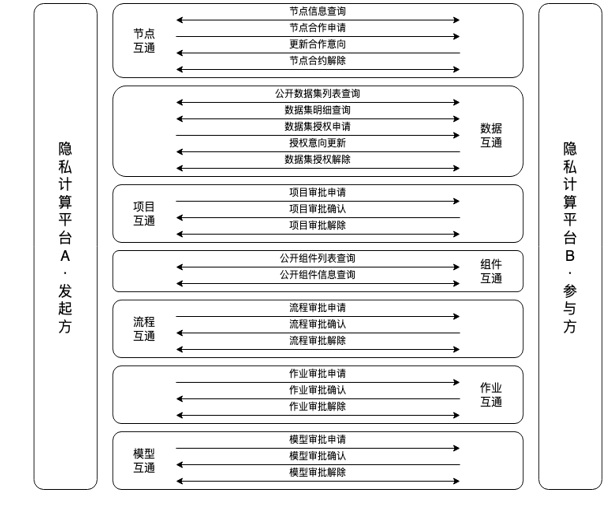
</div>

##### 2.1.1.3 流程有向无环图（DAG）及作业配置（conf）通用结构

任务流程（DAG）及作业配置（conf）信息贯穿整个管理层和数据层，是作业运行的载体。DAG 及 conf 由管理层下发到控制层。

流程 DAG：用来描述流程中组件依赖关系的语言，一旦流程确定则内容不变，DAG 的配置文件采用 json 格式，整个配置文件为一个 json 对象。

作业 conf：用于设置各个参与方的信息，作业系统参数、运行时任务系统参数以及配置信息，conf 的配置文件采用 json 格式，整个配置文件为一个 json 对象。

DAG 与 conf 规范详见控制层，具体参见 3.1.2.1 节。

#### 2.1.2 交互流程

管理层需要同步适配控制层，对流程中的组件编排和作业的参数配置这两个具体计算执行时依赖的静态描述信息进行统一规范，支撑数据平面对计算资源进行统一调度。


<div align="center">
    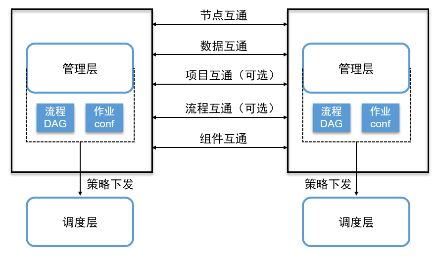
</div>


### 2.2 改造指南

#### 2.2.1 管理层接口

采用 restful 接口风格，调用方法包括 get、post 等。

[管理层接口](../互联互通API接口规范/1.管理层接口/隐私计算互联互通管理层API.md)

#### 2.2.2 涉及改造内容

管理层适配改造需要与“互联互通管理层接口”标准进行比对，整理出与管理面接口文档标准有差异的内容，然后针对这些差异进行适配改造开发。主要包括以下内容：

1. 地址及参数对齐：原厂接口地址、输入输出参数均与互联互通标准存在差异，需要针对原厂每一个接口进行适配改造开发，通过标准接口来适配原厂接口。
   注：如原厂节点之间采用自己独有的通信网关，接口地址采用统一 url 地址交互，而不同接口通过唯一标识进行策略路由。这种场景需要对原厂接口交互策略进行改造适配，以保证与异构的互联互通节点正常通信。
2. HTTP 通信协议及规范：管理层互联互通接口通信协议标准为 HTTP 协议，当管理层通信协议为非 HTTP 协议时，需要进行适配改造；如 Content-Type、HTTP Method、Request Header、公共输出参数结构等，需按互联互通标准适配改造。
3. 管理层交互流程：原厂系统对于管理面元素之间的交互流程可能存在一定差异，如项目审批、流程审批、作业审批、模型审批等，原厂系统本需要对该类交互流程的功能模块做适配改造。
4. 数据结构对齐：管理层互联互通每一个元素所相关的属性与互联互通标准存在一定的差异，例如属性名称的差异、缺失等，都需要进行适配和完善。
5. 数据集上传：由于互联互通数据集访问都采用统一的协议和格式，所以需要按照互联互通标准协议来上传数据集，以保证管理层和数据层对数据的正常访问。

#### 2.2.3 注意事项

##### 2.2.3.1 与其它各层的重要参数及内容

- dataset_id：数据集 id
- token_id：资源授权
- inst_id：机构 id
- node_id：节点 id
- 节点证书：传输层相关

##### 2.2.3.2 与数据面的交互问题

1. 管理面下发作业给控制层，控制层按照”job-”+32 位随机数的规则生成 jobid，并同步返回给管理层。
2. 管理层维护 dataset_id 的存储映射关系，通过接口下发 dataset_id 所对应的数据集地址给控制层。

<div align="center">
    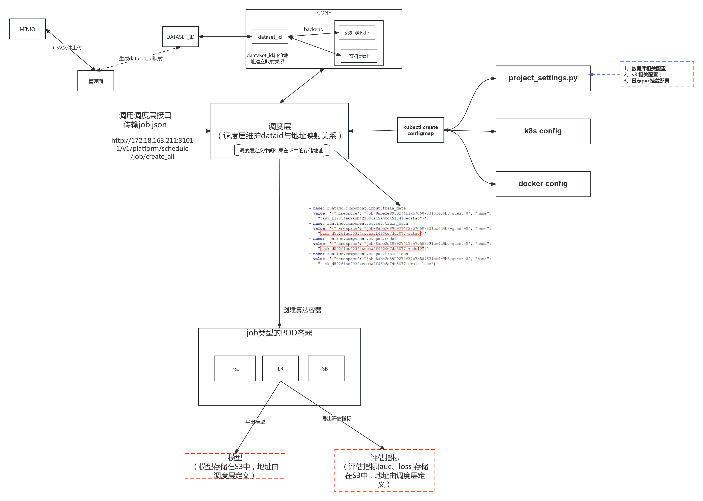
</div>

3. 管理层需要下发 node_id、inst_id、token_id 以及节点证书。

##### 2.2.3.3 问题清单

**（1）问题：节点信息查询接口与节点签约并无直接依赖关系**

**问题解析：**

发起节点签约申请时，会线下获取到合作方的签约地址和 node_id，而节点签约申请参数除了合作方 node_id 外，并不需要传更多的合作方的信息，所以，查询节点信息接口仅仅是补全合作方的详细信息的作用

**解决方案：**

无需解决，如果从标准上考虑，节点未签约的前提下，可查询节点信息接口导致的信息暴露，可以考虑该将该接口的请求加上身份的验证

**（2）问题：签约状态不同步导致再次发起签约失败**

**问题解析：**

发起方节点发起签约时会校验对方签约状态和己方是否一致，不一致则不会发起签约。而合作方节点拒绝签约后，状态应为拒绝状态，但合作方节点出于某种原因会将拒绝状态改为解约状态，导致两方状态不一致的问题。

**解决方案：**

双方统一签约状态，不对签约状态做额外的处理

## 3 控制层

### 3.1 概述

控制层接收管理层的作业请求，以 DAG 和 conf 所携带的内容来实现作业调度控制、任务调度控制、组件注册发现、容器管理与加载等操作，协调各个参与方节点运行作业，通过将一个作业拆分成若干个任务，按照任务的组合顺序来执行每一个任务。在任务被调度开始执行前，由每个任务的配置驱动，启动对应的算法组件容器，实现隐私计算平台对异构算法组件的调用。

#### 3.1.1 功能介绍

##### 3.1.1.1 DAG 和 conf 规范

1. 流程 DAG 定义
   DAG 模板结构如下图所示：

```
dag：
{
    components: [  //算法组件相关，可参考算法自描述
        {
            name: "${name}",//算法组件运行态名称
            componentName: "${componentName}",//算法组件名称
            provider: "${provider}", //算法提供商
            version: "${version}", //算法版本
            inputData: "${inputData}",//kv数组，[{type: "${type}",key: "${key}"}],对应算法自描述中的inputData
            outputData: "${outputData}",//kv数组，[{type: "${type}",key: "${key}"}],对应算法自描述中的outputData
        },
    ],
    version: "${version}",//dag描述版本
}
```

示例如下：

```json
"dag": {
        "components": [
            {
                "name": "intersect_rsa_1",
                "componentName": "Intersection",
                "provider": "unionpay",
                "version": "2.0.0",
                "input": [],
                "output": [
                    {
                        "type": "dataset",
                        "key": "train_data"
                    },
                    {
                        "type": "report",
                        "key": "report0"
                    }
                ]
            },
            {
                "name": "hetero_logistic_regression_1",
                "componentName": "HeteroLR",
                "provider": "unionpay",
                "version": "2.0.0",
                "input": [
                    {
                        "type": "dataset",
                        "key": "intersect_rsa_1.train_data"
                    }
                ],
                "output": [
                    {
                        "type": "dataset",
                        "key": "data0"
                    },
                    {
                        "type": "model",
                        "key": "model0"
                    },
                    {
                        "type": "report",
                        "key": "report0"
                    }
                ]
            }
        ],
        "version": "2.0"
    }
```

1. 作业 conf 定义

conf 模板结构如图所示：

```
config: 
{
    initiator：{
        role: "${role}",//描述发起方节点信息
        nodeId: "${nodeId}",//描述发起方节点信息
    },
    role:{
        guest:"${guest}",//数组
        host:"${host}",//数组
        arbiter: "${arbiter}",//数组
    },
    job_params: {
        common: {
            sync_type: "${sync_type}",//poll、callback等
        },
        guest: {
            0: {//第一个guest方资源信息，依次用0，1，2...表示
                resources: {
                    cpu: "${cpu}",
                    memory: "${memory}",
                    disk: "${disk}"
                }
            }
        },
        host: {
            0: {//第一个host方资源信息，依次用0，1，2...表示
                resources: {
                    cpu: "${cpu}",
                    memory: "${memory}",
                    disk: "${disk}"
                }
            }
        }
    },
    task_params: {
        common： {
            name:  //算法组件运行态名称
            {
                inputParam: "${inputParam}",//算法组件参数，参见算法自描述文件
            },
        },
        guest: {
            0: {
                name: {//算法组件运行态名称
                    dataset_id: "${dataset_id}",//数据集id
                }
            }
        },
        host: {
            0: {
                name: {//算法组件运行态名称
                    dataset_id: "${dataset_id}",//数据集id
                }
            },
        }
    },
    version: "${version}",//config版本信息
}
```

示例如下：

```json
"config": {
        "initiator": {
            "role": "guest",
            "node_id": "JG0100001100000000"
        },
        "role": {
            "guest": [
                "JG0100001100000000"
            ],
            "host": [
                "JG0110017800000000"
            ],
            "arbiter": [
                "JG0100001100000000"
            ]
        },
        "job_params": {
            "common": {
                "sync_type": "poll"
            },
            "guest": {
                "0": {
                    "resources": {
                        "cpu": -1,
                        "memory": -1,
                        "disk": -1
                    }
                }
            },
            "host": {
                "0": {
                    "resources": {
                        "cpu": -1,
                        "memory": -1,
                        "disk": -1
                    }
                }
            }
        },
        "task_params": {
            "common": {
                "hetero_logistic_regression_1":{
                    "id":"id",
                    "label":"y",
                    "penalty":"L2",
                    "tol":0.0001,
                    "alpha":0.01,
                    "optimizer":"nesterov_momentum_sgd",
                    "batch_size":-1,
                    "learning_rate":0.15,
                    "init_param":{
                        "init_method":"zeros"
                    },
                    "max_iter":2,
                    "early_stop":"diff"
                },
                "intersect_rsa_1": {
                    "id": "id",
                    "intersect_method": "rsa",
                    "sync_intersect_ids": true,
                    "only_output_key": false,
                    "rsa_params": {
                        "hash_method": "sha256",
                        "final_hash_method": "sha256",
                        "key_length": 2048
                    }
                }
            },
            "guest": {
                "0": {
                    "intersect_rsa_1": {
                        "name": "test_guest",
                        "namespace": "testspace"
                    }
                }
            },
            "host": {
                "0": {
                    "intersect_rsa_1": {
                        "name": "test_host",
                        "namespace": "testspace"
                    }
                }
            }
        },
        "version": "2.0.0"
    }
```

##### 3.1.1.2 调度交互

控制层应包含以下功能内容：

1. 作业与任务的创建与运行
2. ① 发起方创建作业后，由发起方将创建作业请求转发给调度方，然后再有调度方分发给每个参与方
3. ② 由调度方根据运行情况来判断是否启动运行作业，并向各个参与方发送启动作业请求
4. ③ 启动作业后，调度方遍历作业中任务列表，并向各个参与方发送启动任务请求
5. 作业与任务停止
6. ① 作业运行过程中，发起方、参与方都可以主动发起停止作业，将停止请求发送至调度方，再由调度方转发给各个参与方，此时作业状态变为 FINISHED，而此时处于 RUNNING 状态下的任务，状态变为 FAILED
7. ② 作业运行过程中，当某一方任务状态为 FAILED 时，则由调度方主动向各个参与方发送停止作业请求，此时作业状态变为 FINISHED，而此时处于 RUNNING 状态下的任务，状态变为 FAILED
8. 任务执行状态同步方式

- 东西向任务状态查询采用 poll 轮询模式。
- 南北向任务状态查询采用 callback 回调模式。

9. 在流程调度环节，隐私计算参与方分为两类角色：协调方、参与方：

| 角色名 | 角色定义                                                                                                                 |
| ------ | ------------------------------------------------------------------------------------------------------------------------ |
| 调度方 | 负责协调所有参与方任务的角色，调度方可以为独立的第三方节点，也可以为其中一个参与方节点，在任务创建时选择对应节点来确定。 |
| 参与方 | 通常代表一个隐私计算节点，在某个隐私计算任务中提供计算能力的角色。                                                       |

##### 3.1.1.3 加载算法容器

1. 平台应支持对算法组件容器的注册功能。
2. 平台的控制层服务应支持对注册的算法组件容器进行生命周期管理，实时创建或销毁算法组件容器并实时监控算法组件状态，推荐采用 K8s 集群实现。
3. 平台的控制层在创建算法组件容器执行任务时，应支持按照互联互通标准规范的环境变量格式向算法组件容器输入系统配置、组件配置、算法组件参数、算法组件输入数据、算法组件输出数据等配置信息。

### 3.2 改造指南

#### 3.2.1 控制层接口

控制层接口主要包括东西向接口、南北向接口及算法信息交互接口。东西向接口涉及本方与参与方的通信调度。南北向接口主要负责作业运行、算法容器拉起运行等。算法信息交互接口主要负责算法组件运行状态与控制层的信息同步。

（1）东西向接口

- 创建作业（调度方）
- 创建作业
- 启动作业
- 启动任务
- 停止作业（调度方）
- 停止作业
- 查询作业状态
- 查询作业状态（调度方）
- 作业审批确认
- 查询任务回调信息

（2）算法回调接口

- 回调任务信息（控制层接口，算法组件调用该接口同步信息）

（3）南北向接口（可选）

- 组件注册
- 创建作业
- 停止作业
- 停止任务
- 查询作业状态
- 查询作业列表
- 查询任务日志行数
- 查询任务日志

控制层接口具体详见如下链接：

[控制层接口](../互联互通API接口规范/2.控制层接口/隐私计算互联互通控制层API.md)

#### 3.2.2 涉及改造内容

##### 3.2.2.1 调度流程改造

- callback 回调模式

<div align="center">
    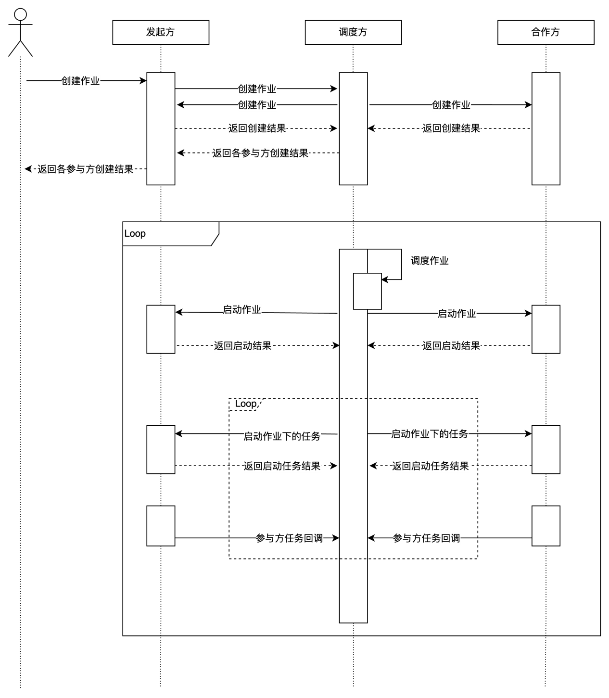
</div>

- poll 轮询模式

<div align="center">
    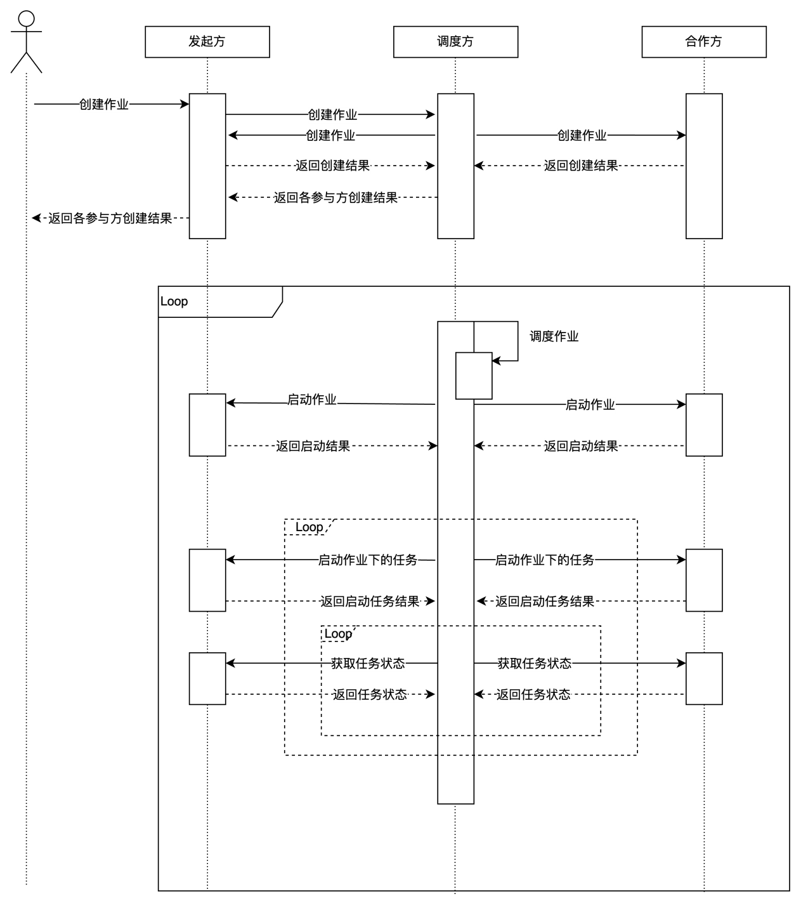
</div>

- 调度方根据任务状态停止作业

<div align="center">
    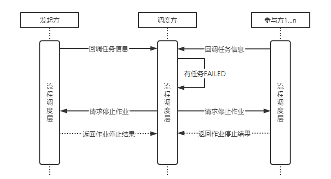
</div>

##### 3.2.2.2 算法容器加载

容器一般为即用即销毁形式。

1. 容器加载流程如下图所示：

<div align="center">
    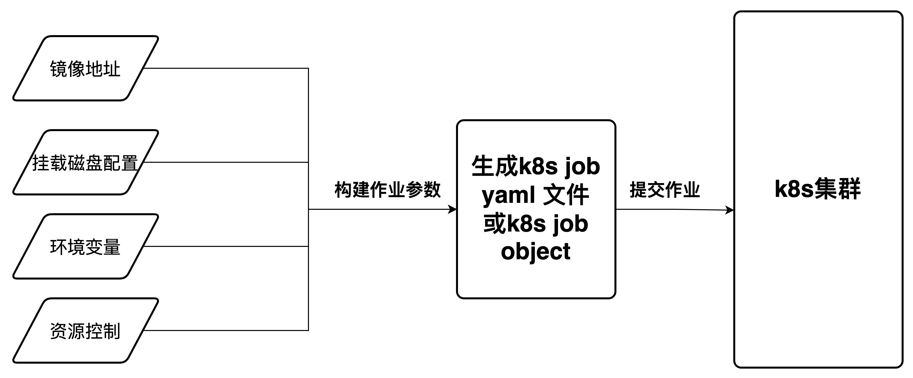
</div>

1. 容器加载要点：

- 获取镜像地址: 镜像地址在组件注册时由管理侧传给控制层，控制层连同组件模板一同写入数据库，因此，需要从控制层关联的数据库中获取当前算法组件需要的镜像地址。
- 配置磁盘挂载： 配置 nfs 或其他磁盘挂载方式，将算法落盘的数据挂载到其他服务器中，以便在 pod 销毁后仍能查看算法输出的数据。
- 构建环境变量: 基于创建作业时管理侧传入的参数，构建输入、输出、算法参数，同时将磁盘挂载路径等信息一同写入环境变量。
- 资源控制: 基于创建作业时管理侧传入的 resource 参数，获取 cpu、memory 等参数，将参数值写入 k8s yaml 或 k8s job objet，实现对 pod 的资源控制。

2. 资源及环境信息配置：数据库相关配置信息加载、存储相关配置信息加载、日志及 PVC 挂载配置。
3. 算法容器加载的方式可以分为三种：K8S（权限）、进程方式（自有平台跑自有算法）、docker 方式（权限），推荐 K8S。

- k8s 加载容器方式(推荐此方式)：

安装 k8s python sdk:

```shell
pip install kubernetes
```

导入所需依赖：

```shell
from kubernetes import client, config
 from kubernetes.client import (
     V1VolumeMount,
     V1NFSVolumeSource,
     V1EnvVar,
     V1EnvVarSource,
     V1ObjectFieldSelector,
 )

 from project_settings import (
     k8s_active_deadline_seconds,
     k8s_ttl_seconds_after_finished,
     k8s_namespace,
     logs_volumes_mount_path,
     logs_volumes_source_volume,
     nfs_server,
     logs_volumes_name,
     logs_sub_path,
     image_pull_policy,
 )
```

构建算法容器所需环境变量参数 env_list：

```python
def build_env(paramaters: dict):
"""
:param paramaters: dict 算法运行依赖的参数
:return: list<V1EnvVar> 返回k8s环境变量数组
"""
if paramaters is None:
    paramaters = {}
envs = []
for k, v in paramaters.items():
    if isinstance(v, int):
        new_v = str(v)
    elif isinstance(v, float):
        new_v = str(v)
    elif isinstance(v, dict):
        new_v = json.dumps(v)
    elif isinstance(v, list):
        new_v = json.dumps(v)
    elif isinstance(v, str):
        new_v = v
    elif isinstance(v, bool):
        new_v = "true" if v else "false"
    else:
        raise Exception(f"暂不支持参数{k}的数据类型{type(v)}")
    env = V1EnvVar(name=k, value=new_v)
    envs.append(env)
# 添加host ip到环境变量
value_from = V1EnvVarSource(
    field_ref=V1ObjectFieldSelector(field_path="status.hostIP")
)
env = V1EnvVar(name="MY_HOST_IP", value_from=value_from)
envs.append(env)
return envs
```

构建资源控制参数 resources：

```python
# resource_info的值是从作业创建的配置里获取
resource_info = {"cpu":1, "memory": 16}
rq = {}
cpu_num = resource_info.get("cpu")
memory = resource_info.get("memory")
if cpu_num and cpu_num != -1:
    rq.update({"cpu": f"{cpu_num}"})
if memory and memory != -1:
    rq.update({"memory": f"{memory}Gi"})
if rq:
    resources = client.V1ResourceRequirements(
        requests=rq,
        limits=rq,
    )
```

挂载磁盘配置 volume_mounts：

```python
# 容器中的目录
 volume_mounts = []
 volume_mounts.append(
     V1VolumeMount(
         mount_path={容器中日志路径}, # 银联示例：/data/projects/fate/fateflow/logs
         name={挂载目录名称}, # 银联示例：python-data
         sub_path={子路径}, # 银联示例：logs
     )
 )

 # nfs中挂载地址：
 volumes = []
 volumes.append(
         client.V1Volume(
             name={挂载目录名称}, # 银联示例：python-data
             nfs=V1NFSVolumeSource(
                 path={挂载目录路径},  # 银联示例：/fate-70004/python
                 server={nfs server地址} # 银联示例：10.0.1.43
             ),
         )
     )]
```

基于上述参数构建 container 对象：

```python
container = client.V1Container(
    name={容器名称}, # 名称可自定义
    image={镜像地址}, # 镜像地址获取方式需要实现
    image_pull_policy={镜像拉去策略}, # 可选值: Always 、Never 、IfNotPresent
    env=env_list,
    # 这个容器通常情况下，需要2000%的CPU时间和50MiB的内存（requests），同时最多允许它使用10%的CPU时间和4000MiB的内存（limits）,
    # CPU单位后缀 m 表示千分之一核，也就是说 1 Core = 1000m。
    resources=resources,
    volume_mounts=volume_mounts,
)
```

定义 Pod 的模板规格：

```python
template = client.V1PodTemplateSpec(
    metadata=client.V1ObjectMeta(labels={"app": "workflow"}),
    spec=client.V1PodSpec(
        restart_policy="Never",
        containers=[container],
        volumes=volumes,
    ),
)
```

定义 Job 的规格（Spec）：

```python
spec = client.V1JobSpec(
    active_deadline_seconds={任务超时时间}, # 任务超时时间，单位s
    # backoff_limit=4, 作业失败重试次数
    template=template,
    ttl_seconds_after_finished={Job生命周期控制参数},  # 任务完成/失败多久后删除,单位s, 0:完成后立即删除
)
```

提交作业至 k8s 集群：

```python
config.load_kube_config()
api_instance = client.BatchV1Api()
api_instance.create_namespaced_job(body=job, namespace={k8s命名空间配置}) # namespace参数值需要替换成拥有运行作业权限的命名空间
```

- docker 加载容器方式

docker 启动算法容器示例:

```python
import docker
 import shutil
 import os

 def run_container(image_name, env_vars, script_path, nfs_mount_path, nfs_server):
     client = docker.from_env()

     # 设置环境变量
     environment = {key: str(value) for key, value in env_vars.items()}

     # 创建并运行容器
     container = client.containers.run(
         image=image_name,
         detach=True,
         environment=environment,
         volumes={nfs_mount_path: {'bind': '/app/output', 'mode': 'rw'}},
         command=f'/bin/bash -c "{script_path}"'
     )

     # 等待容器执行结束
     exit_code = container.wait()['StatusCode']

     # 销毁容器
     container.remove(force=True)

     # 将容器中的数据上传到 NFS 服务器
     upload_to_nfs(nfs_mount_path, nfs_server)

     return exit_code

 def upload_to_nfs(local_path, nfs_server):
     # 使用 shutil 将本地目录上传到 NFS 服务器
     shutil.copytree(local_path, os.path.join(nfs_server, 'uploaded_data'))

 if __name__ == "__main__":
     image_name = "your-docker-image"  # 替换为你的 Docker 镜像名字
     env_vars = {"YOUR_VARIABLE": "your_value"}  # 替换为你的环境变量
     script_path = "/path/to/your/script.sh"  # 替换为你的脚本路径
     nfs_mount_path = "/local/path"  # 本地挂载路径
     nfs_server = "nfs-server:/nfs/path"  # 替换为你的 NFS 服务器地址和路径

     exit_code = run_container(image_name, env_vars, script_path, nfs_mount_path, nfs_server)
     print(f'Container exit code: {exit_code}')
```

补充说明：

```
请确保替换上述示例中的占位符（如 your-docker-image、your_variable、/path/to/your/script.sh、/local/path、nfs-server:/nfs/path）为你实际使用的值。此脚本将创建一个容器，执行脚本，将脚本输出的数据挂载到本地目录，然后将本地目录中的数据上传到 NFS 服务器。
```

- 进程加载方式

进程加载算法示例:

```python
import subprocess
 import os
 import shutil

 def run_script(script_path, env_vars, nfs_mount_path, nfs_server):
     # 构建启动脚本的命令
     command = ["python", script_path]
     
     # 设置环境变量
     for key, value in env_vars.items():
         os.environ[key] = str(value)

     # 启动脚本
     process = subprocess.Popen(command, stdout=subprocess.PIPE, stderr=subprocess.PIPE)
     stdout, stderr = process.communicate()

     # 将输出的数据挂载到 NFS 服务器
     if process.returncode == 0:
         upload_to_nfs(stdout, nfs_mount_path, nfs_server)

     return process.returncode

 def upload_to_nfs(data, local_path, nfs_server):
     # 使用 shutil 将数据写入本地目录
     with open(local_path, 'wb') as file:
         file.write(data)

     # 使用 shutil 将本地目录上传到 NFS 服务器
     shutil.copy(local_path, nfs_server)

 if __name__ == "__main__":
     script_path = "/path/to/your/script.py"  # 替换为你的 Python 算法启动脚本路径
     env_vars = {"YOUR_VARIABLE": "your_value"}  # 替换为你的环境变量
     nfs_mount_path = "/local/path/output_data.txt"  # 本地挂载路径
     nfs_server = "/nfs/path/output_data.txt"  # 替换为你的 NFS 服务器路径

     exit_code = run_script(script_path, env_vars, nfs_mount_path, nfs_server)
     print(f'Script exit code: {exit_code}')
```

补充说明：

```
这个脚本使用 subprocess 启动了一个 Python 脚本，将环境变量传递给该脚本。脚本执行结束后，它将输出的数据写入本地目录，然后使用 shutil.copy 将本地目录中的数据上传到 NFS 服务器。请确保替换上述示例中的占位符为你实际使用的值。
实际实现过程中需要在最外层实现一套作业及任务管理的服务，在任务执行前准备好算法所需的环境变量参数，最后调用此脚本提交算法任务。
```

#### 3.2.3 注意事项

1. 创建作业 create_all 将资源审核、准备及运行合并到一起
2. 南北向以 callback 回调方式获取算法容器状态，东西向以 poll 方式回调信息
3. 生成 job_id 和 task_id，将 job_id 返回管理层。其中 job_id 生成规则为：“job-”+32 位随机数；task_id 生成规则为：“task_”+32 位随机数
4. k8s 模式拉起算法容器的模式需要提前配置相应 API server 权限
5. 当无协调方时，则由发起方承担协调方的功能，由发起方向各个参与方分发创建作业、停止作业、查询作业状态、同步任务状态等请求

## 4 算法组件层

### 4.1 概述

算法以“算法容器”的方式运行，即用即销毁。针对具体的算法组件，开发者需要同步提供 json 格式的算法自描述文件（详见 4.1.2.3 节）供算法使用方参考，算法使用方基于算法自描述文件可以注册（详见 4.2.1.2）并使用算法。

#### 4.1.1 功能介绍

##### 4.1.1.1 算法容器化加载

算法组件容器化加载的整体关系如下：

<div align="center">
    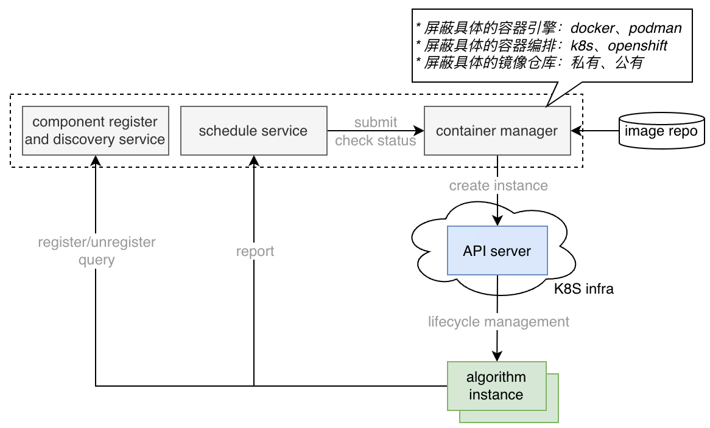
</div>

与隐私计算平台相关的模块包括：

1. component register and discovery service：组件注册与发现。用于管理组实例的服务，提供组件的注册和查找服务。组件实例启动后进行注册，实现算法服务发现和路由（管理层注册）。
2. schedule service：调度服务。对算法作业、任务进行调度
3. container manager：容器管理器。对底层容器编排能力的封装，接收调度服务的请求

注意：上述各模块是逻辑上的抽象，不对应具体的服务，物理形态不作限制。

- 组件通过加载机制，将组件的镜像加载成为组件实例，并将响应的接口注册到注册和发现服务上，供任务进行调用。任务和组件实例之间，可以是多个任务对应一个组件实例，也可以是一对一形式。
- 其中组件镜像（Component Image）指用于表示组件的打包后的容器镜像文件。组件实例（Component Instance）指在加载和启动后用于提供组件功能的进程或者服务。组件实例可以是常驻或者单次形态进行运行，但组件的工作流程和步骤都保持一致。

算法容器设计目标及约定如下：

- 包容关系：一个镜像可以包含一个或者多个组件
- 生命周期：算法运行的容器为即用即销毁形式
- 计算模式：离线模式（算法之间的计算数据传递使用静态的文件）
- 描述方式：完全无文件的方式为主

##### 4.1.1.2 算法镜像参数定义及注入方式

（1）算法容器相关名称

- 算法包：package
- 算法操作：component
- 组件自描述部分：component self-description part
- 运行环境部分： running environment part
- 动态运行部分：dynamic runtime information part

（2）镜像总体描述

| 分类         | 子项目       | 获取位置 | 数据内容                        |
| ------------ | ------------ | -------- | ------------------------------- |
| 运行环境部分 | 支撑系统接口 | ENV      | k=v, 系统接口地址               |
|              | 配置信息     | ENV      | k=v, 配置选项内容               |
|              |              |          |                                 |
| 动态运行部分 | 算法名称     | ENV      | k=v, 算法子标识字符串           |
|              | 算法参数     | ENV      | k=v, 算法参数                   |
|              | 算法输入数据 | ENV      | k=v, 输入数据文件标识           |
|              | 算法输出数据 | ENV      | k=v, 系统分配的输出数据文件标识 |

（3）键名定义规范

名称定义：< 部分名 >.< 部分序号 >.< 子项目 >.< 子项目序号 >.< 条目名称 >.< 条目序号 >

示例：

- component.1.name： 第 1 个算法组件的名称
- component.1.parameter.2.name： 第 1 个算法组件的第 2 个参数名称

（4）组件运行状态返回规范

运行状态获取：再容器结束后，通过容器内的主进程的运行结果作为当前组件的状态。取值范围为含零非负整数。

- 状态码等于 0：表示运行成功
- 状态码大于 0: 表示运行失败

（5）组件日志

组件运行的需要上报的日志，通过容器的标准输出 stdout 的内容，作为组件运行的日志；日志内容可以包括来自组件运行期间不同模块，等级，线程等产生的日志输出，以行作为最小日志记录单元。

（6）系统支撑相关接口

| **标识名称**     | **可选性** | **标识含义**     | **描述**                                     |
| ---------------- | ---------- | ---------------- | -------------------------------------------- |
| system.storage   | 必选       | 存储层服务地址   |                                              |
| system.callback  | 可选       | 控制层回调地址   | 可通过接口回调，也可通过容器运行结果，或其他 |
| system.transport | 必选       | 传输服务地址     |                                              |
| system.compute   | 可选       | 计算引擎服务地址 |                                              |

（7）组件配置信息

| **标识名称**             | **可选性** | **标识含义**                                                                                                                                        | **描述**           |
| ------------------------ | ---------- | --------------------------------------------------------------------------------------------------------------------------------------------------- | ------------------ |
| config.self_role         | 必选       | 当前组件运行任务的角色 +index，多个是用英文逗号分割                                                                                                 | guest/host/arbiter |
| config.task_id           | 必选       | 组件运行的任务 ID                                                                                                                                   |                    |
| config.node_id..<role_n> | 必选       | 角色对应的节点 ID                                                                                                                                   | 数据传输时需要     |
| config.inst_id..<role_n> | 必选       | 角色对应的机构 ID                                                                                                                                   |                    |
| config.session_id        | 必选       | 传输 SDK 需要的会话 ID                                                                                                                              |                    |
| config.trace_id          | 必选       | 链路 ID                                                                                                                                             |                    |
| config.token             | 必选       | 对应管理面 ResourcePermit 实体中的 token，用于传输接收方进行权限校验 **注：目前两个以上参与方时暂不确定传参方式，所以暂不建议对此进行字段进行校验** |                    |
| config.log.path          | 必选       | log 日志路径（容器内）                                                                                                                              |                    |
| config.n_threads         | 可选       | 存储 SDK 上传、下载数据的并行数                                                                                                                     | 存储层需要         |
| config.chunk_size        | 可选       | 存储 SDK 上传、下载数据的块大小                                                                                                                     |                    |

（8）算法组件名称

| **标识名称**           | **可选性** | **标识含义**       | **描述** |
| ---------------------- | ---------- | ------------------ | -------- |
| runtime.component.name | 必选       | 当前运行的组件名称 |          |

（9）算法组件参数

| **标识名称**                 | **可选性** | **标识含义**             | **描述** |
| ---------------------------- | ---------- | ------------------------ | -------- |
| runtime.component.parameter. | 必选       | 组件运行期的参数对应的值 |          |

（10）算法输入数据

| **标识名称**             | **可选性** | **标识含义**                   | **描述** |
| ------------------------ | ---------- | ------------------------------ | -------- |
| runtime.component.input. | 必选       | 组件运行期的输入对应的文件标识 |          |

（11）算法输出数据

| **标识名称**              | **可选性** | **标识含义**                   | **描述** |
| ------------------------- | ---------- | ------------------------------ | -------- |
| runtime.component.output. | 必选       | 组件运行期的输出对应的文件标识 |          |

（12）容器参数注入方式

控制层调起算法容器时，以环境变量方式给算法容器注入超参数，包括：算法超参数、系统参数、数据源配置参数等。

```yaml
- env:
        - name: runtime.component.name
          value: Intersection
        - name: runtime.component.parameter.id
          value: id
        - name: runtime.component.parameter.intersect_method
          value: rsa
        - name: runtime.component.parameter.sync_intersect_ids
          value: "True"
        - name: runtime.component.parameter.only_output_key
          value: "False"
        - name: runtime.component.parameter.rsa_params
          value: '{"hash_method": "sha256", "final_hash_method": "sha256", "key_length":
            2048}'
        - name: runtime.component.parameter.name
          value: test_guest
        - name: runtime.component.parameter.namespace
          value: testspace
        - name: runtime.component.input.train_data
          value: '{"namespace": "testspace", "name": "test_guest"}'
        - name: runtime.component.output.train_data
          value: '{"namespace": "job-8abe2e8959274f37b7c507831bc4c9b8-guest-0", "name":
            "task_bd7354a62aeb421086ac5a40c4518418-data0"}'
        - name: runtime.component.output.train-intersection
          value: '{"namespace": "job-8abe2e8959274f37b7c507831bc4c9b8-guest-0", "name":
            "task_bd7354a62aeb421086ac5a40c4518418-train-intersection"}'
```

```yaml
- name: config.self_role
          value: guest.0
        - name: config.node_id.guest.0
          value: LX0000010000110
        - name: config.inst_id.guest.0
          value: JG0100001100000000
        - name: config.task_id
          value: task_bd7354a62aeb421086ac5a40c4518418
        - name: config.session_id
          value: session_job_8abe2e8959274f37b7c507831bc4c9b8
        - name: config.token
          value: token_job_8abe2e8959274f37b7c507831bc4c9b8
        - name: config.trace_id
          value: None
        - name: config.log.path
          value: /data/projects/fate/fateflow/logs/job_8abe2e8959274f37b7c507831bc4c9b8/host/LX0000010000110/intersect_rsa_1
        - name: config.node_id.host.0
          value: LX0000010000110
        - name: config.inst_id.host.0
          value: JG0100001100000000
```

```yaml
- name: system.callback
          value: http://192.168.1.69:9011/v1/platform/schedule/task/callback
        - name: system.storage
          value: s3://192.168.1.69:9200?username=EyXV9sFu9xPCasRQ&password=YhMrhBvlO0oAx4bdRpNBAQQzYw9WC3ON
        - name: system.transport
          value: 192.168.1.69:30304
        - name: system.compute
          value: spark://192.168.1.69:7077
        - name: system.operator_serving
          value: 10.0.1.37:30400
```

##### 4.1.1.3 算法自描述文件

原厂算法需要对各自的算法组件定义算法自描述文件，用以描述所提供的算法镜像内部参数信息，继而保证每个参与互联互通的节点能工正常的解析和注册算法到自己的节点，算法自描述模板如下：

```
{
    componentName: "${componentName}", //算法组件名称，跟算法容器的环境变量相对应

    title: "${title}", //页面显示名称

    provider: "${provider}", //算法提供商

    version: "${version}", //算法版本

    description: "${description}", //算法描述

    roleList: "${roleList}", //[必须]算法支持的角色定义,数组类型。例如：["guest", "host","arbiter"]

    desVersion: "${desVersion}", //[可选]描述文件采用的版本

    storageEngine:"${storageEngine}",//[必须]说明算法组件所支持的存储引擎，数组类型。如：["s3", "hdfs","eggroll"]

    /**
     * 描述算法输入参数
     * 输入参数这里是指如算法超参相关的信息,和算法组件输入的数据区分开来,参考inputData的描述
     **/
    inputParam: [{
        name: "${name}", //输入字段的形式参数名称，跟算法容器的环境变量相对应
        title: "${title}", //页面显示字段标题
        description: "${description}", //参数描述
        type: "${type}", //描述输入字段的类型
        /**
         * 以下给出常用的几种数据类型:
         * string：字符串类型
         * int: 整数类型
         * float: 浮点数类型
         * boolean: 布尔类型
         * integer: 整型对象，可以为null
         * number: 数值型，包括整数和小数（当不具体区分整型和浮点型时采用该种类型）
         * object: 复杂类型,可以使用json表示,前端就具体的json数据结构可扩展相关控件。
         * ...等其他类型
        **/
        bindingData: "${bindingData}", //[可选],可枚举的静态绑定数据,可以引用外部其它函数获取控件绑定的数据,如可渲染下拉菜单、单选框、多选框等的数据获取方式       
        /**
         * 例如1:静态绑定数据
         * bindingData:"[{label: "${label}",value: "${value}"}]",其中是可以执行的 kv Json，格式参考为kv数组。
         *
         * 例如2:动态绑定数据
         * bindingData:"call_function getKV()"。//定义一个调用的回调函数获取数据，
         * 这里的call_function作为一个函数调用的标识符使用，解析执行器使用call_function作为标识符判断，用于与静态值区别，
         * 后面的getKV()，解析执行器需要保障执行上下文中存在可调用的getKV()函数，getKV()的函数命名，在实际使用中，可自定义。
        **/
        optional: "${optional}", //[必选],表示该参数是必须的还是可选的,默认为true表示可选,false表示必填
        defaultValue: "${defaultValue}", //[可选],输入的默认值。
        validator: "${validator}", //[可选],选择一个字段校验器,如可以写成 regular:'正则表达式',来做正则验证；使用（inf,sup）来对数值的上下界限进行限定
        dependsOn: "${dependsOn}", //[可选]只用于bindingData,表示算法的条件参数，用于组件内部依赖关系展示,默认为空值。若依赖于上游参数，则提供依赖列表，如：["param.value",""]
        /*以下字段跟前端显示及渲染有关，供前端展示参考*/
        UIPattern: "${UIPattern}", //[可选],表示字段的UI模式,默认为editeable,此外有readOnly表示只读,hidden,表示隐藏控件
        groupTag: "${groupTag}", //[可选] 分组标签,用于分组显示,如[默认分组-显示、高级分组-默认不显示]
        UIType: "${UIType}" //[可选],表示前端采用的控件类型,默认为input,其它的比如textArea,numberPicker、checkbox、redio、switch、select、selectTree等
    }],
    /**
     * 
     * 描述算法组件在运行时的输入数据
     * 
     **/
    inputData: [{

        name: "${name}", //输入数据的形式参数名称，跟算法容器的环境变量相对应

        description: "${description}", //输入数据描述信息

        category: "${category}", //输入数据的类型 model、dataset、training_set、test_set、datasets（多个数据文件）

        dataFormat:"${dataFormat}" //[可选]自持的输入数据文件格式，数组类型，默认取第一个。如：["csv","pmml","json","yaml","zip"]

    }],

    /**
     * 
     * 描述算法组件在运行时的输出数据
     * 
     **/
    outputData: [{

        name: "${name}", //输出数据的形式参数名称，跟算法容器的环境变量相对应

        description: "${description}", //输出数据描述信息

        category: "${category}" ,//输出数据的类型 model、dataset、training_set、test_set、report、metric

        dataFormat:"${dataFormat}" //[可选]支持的输出数据文件格式，数组类型，默认取第一个。如：["csv","pmml","json","yaml","zip"]
     
    }],
    /**
     * 
     * 描述算法组件的异常
     * 
     **/
    result: [{
        resultCode: "${resultCode}",

        resultMessage: "${resultMessage}"
    }]
}
```

##### 4.1.1.4 存储功能规范

1. 控制层创建算法容器，指定数据集获取地址及结果集的输出地址（通过环境变量下发地址）
2. 算法容器从指定地址获取并加载数据集信息

- 直接加载
- 通过 sdk 加载

3. 算法容器输出计算结果集到指定数据地址

- 直接输出
- 通过 sdk 传输

4. 存储相关定义

- 存储层数据实体定义：

| **属性名称** | **类型** | **说明**                         |
| ------------ | -------- | -------------------------------- |
| name         | String   | 数据表名称                       |
| namespace    | String   | 数据表命名空间                   |
| count        | Integer  | 数据量                           |
| partitions   | Integer  | 分区数量                         |
| column_info  | List     | 特征的相关信息，比如特征的类型等 |
| description  | String   | 数据描述信息                     |
| create_time  | Datetime | 数据创建时间                     |
| expire_time  | Datetime | 数据有效截止时间                 |
| file_type    | String   | 数据集文件类型                   |
| data_type    | String   | 数据集类型，dense/sparse         |

- 存储层特征信息定义：

| **属性名称** | **类型** | **说明**                                 |
| ------------ | -------- | ---------------------------------------- |
| name         | String   | 特征名称                                 |
| type         | String   | 特征类型：int、string、float、boolean 等 |

##### 4.1.1.5 传输功能规范

（1）算法与控制层通信（通过算法任务状态回调方式通信）。

（2）算法间运行过程通信：

- 支持多种协议（HTTP1.1、grpc）实现安全传输。
- 基于传输层算法通信接口完成算法组件间数据通信（见传输层接口文档）。
- 基于传输 sdk 实现算法间的数据通信。

（3）通信数据安全校验，携带 session_id、token。

##### 4.1.1.6 计算功能规范

（1）支持多种计算引擎：基于 yarn 部署的 spark 引擎、基于内存方式的计算引擎。

（2）计算模式为离线计算，即算法之间的计算数据传递使用静态的文件。

##### 4.1.1.7 其他约定规范

参与节点需要将节点信息、机构信息等都转为算法容器的环境变量，导入算法容器中执行。

### 4.2 改造指南

#### 4.2.1 相关接口及规范

##### 4.2.1.1 参数映射方式

1. 算法自描述文件中需定义算法超参数、算法输入输出的数据规范、算法组件标识符等（runtime.component.XXX）。
2. 按照算法镜像参数定义方式将相关参数转换为环境变量。
3. 环境变量注入算法容器运行。

##### 4.2.1.2 算法自描述文件规范

按照提供的算法组件镜像自描述模板规范相关环境变量。

- 输入数据类型

输入数据类型包括：model、dataset、training_set、test_set、datasets（多个数据文件）等。

- 输出数据类型

输出数据类型包括：model、dataset、training_set、test_set、report、metric 等。

##### 4.2.1.3 存储相关参数规范

算法组件的数据存储部分改造：算法获取初始化数据、算法最终生成的数据或者模型上传等做相应的改造。存储相关配置参数，通过 env 的方式获取。

- 控制层生成数据存储路径规则
- S3 存储：s3://{bucket}/{key}

```
runtime.component.output.train_data={‘namespace’:’${jobid}-${role}-${index}’, ‘name’:’${taskid}-${type}’}
runtime.component.output.test_data={‘namespace’:’${jobid}-${role}-${index}’, ‘name’:’${taskid}-${type}’}
```

```
s3.Object(bucket_name="storage", key="{}-{}".format(namespace, name))
```

- hdfs 存储：/XXX/XXX
- nfs 存储：/XXX/XXX
- 算法组件存储类型

算法输入类型包括：model、dataset、training_set、test_set、datasets（多个数据文件）等。

算法输入格式包括：csv","pmml","json","yaml","zip"等。

算法输出类型包括：model、dataset、training_set、test_set、report、metric 等。

算法输出格式包括：["csv","pmml","json","yaml","zip"]等。

##### 4.2.1.4 传输协议规范

传输协议需支持 http1.1、tls v1.2+、grpc 等。

1. 控制层指定算法容器传输协议（算法支持多种协议的前提下）。
2. 控制层以环境变量方式下发算法传输协议配置参数。
3. 算法以环境变量的方式读取参数。

##### 4.2.1.5 算法组件层接口

算法组件层接口如下链接：

[算法组件层接口](../互联互通API接口规范/3.算法组件层接口/隐私计算互联互通算法组件层API.md)

#### 4.2.2 涉及改造内容

##### 4.2.2.1 算法容器化改造

算法容器化改造包括参数获取、数据传输、数据存储、算法启动、状态上报这五部分：

1. 参数获取：原厂算法参数传输根据文档算法组件章节的要求，将算法镜像参数的信息描述打包成相应的格式，算法执行过程中获取参数的方式严格按照文档的路径要求去开发获取，通过 env 的方式获取相应的参数。
2. 数据传输：原厂算法计算的中间数据传输改造为金科联盟课题定义的 mesh 传输服务，mesh 相关配置参数，通过 env 的方式获取。
3. 数据存储：原厂算法的数据存储部分改造为调用金科联盟课题定义的存储 SDK 的方式。算法获取初始化数据、算法最终生成的数据或者模型上传等做相应的改造。存储相关配置参数，通过 env 的方式获取。
4. 算法启动：将原厂启动算法的方式改造为使用 shell 脚本启动的方式，控制层会通过执行 shell 脚本，驱动算法运行。
5. 状态上报：算法会主动回调控制层上报算法的运行状态，是运行中还是已完成。回调地址通过 env 的方式获取。

改造后容器内部流程图参考示例：

<div align="center">
    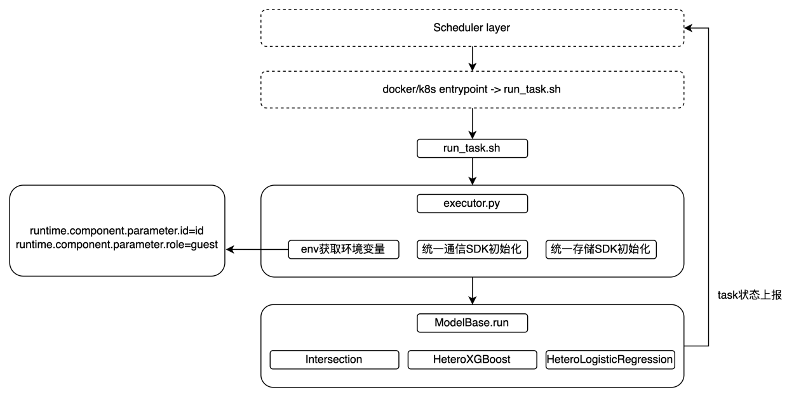
</div>

##### 4.2.2.2 算法注册（对应管理层）

算法容器注册及使用流程如下：

<div align="center">
    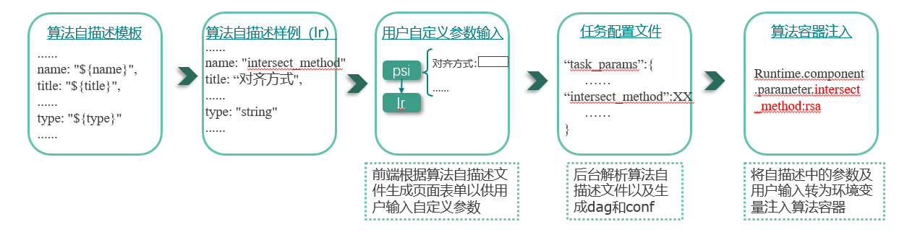
</div>


如果存在管理层，则需要对应开发算法注册功能：

1. 算法注册过程描述

算法组件提供方需上传算法镜像到镜像仓库（镜像仓库所有方需授权合作节点镜像仓库访问权限）。

算法组件镜像地址和算法自描述文件（JSON 格式）需线下提供给合作方节点。

算法组件镜像中包含 1 个或多个可运行的算法组件，且与算法自描述文件中三要素对应。

管理端通过输入算法组件镜像地址和算法自描述文件，读取解析算法组件自描述文件信息并与镜像地址关联，完成算法组件注册。

2. 算法注册方案示意图

<div align="center">
    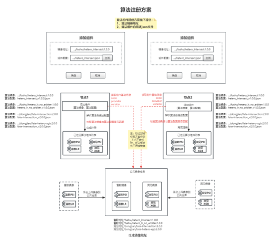
</div>

##### 4.2.2.3 存储

方案一：使用现有的 s3 存储 sdk。

方案二：提供支持算法组件运行的计算、调度及存储接口。

##### 4.2.2.4 传输

方案一：使用现有的 mesh 传输 sdk（mesh 开源地址）。

方案二：按照传输协议规范开发传输引擎。

#### 4.2.3 注意事项

- 对外通信接口

算法组件不对外暴露映射端口，通过调用通信组件与外部算法容器进行通信。

- 算法容器如何拼接输入输出的文件路径：认证及拼接规则

```yaml
-env:
  name: system.storage
  value: s3://IP:port?username=XXX&password=XXX&bucket=XXX
```

```python
s3.Object(bucket_name="storage", key="{}-{}".format(namespace, name))
```

- 算法输出类型包括 model、report 和 metrics，分别由调度分配对应存储的地址。
- 管理层支持多个节点组网配置，组网时通过接口方式将节点信息写入传输层路由表。

## 5 传输层

### 5.1 概述

传输层需对传输接口、传输协议、报文格式等进行标准化定义，从而为隐私计算平台间的互联互通提供底层的通信基础。此外，支持算法和调度的通信流量基于传输层统一转发。

#### 5.1.1 功能介绍

##### 5.1.1.1 传输信道管理

传输层托管互联互通传输信道，传输层默认监听 7304 端口，7304 端口提供 HTTP1.x、HTTP2、GRPC 等多协议服务，并支持 TLS 和非 TLS 协议，默认使用 TLS1.2 及以上协议进行协商。传输层设计为插件化架构，通过路由绑定实现网络路由链中的扩展能力支持，如需对传输层进行扩展开发，只需要实现相关的 Plugin 插入即可。通过路由服务实现网络流量在信道中向（管理面、控制面、数据面）业务端的双向传输。

传输层二次开发扩展 SPI 规范如下：

```go
type Middleware interface {

        // Name is middleware name
        Name() string

        // Priority more than has more priority
        Priority() int

        // Scope is middleware effect scope, 0 is global, others is customized.
        Scope() int

        // New middleware instance
        New(ctx context.Context, next http.Handler, name string) (http.Handler, error)
}
```

传输层信道管理示例图如下：

<div align="center">
    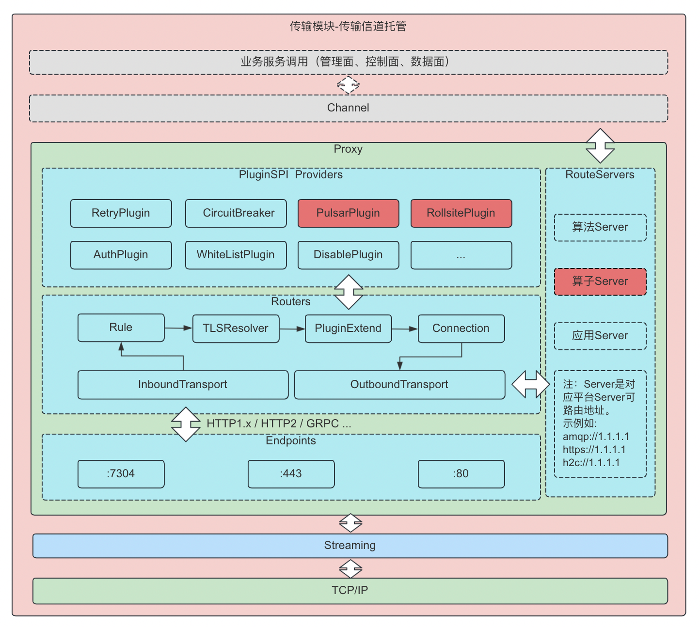
</div>

##### 5.1.1.2 Token 及 Session 管理

传输层提供 Session 管理，业务端（管理面、控制面、数据面）可通过请求头 x-ptp-session-id 实现对信道中 Session 生命周期进行管理，如 Session 的创建、传输、销毁。

传输层提供 Token 透传能力，业务端（管理面、控制面、数据面）可通过请求头 x-ptp-token 进行透传，便于资源端进行认证和鉴权。

##### 5.1.1.3 阻塞和非阻塞传输

传输层提供阻塞和非阻塞数据传输两种通信模式。阻塞模式传输层提供跨节点、跨应用路由能力，直连到业务端和资源端；非阻塞模式传输层提供跨节点、跨应用路由能力、信道缓冲能力和多协议互通能力，以规范中定义的编程接口进行通信。

##### 5.1.1.4 路由转发

传输层跨节点、跨应用路由转发能力由底层路由模块实现，路由模块支持多种转发模型，多种转发模型间可配套组合使用。

- 请求头路由

通过 `x-ptp-target-inst-id` 或 `x-ptp-target-node-id` 进行跨节点路由。配置方式，节点组网。

- 请求路径路由

通过 HTTP Path 进行服务路由，支持按正则进行匹配。配置方式，服务注册。

#### 5.1.2 流程及关系

传输层能够在异构的隐私计算平台之间，提供通信相关规范和参考实现模式。传输层统一 `应用容器-传输模块-合作节点` 间数据传输协议，传输模块分为客户端和服务端两部分，客户端为各语言的集成 SDK，服务端为通信模块底座。

传输层支持多种方式运行(支持 ARM/AMD 架构)

1. 作为容器运行在各个容器运行时（Docker、Containerd 等）
2. 作为容器运行在各类 PaaS 及云平台
3. 作为应用运行在各类裸机环境（Windows、Linux、Darwin）

传输层支持两种方式集成：

1. 使用传输 SDK，调用编程接口

传输层 SDK 抽象隐私计算下数据传输的多个标准编程接口，保障跨语言快速集成开发下的语义统一。

使用 SDK 集成传输层的便利在于，SDK 内置了多协议抽象层，可以使算子、算法、应用的可移植性更好，提升互联互通集成的效率和稳定性。算子、算法、应用通过传输 SDK 集成通信传输后，该集成方式下的算子、算法可快速移植到不同实现的互联互通底座上，天然兼容同步通信、异步通信、底层多协议的不同实现。使用传输 SDK 流程如下：

<div align="center">
    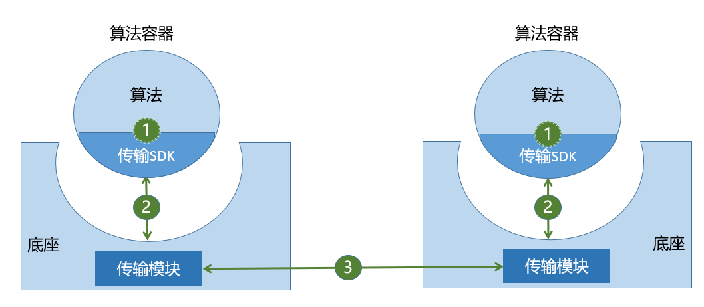
</div>
2. 基于传输层通信协议，直接调用传输层原生 API

基于传输层通信协议，直接调用传输层原生 API，则可以在无需 SDK 的情况，实现互联互通传输集成，该方式直接对接传输模块，可定制性更强，适合隐私计算平台端需要根据自身的需求进行一些个性定制的情况。

传输模块默认提供 HTTP1.x、HTTP2、GRPC 等协议下的通信支持，若直接调用传输层原生 API，则会使应用容器耦合传输模块提供的其中一种协议进行通信，需要在应用容器中进行多协议的适配。该集成方式下的算子、算法移植到非标准实现的其他互联互通底座上，可移植性和工作量正相关。

基于传输层通信协议，直接调用传输层原生 API 流程如下：

<div align="center">
    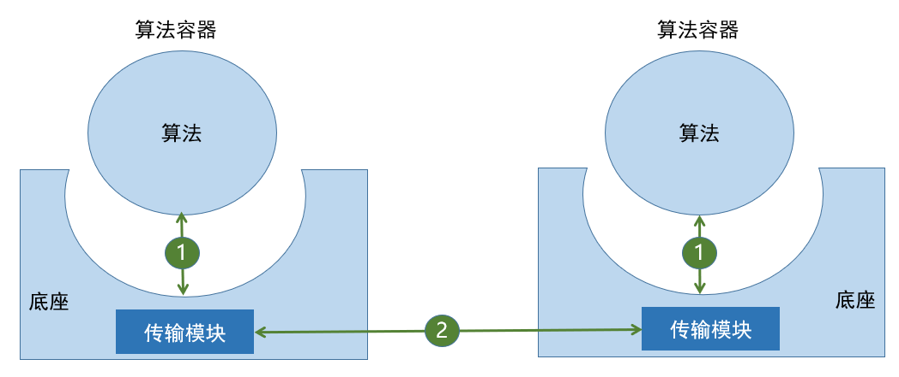
</div>

### 5.2 改造指南

#### 5.2.1 传输协议规范及接口

##### 5.2.1.1 传输协议规范

具体传输协议及接口如下链接：

[传输层接口](../互联互通API接口规范/4.传输层接口/隐私计算互联互通传输层API.md)

##### 5.2.1.2 传输接口

标准的传输报文和具体的传输协议无关，包含了报文头和报文体，传输错误码和错误信息，报文编码需加入 x-前缀。除此之外，还需要预留可扩展的元信息，例如，可以通过元信息，扩展异步通信所需要的 message-topic 和 message-code。

###### 5.2.1.2.1 传输模块跨节点接口改造

传输模块跨节点集成改造需要实现如下通信接口（实现 GRPC 或 HTTP1.x 之一），该接口用于互联互通场景下跨节点间的所有报文传输，所有通信请求在互联互通场景下均会被转化为如下的接口协议进行调用或被调用。其中 GRPC 和 HTTP1.x 接口声明如下：

- GRPC 格式

```protobuf
syntax = "proto3";

package org.ppc.ptp;
option go_package = "github.com/be-io/mesh/ptp";
option java_package = "io.bfia.ptp";

// PTP Private transfer protocol
// 通用报头名称编码，4层无Header以二进制填充到报头，7层以Header传输
// x-ptp-version             required 协议版本
// x-ptp-tech-provider-code  required 厂商编码
// x-ptp-trace-id            required 链路追踪ID
// x-ptp-token               required 认证令牌
// x-ptp-uri                 required 互联互通资源定位符，为跨节点实际请求的资源路径，用于兼容多协议
// x-ptp-source-node-id      required 发送端节点编号
// x-ptp-target-node-id      required 接收端节点编号
// x-ptp-source-inst-id      required 发送端机构编号
// x-ptp-target-inst-id      required 接收端机构编号
// x-ptp-session-id          required 通信会话号，全网唯一

// 通信传输层输入报文编码
message Inbound {
  map<string, string>  metadata = 1;   // 报头，可选，预留扩展，Dict，序列化协议由通信层统一实现
  bytes payload = 2;                   // 报文，上层通信内容承载，序列化协议由上层基于SPI可插拔
}

// 通信传输层输出报文编码
message Outbound {
  map<string, string>  metadata = 1;  // 报头，可选，预留扩展，Dict，序列化协议由通信层统一实现
  bytes payload = 2;                  // 报文，上层通信内容承载，序列化协议由上层基于SPI可插拔
  string code = 3;                    // 状态码
  string message = 4;                 // 状态说明
}

// 互联互通如果使用异步传输协议作为标准参考，Header会复用metadata传输互联互通协议报头，且metadata中会传输异步场景下的消息相关属性
// 互联互通如果使用其他协议作为参考标准，Header会复用metadata传输互联互通协议报头
// 互联互通如果使用GRPC作为参考标准，Header会复用HTTP2的报头传输互联互通协议报头

service PrivateTransferProtocol {
  rpc transport (stream Inbound) returns (stream Outbound);
  rpc invoke (Inbound) returns (Outbound);
}
```

- HTTP1.x 格式

```shell
HTTP POST /v1/interconn/chan/invoke
请求头:
x-ptp-version:               required 协议版本
x-ptp-tech-provider-code:    required 厂商编码
x-ptp-trace-id:              required 链路追踪ID
x-ptp-token                  required 认证令牌
x-ptp-uri                    required 互联互通资源定位符，为跨节点实际请求的资源路径，用于兼容多协议
x-ptp-session-id             required 通信会话号，全网唯一
x-ptp-source-node-id         required 发送端节点编号，全网唯一
x-ptp-target-node-id         required 接收端节点编号，全网唯一
x-ptp-source-inst-id         optional 发送端机构编号，全网唯一
x-ptp-target-inst-id         optional 接收端机构编号，全网唯一
请求体:
根据头字段x-ptp-version以及Content-Type进行序列化处理

响应体:
透传二进制报文，不做特殊处理
```

###### 5.2.1.2.2 SDK 与传输模块接口改造

SDK 与传输模块接口集成改造需要实现如下通信接口（实现 GRPC 或 HTTP1.x 之一），该接口用于互联互通场景下算子/算法与传输模块的所有报文传输，所有数据面请求在互联互通场景下均会被转化为如下的接口协议进行调用或被调用。其中 GRPC 和 HTTP1.x 接口声明如下：

- GRPC 格式

```protobuf
syntax = "proto3";

package org.ppc.ptp;
option go_package = "github.com/be-io/mesh/ptp";
option java_package = "io.bfia.ptp";

// PTP Private transfer protocol
// 通用报头名称编码，4层无Header以二进制填充到报头，7层以Header传输
// x-ptp-tech-provider-code:    required 厂商编码
// x-ptp-trace-id:              required 链路追踪ID
// x-ptp-token                  required 认证令牌
// x-ptp-session-id             required 通信会话号，全网唯一
// x-ptp-target-node-id         required 接收端节点编号，全网唯一
// x-ptp-target-inst-id         optional 接收端机构编号，全网唯一

message PeekInbound {
  string topic = 1;                   // optional 会话主题，相同信道具有唯一性，用于同一信道的传输隔离
}

message PopInbound {
  string topic = 1;                   // optional 会话主题，相同信道具有唯一性，用于同一信道的传输隔离
  int32 timeout = 2;                  // optional 阻塞超时时间，默认120s
}

message PushInbound{
  string topic = 1;                   // optional 会话主题，相同信道具有唯一性，用于同一信道的传输隔离
  bytes payload = 2;                  // 二进制报文
  map<string, string> metadata = 3;   // optional 保留参数，用于扩展性
}

message ReleaseInbound {
  string topic = 1;                   // optional 会话主题，相同信道具有唯一性，用于同一信道的传输隔离
  int32 timeout = 2;                  // optional 阻塞超时时间，默认120s
}

message TransportOutbound {
  map<string, string>  metadata = 1;  // 可选，预留扩展，Dict，序列化协议由通信层统一实现
  bytes payload = 2;                  // 二进制报文
  string code = 3;                    // 状态码
  string message = 4;                 // 状态说明
}

service PrivateTransferTransport {
  rpc peek (PeekInbound) returns (TransportOutbound);
  rpc pop (PopInbound) returns (TransportOutbound);
  rpc push (PushInbound) returns (TransportOutbound);
  rpc release (ReleaseInbound) returns (TransportOutbound);
}
```

- HTTP1.x 格式

数据发送

```shell
HTTP POST /v1/interconn/chan/push
请求头:
x-ptp-tech-provider-code:    required 厂商编码
x-ptp-trace-id:              required 链路追踪ID
x-ptp-token                  required 认证令牌
x-ptp-session-id             required 通信会话号，全网唯一
x-ptp-target-node-id         required 接收端节点编号，全网唯一
x-ptp-target-inst-id         optional 接收端机构编号，全网唯一
```

数据接收

```shell
HTTP POST /v1/interconn/chan/pop
请求头:
x-ptp-tech-provider-code:    required 厂商编码
x-ptp-trace-id:              required 链路追踪ID
x-ptp-token                  required 认证令牌
x-ptp-session-id             required 通信会话号，全网唯一
x-ptp-target-node-id         required 接收端节点编号，全网唯一
x-ptp-target-inst-id         optional 接收端机构编号，全网唯一
```

数据快速获取

```shell
HTTP POST /v1/interconn/chan/peek
请求头:
x-ptp-tech-provider-code:    required 厂商编码
x-ptp-trace-id:              required 链路追踪ID
x-ptp-token                  required 认证令牌
x-ptp-session-id             required 通信会话号，全网唯一
x-ptp-target-node-id         required 接收端节点编号，全网唯一
x-ptp-target-inst-id         optional 接收端机构编号，全网唯一
```

Session 释放

```shell
HTTP POST /v1/interconn/chan/release
请求头:
x-ptp-tech-provider-code:    required 厂商编码
x-ptp-trace-id:              required 链路追踪ID
x-ptp-token                  required 认证令牌
x-ptp-session-id             required 通信会话号，全网唯一
x-ptp-target-node-id         required 接收端节点编号，全网唯一
x-ptp-target-inst-id         optional 接收端机构编号，全网唯一
```

#### 5.2.2 传输引擎

需要实现传输引擎或者代理通信模块，用于给算法提供标准的通信接口。具体可以参照 [mesh](https://github.com/be-io/interconnection-bfia/blob/main/bfia/mesh/) 以及 [osx](https://github.com/FederatedAI/FATE) 等开源组件。

#### 5.2.3 注意事项

1. 传输模块默认以 7304 端口提供服务，部署需要映射 7304 端口，部署示例如下（K8S）：

```yaml
apiVersion: apps/v1
kind: Deployment
metadata:
  labels:
    app: mesh
    group: bfia
  name: mesh
spec:
  progressDeadlineSeconds: 600
  replicas: 1
  revisionHistoryLimit: 10
  selector:
    matchLabels:
      app: mesh
      group: bfia
  strategy:
    rollingUpdate:
      maxSurge: 25%
      maxUnavailable: 25%
    type: RollingUpdate
  template:
    metadata:
      labels:
        app: mesh
        group: bfia
    spec:
      containers:
        - name: main
          image: bfia/mesh
          imagePullPolicy: Always
          env:
            - name: MESH_HOME
              value: /mesh
          livenessProbe:
            failureThreshold: 24
            httpGet:
              path: /stats
              port: 7304
              scheme: HTTP
            initialDelaySeconds: 30
            periodSeconds: 5
            successThreshold: 1
            timeoutSeconds: 5
          readinessProbe:
            failureThreshold: 24
            httpGet:
              path: /stats
              port: 7304
              scheme: HTTP
            initialDelaySeconds: 30
            periodSeconds: 5
            successThreshold: 1
            timeoutSeconds: 5
          terminationMessagePath: /dev/termination-log
          terminationMessagePolicy: File
      dnsPolicy: ClusterFirst
      restartPolicy: Always
      schedulerName: default-scheduler
      securityContext: { }
      terminationGracePeriodSeconds: 30
---
apiVersion: v1
kind: Service
metadata:
  labels:
    app: mesh
    group: bfia
  name: mesh
spec:
  ipFamilies:
    - IPv4
  ipFamilyPolicy: SingleStack
  ports:
    - name: "7304"
      port: 7304
      protocol: TCP
      targetPort: 7304
  selector:
    app: mesh
    group: bfia
  sessionAffinity: None
  type: ClusterIP
```

2. SDK 与传输模块服务之间的传输报文、接口及使用。

SDK 需要配置一个环境变量或启动参数 `MESH_ADDRESS`，该地址为传输模块服务地址，[SDK 接口使用示例](https://github.com/be-io/mesh/blob/master/specifications/api/README_CN.md)。

3. 若不使用 SDK 的方式，则需要参考相关规范中的 API 接口，以原生协议进行调用（如 HTTP1.x 或 GRPC）。

规范中的 API 接口声明为

- [GRPC-传输模块到传输模块接口.proto](https://github.com/be-io/mesh/blob/master/specifications/api/mesh.x.proto)
- [GRPC-容器到传输模块接口.proto](https://github.com/be-io/mesh/blob/master/specifications/api/mesh.y.proto)
- [HTTP1.x-传输模块到传输模块接口.swagger.json](https://github.com/be-io/mesh/blob/master/specifications/api/mesh.x.swagger.json)
- [HTTP1.x-容器到传输模块接口.swagger.json](https://github.com/be-io/mesh/blob/master/specifications/api/mesh.y.swagger.json)

# 附录

暂无
